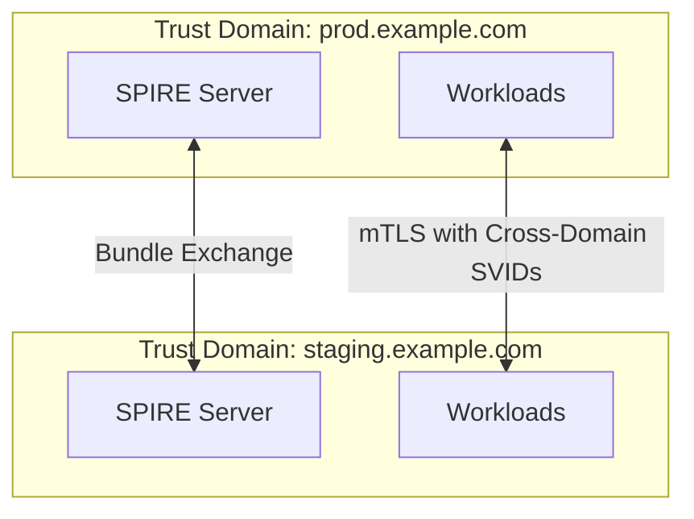
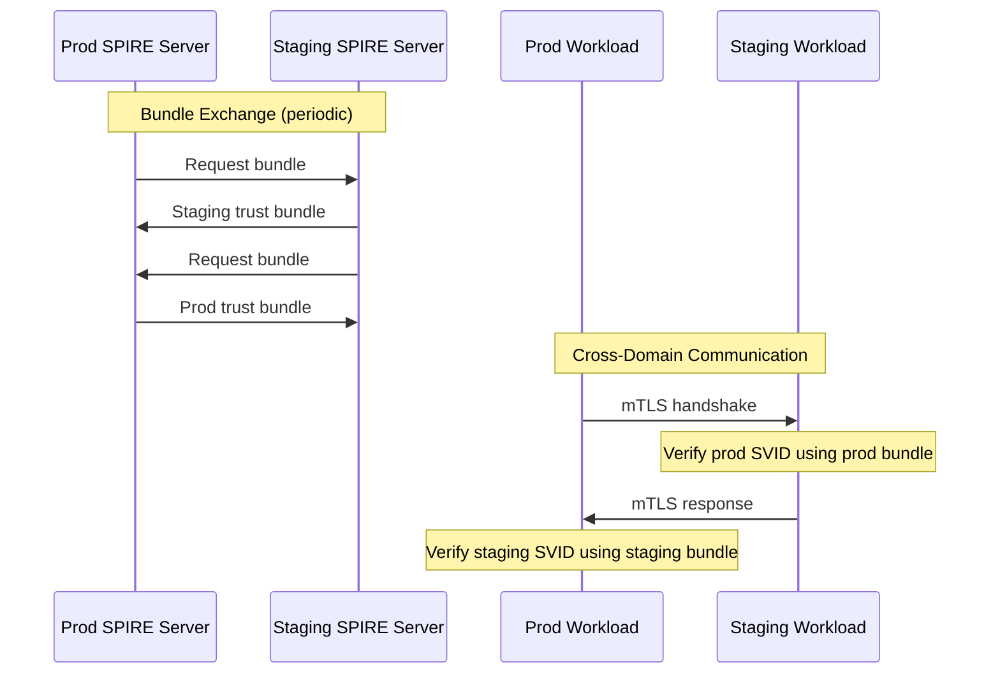
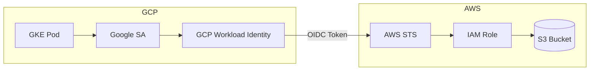
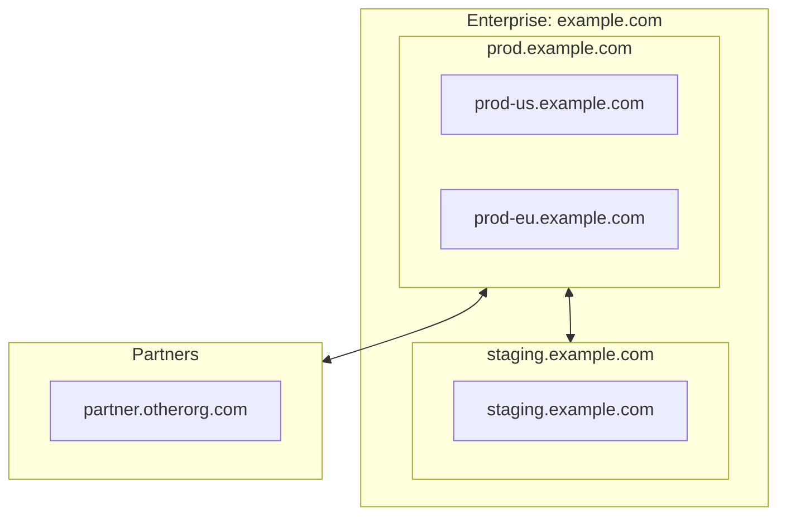
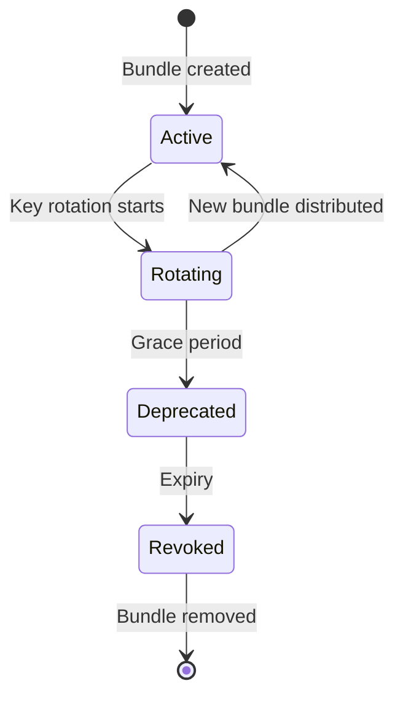
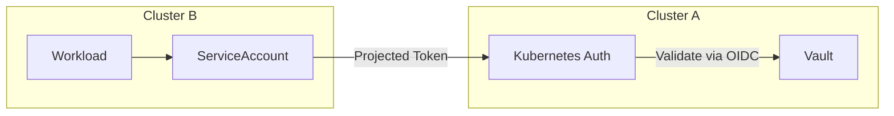
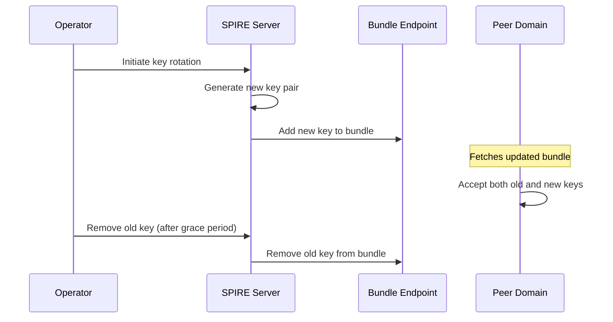

```
RFC-WORKLOAD-IDENTITY-0001                                     Section 12
Category: Standards Track                                     Federation
```

# 12. Federation

[← Previous: Service Mesh Integration](./11-service-mesh-integration.md) | [Index](./00-index.md#table-of-contents) | [Next: Rationale →](./13-rationale.md)

---

## 12.1 Federation Overview

### 12.1.1 What is Identity Federation

Identity federation enables workloads in different trust domains to establish mutual trust:

| Scenario | Federation Type |
|----------|-----------------|
| Multiple Kubernetes clusters | SPIFFE cross-cluster |
| Different cloud providers | Workload identity federation |
| Partner organizations | Trust bundle exchange |
| Hybrid cloud | On-prem to cloud federation |

### 12.1.2 Federation Challenges

| Challenge | Solution |
|-----------|----------|
| Different trust roots | Trust bundle exchange |
| Network boundaries | Secure federation endpoints |
| Policy consistency | Centralized policy, distributed enforcement |
| Key management | Automated rotation, secure storage |

---

## 12.2 SPIFFE Federation

### 12.2.1 Trust Domains

Each SPIFFE deployment has a trust domain:

| Environment | Trust Domain |
|-------------|--------------|
| Production cluster | `prod.example.com` |
| Staging cluster | `staging.example.com` |
| Partner org | `partner.otherorg.com` |

### 12.2.2 Federation Bundle

Trust bundles contain public keys for verifying identities:

```json
{
  "trust_domain": "prod.example.com",
  "keys": [
    {
      "kty": "RSA",
      "use": "x509-svid",
      "n": "...",
      "e": "AQAB"
    }
  ],
  "sequence_number": 1
}
```

### 12.2.3 Federation Relationship



### 12.2.4 SPIRE Federation Configuration

```yaml
# SPIRE Server configuration for federation
server:
  trust_domain: "prod.example.com"
  ca_subject:
    country: ["US"]
    organization: ["Example Corp"]

  federation:
    bundle_endpoint:
      address: "0.0.0.0"
      port: 8443
      acme:
        domain_name: "spiffe-federation.prod.example.com"
        email: "security@example.com"

    federates_with:
      "staging.example.com":
        bundle_endpoint_url: "https://spiffe-federation.staging.example.com:8443"
        bundle_endpoint_profile:
          https_spiffe:
            endpoint_spiffe_id: "spiffe://staging.example.com/spire/server"
```

### 12.2.5 Federation Workflow



---

## 12.3 Multi-Cloud Identity

### 12.3.1 Cloud Workload Identity Federation

Federating between cloud providers:

| Source | Target | Federation Path |
|--------|--------|-----------------|
| GKE → AWS | GCP WI → AWS STS | OIDC token → AssumeRoleWithWebIdentity |
| EKS → GCP | AWS IAM → GCP WIF | OIDC token → Workload Identity Pool |
| AKS → AWS | Azure WI → AWS STS | OIDC token → AssumeRoleWithWebIdentity |

### 12.3.2 GCP to AWS Federation



Configuration:

```hcl
# AWS: Trust GCP OIDC
resource "aws_iam_role" "gcp_workload" {
  name = "gcp-workload-access"

  assume_role_policy = jsonencode({
    Version = "2012-10-17"
    Statement = [{
      Effect = "Allow"
      Principal = {
        Federated = "arn:aws:iam::${var.account_id}:oidc-provider/container.googleapis.com/v1/projects/${var.gcp_project}/locations/${var.gcp_location}/clusters/${var.gcp_cluster}"
      }
      Action = "sts:AssumeRoleWithWebIdentity"
      Condition = {
        StringEquals = {
          "container.googleapis.com:sub" = "system:serviceaccount:${var.namespace}:${var.service_account}"
        }
      }
    }]
  })
}
```

### 12.3.3 AWS to GCP Federation

```hcl
# GCP: Workload Identity Pool for AWS
resource "google_iam_workload_identity_pool" "aws" {
  workload_identity_pool_id = "aws-pool"
  display_name              = "AWS Workload Pool"
}

resource "google_iam_workload_identity_pool_provider" "aws_eks" {
  workload_identity_pool_id          = google_iam_workload_identity_pool.aws.workload_identity_pool_id
  workload_identity_pool_provider_id = "aws-eks"
  display_name                       = "AWS EKS"

  aws {
    account_id = var.aws_account_id
  }

  attribute_mapping = {
    "google.subject"        = "assertion.arn"
    "attribute.aws_account" = "assertion.account"
  }
}

# Bind to GCP service account
resource "google_service_account_iam_binding" "aws_workload" {
  service_account_id = google_service_account.target.name
  role               = "roles/iam.workloadIdentityUser"

  members = [
    "principalSet://iam.googleapis.com/${google_iam_workload_identity_pool.aws.name}/attribute.aws_account/${var.aws_account_id}"
  ]
}
```

---

## 12.4 Trust Domain Management

### 12.4.1 Trust Domain Hierarchy



### 12.4.2 Trust Domain Policies

| Policy | Description |
|--------|-------------|
| **Full trust** | All workloads can communicate |
| **Selective trust** | Only specific SPIFFE IDs allowed |
| **One-way trust** | Domain A trusts B, B doesn't trust A |
| **Transitive trust** | A trusts B, B trusts C, therefore A trusts C |

### 12.4.3 Trust Bundle Lifecycle



---

## 12.5 Cross-Cluster Vault Access

### 12.5.1 Vault Multi-Cluster Authentication

Workloads in cluster B accessing Vault in cluster A:



### 12.5.2 Multi-Cluster Auth Configuration

```bash
# Enable auth for remote cluster
vault auth enable -path=kubernetes-cluster-b kubernetes

# Configure with cluster B's OIDC issuer
vault write auth/kubernetes-cluster-b/config \
    kubernetes_host="https://cluster-b.example.com:6443" \
    kubernetes_ca_cert=@cluster-b-ca.crt \
    issuer="https://oidc.cluster-b.example.com"

# Create role for cross-cluster access
vault write auth/kubernetes-cluster-b/role/cross-cluster-app \
    bound_service_account_names=app \
    bound_service_account_namespaces=default \
    policies=cross-cluster-read \
    ttl=1h
```

---

## 12.6 Partner Federation

### 12.6.1 B2B Federation Requirements

| Requirement | Implementation |
|-------------|----------------|
| Trust establishment | Out-of-band bundle exchange |
| Scope limitation | Specific SPIFFE ID patterns |
| Audit | Log all cross-org access |
| Revocation | Immediate bundle removal |

### 12.6.2 Partner Trust Bundle

```yaml
# Partner federation configuration
federation:
  federates_with:
    "partner.otherorg.com":
      bundle_endpoint_url: "https://spiffe.partner.otherorg.com:8443"
      bundle_endpoint_profile:
        https_web: {}
      # Only trust specific workloads
      trust_bundle_url: "https://spiffe.partner.otherorg.com/.well-known/spiffe-bundle.json"
```

### 12.6.3 Scoped Trust

```yaml
# Only allow specific partner workloads
apiVersion: policy.linkerd.io/v1beta1
kind: ServerAuthorization
metadata:
  name: allow-partner-api
  namespace: b2b-gateway
spec:
  server:
    name: partner-gateway
  client:
    meshTLS:
      identities:
        # Only trust partner's integration service
        - "spiffe://partner.otherorg.com/ns/integration/sa/api-client"
```

---

## 12.7 Security Considerations

### 12.7.1 Federation Risks

| Risk | Mitigation |
|------|------------|
| Malicious bundle injection | Verify bundle signatures, HTTPS |
| Over-permissive trust | Explicit SPIFFE ID allowlists |
| Lateral movement via federation | Segment federated access |
| Trust anchor compromise | HSM-backed keys, rotation |

### 12.7.2 Federation Security Controls

| Control | Implementation |
|---------|----------------|
| Bundle verification | HTTPS + SPIFFE endpoint verification |
| Audit | Log all federation events |
| Revocation | Immediate bundle removal capability |
| Scope limitation | SPIFFE ID pattern matching |

### 12.7.3 Zero Trust Federation

Even with federation, apply zero trust:

```yaml
# Federated workloads still need explicit authorization
apiVersion: policy.linkerd.io/v1beta1
kind: ServerAuthorization
metadata:
  name: federated-access
spec:
  server:
    name: api
  client:
    meshTLS:
      identities:
        # Explicit allow, not wildcard
        - "spiffe://partner.example.com/ns/allowed/sa/client"
      # Deny by default - only listed identities allowed
```

---

## 12.8 Operational Procedures

### 12.8.1 Establishing Federation

1. Exchange trust bundles out-of-band (secure channel)
2. Configure federation endpoints
3. Test connectivity with restricted workloads
4. Expand access incrementally
5. Monitor and audit cross-domain traffic

### 12.8.2 Rotating Federation Keys



### 12.8.3 Revoking Federation

```bash
# Remove federation relationship
spire-server federation delete -trustDomain partner.example.com

# Update mesh policies
kubectl delete serverauthorization -l federation=partner.example.com

# Verify revocation
spire-server bundle list
```

---

## 12.9 Compliance Mapping

### 12.9.1 Invariant Enforcement

| Invariant | Federation Implementation |
|-----------|--------------------------|
| INV-1 | Cross-domain SVIDs still cryptographically verified |
| INV-6 | mTLS required for cross-domain communication |
| INV-7 | Policies scope cross-domain access |
| INV-10 | All federation events logged |

### 12.9.2 Audit Requirements

| Event | Required Context |
|-------|------------------|
| Bundle exchange | Source domain, timestamp, keys |
| Cross-domain auth | Source SPIFFE ID, target, outcome |
| Policy evaluation | Client identity, requested resource, decision |
| Federation removal | Removed domain, reason, operator |

---

## Document Navigation

| Previous | Index | Next |
|----------|-------|------|
| [← 11. Service Mesh Integration](./11-service-mesh-integration.md) | [Table of Contents](./00-index.md#table-of-contents) | [13. Rationale →](./13-rationale.md) |

---

*End of Section 12 — RFC-WORKLOAD-IDENTITY-0001*
