# Platform Security Architecture

## Centralized Authentication & Authorization
### Azure AD → Keycloak → Platform Components

**ProficientNow Infrastructure Team**  
*January 2026*

---

## Table of Contents

1. [Executive Summary](#executive-summary)
2. [Security Architecture Overview](#security-architecture-overview)
3. [Azure AD Configuration](#azure-ad-configuration)
4. [Keycloak Realm Configuration](#keycloak-realm-configuration)
5. [Role-Based Access Control Model](#role-based-access-control-model)
6. [Component OIDC Configuration](#component-oidc-configuration)
7. [Security Tools Architecture](#security-tools-architecture)
8. [Kubernetes RBAC Integration](#kubernetes-rbac-integration)
9. [Implementation Plan](#implementation-plan)
10. [Appendices](#appendices)

---

## Executive Summary

This document defines the comprehensive security architecture for the ProficientNow platform, establishing **Azure AD as the authoritative identity source** with **Keycloak as the central identity broker**. The architecture ensures zero-trust authentication across all 15+ platform components while maintaining fine-grained role-based access control (RBAC) for diverse user personas.

### Key Objectives

- **Single source of identity truth**: Azure AD manages all user lifecycle operations
- **Centralized authentication**: Keycloak federates identity to all platform components via OIDC
- **Role-based authorization**: Seven distinct platform roles mapped to Azure AD groups
- **Runtime security**: Falco, Falco-Talon, and Kyverno provide defense-in-depth
- **Zero manual user management**: Users auto-provisioned through group membership sync

### Scope

This architecture covers authentication and authorization for:

| Category | Components |
|----------|------------|
| GitOps & Deployment | ArgoCD, Kargo, Argo Rollouts |
| Observability | Grafana, OneUptime |
| Security | Vault, Keycloak Admin, Falco |
| Developer Platform | Backstage, Harbor, Verdaccio, Tekton Dashboard |
| Application Infrastructure | Temporal, KubeVirt Manager |
| Cluster Access | Kubernetes API (kubectl) |

---

## Security Architecture Overview

### Identity Flow Architecture

The platform implements a three-tier identity architecture that separates identity source, identity broker, and service provider concerns.

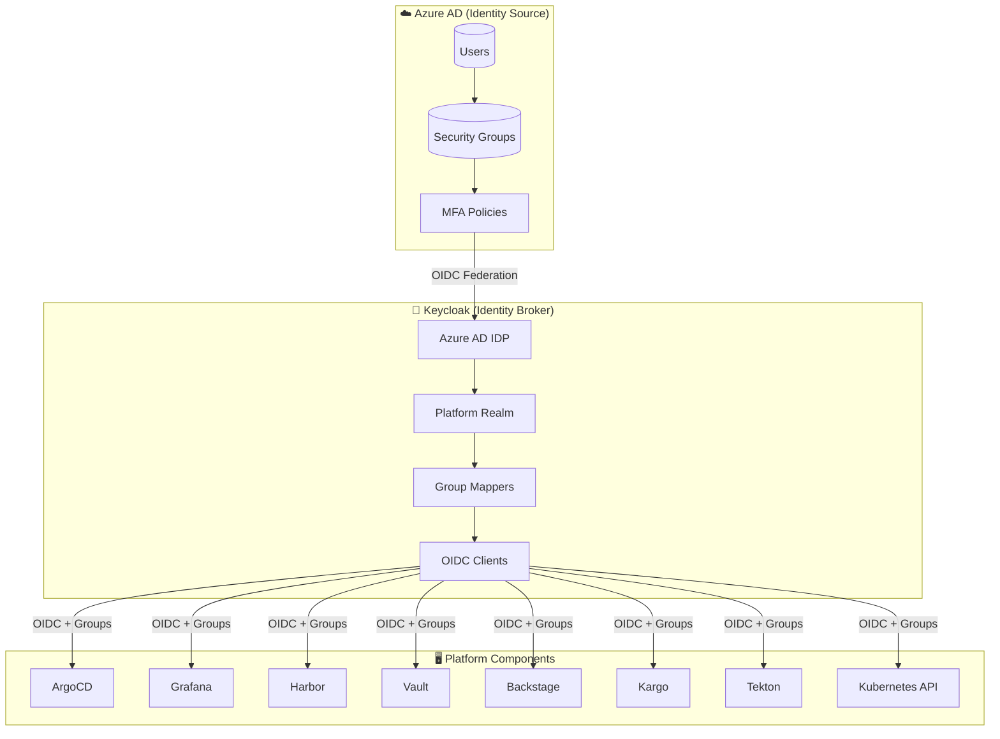

### Authentication Flow Sequence

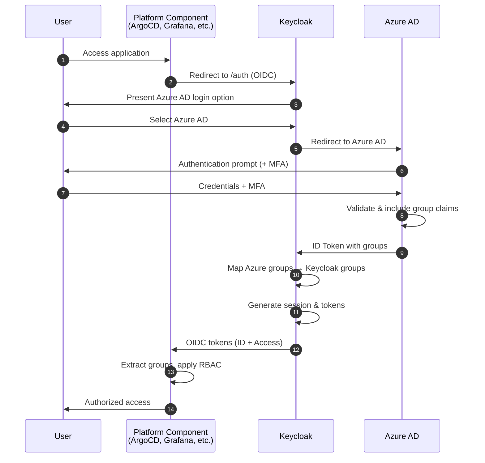

### Layer Responsibilities

| Layer | Component | Responsibility |
|-------|-----------|----------------|
| **Identity Source** | Azure AD (Entra ID) | User lifecycle, group management, MFA enforcement, identity verification |
| **Identity Broker** | Keycloak | OIDC/SAML federation, claims transformation, session management, protocol translation |
| **Service Providers** | Platform Components | OIDC client authentication, group-based RBAC, service-specific authorization |

---

## Azure AD Configuration

### Enterprise Application Setup

A single Azure AD Enterprise Application serves as the OIDC provider for Keycloak. This centralizes identity federation and simplifies certificate/secret rotation.

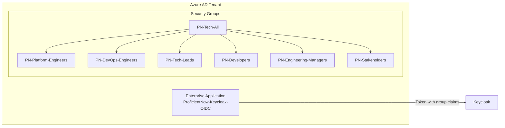

### App Registration Configuration

| Setting | Value |
|---------|-------|
| **Application Name** | `ProficientNow-Keycloak-OIDC` |
| **Supported Account Types** | Single tenant (this organization only) |
| **Redirect URI** | `https://keycloak.pnats.cloud/realms/platform/broker/azure-ad/endpoint` |
| **ID Token Claims** | `email`, `preferred_username`, `groups`, `name` |
| **Token Configuration** | Groups claim: Security groups, emit as: Group ID |

### Azure AD Security Groups

All platform users must belong to a parent group that syncs to Keycloak. Role-specific subgroups determine authorization levels:

| Azure AD Group | Keycloak Group | Purpose |
|----------------|----------------|---------|
| `PN-Tech-All` | `/platform-users` | Parent group for all tech staff |
| `PN-Platform-Engineers` | `/platform-admins` | Full platform administration |
| `PN-DevOps-Engineers` | `/devops-engineers` | CI/CD and deployment operations |
| `PN-Tech-Leads` | `/tech-leads` | Team-scoped elevated access |
| `PN-Developers` | `/developers` | Application development access |
| `PN-Engineering-Managers` | `/engineering-managers` | Read-only dashboards and reports |
| `PN-Stakeholders` | `/stakeholders` | Business metrics visibility |

### Group Claims Configuration

In Azure AD App Registration → Token Configuration:

```json
{
  "groupMembershipClaims": "SecurityGroup",
  "optionalClaims": {
    "idToken": [
      {
        "name": "groups",
        "source": null,
        "essential": false,
        "additionalProperties": ["emit_as_roles"]
      }
    ]
  }
}
```

---

## Keycloak Realm Configuration

### Realm Structure

```mermaid
flowchart TB
    subgraph Keycloak["Keycloak Server"]
        subgraph Realm["Platform Realm"]
            IDP[Identity Provider<br/>Azure AD OIDC]
            
            subgraph ClientScopes["Client Scopes"]
                GroupScope[groups scope<br/>Group Membership Mapper]
            end
            
            subgraph Clients["OIDC Clients"]
                C1[argocd]
                C2[grafana]
                C3[harbor]
                C4[vault]
                C5[backstage]
                C6[kargo]
                C7[tekton]
                C8[kubernetes]
            end
            
            subgraph Groups["Keycloak Groups"]
                G1[/platform-admins]
                G2[/devops-engineers]
                G3[/tech-leads]
                G4[/developers]
                G5[/engineering-managers]
                G6[/stakeholders]
            end
        end
    end

    IDP -->|Group Mapping| Groups
    GroupScope --> Clients
    Groups -->|Included in tokens| Clients
```

### Realm Settings

| Setting | Value | Rationale |
|---------|-------|-----------|
| **Realm Name** | `platform` | Isolated from other Keycloak uses |
| **SSO Session Idle** | 30 minutes | Balance security/usability |
| **SSO Session Max** | 10 hours | Full workday coverage |
| **Access Token Lifespan** | 5 minutes | Short-lived for security |
| **Refresh Token Lifespan** | 30 minutes | Aligned with session idle |
| **User Registration** | Disabled | Managed via Azure AD |
| **Login with Email** | Enabled | Consistent with Azure AD |
| **Edit Username** | Disabled | Federated identity |

### Azure AD Identity Provider Configuration

| Configuration | Value |
|---------------|-------|
| **Alias** | `azure-ad` |
| **Display Name** | `Microsoft Azure AD` |
| **Discovery Endpoint** | `https://login.microsoftonline.com/{tenant-id}/v2.0/.well-known/openid-configuration` |
| **Client Authentication** | Client secret sent as post |
| **Scopes** | `openid email profile` |
| **Trust Email** | Enabled |
| **First Login Flow** | `first broker login` |
| **Sync Mode** | Force (update on every login) |

### Identity Provider Mappers

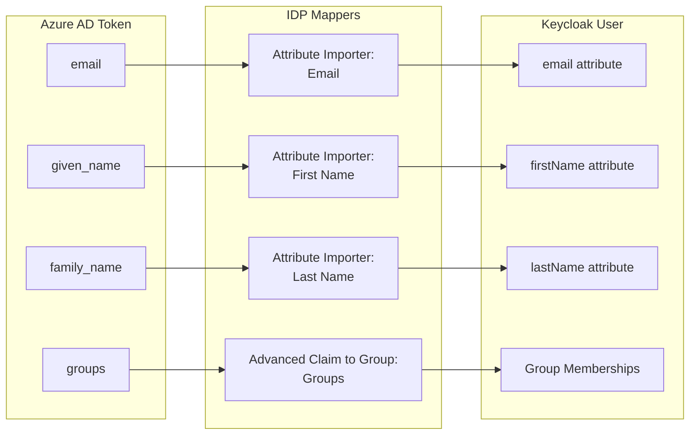

### Client Scope: groups

Create a dedicated client scope named `groups` that includes group membership in tokens:

| Setting | Value |
|---------|-------|
| **Name** | `groups` |
| **Protocol** | OpenID Connect |
| **Display On Consent Screen** | Off |
| **Include In Token Scope** | On |

**Mapper Configuration:**

| Mapper Setting | Value |
|----------------|-------|
| **Mapper Type** | Group Membership |
| **Token Claim Name** | `groups` |
| **Full group path** | Disabled (use group names only) |
| **Add to ID token** | Enabled |
| **Add to access token** | Enabled |
| **Add to userinfo** | Enabled |

---

## Role-Based Access Control Model

### Platform Role Hierarchy

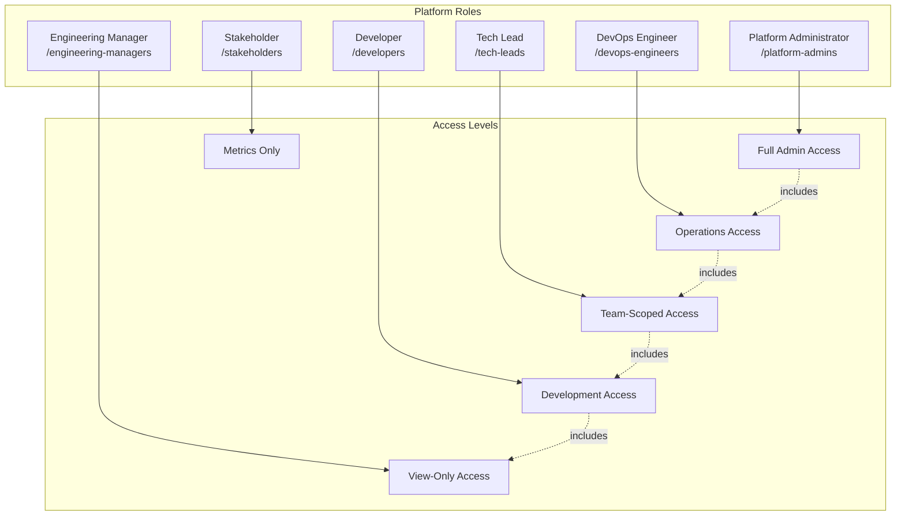

### Role: Platform Administrator

**Keycloak Group:** `/platform-admins`  
**Description:** Full administrative access to all platform components. Reserved for Platform Engineering team members.

| Component | Role/Permission | Scope |
|-----------|-----------------|-------|
| ArgoCD | `role:admin` | Full cluster and application management |
| Grafana | `GrafanaAdmin` | Org administration, data source management |
| Harbor | Project Admin + System Admin | All projects |
| Vault | `admin`, `secrets-admin` policies | All paths |
| Keycloak | Realm admin | Platform realm |
| Kargo | Full management | All stages and freight |
| Kubernetes | `cluster-admin` | Cluster-wide |

### Role: DevOps Engineer

**Keycloak Group:** `/devops-engineers`  
**Description:** CI/CD pipeline management, deployment operations, and monitoring access.

| Component | Role/Permission | Scope |
|-----------|-----------------|-------|
| ArgoCD | `role:admin` | Assigned projects only |
| Grafana | `Admin` | Dashboard creation, alerting |
| Harbor | `Developer` | Push/pull images, create repositories |
| Vault | `secrets-read`, `ci-cd` policies | Assigned paths |
| Tekton | Full management | All pipelines and tasks |
| Kargo | Stage promotion | Assigned projects |
| Kubernetes | `edit` ClusterRole | Assigned namespaces |

### Role: Tech Lead

**Keycloak Group:** `/tech-leads`  
**Description:** Team-scoped elevated access for technical leadership responsibilities.

| Component | Role/Permission | Scope |
|-----------|-----------------|-------|
| ArgoCD | `role:admin` | Team projects |
| Grafana | `Editor` | Team folder access |
| Harbor | `Developer` | Team projects |
| Backstage | Entity ownership | Template execution |
| Vault | `secrets-read` | Team paths |
| Kubernetes | `edit` ClusterRole | Team namespaces |

### Role: Developer

**Keycloak Group:** `/developers`  
**Description:** Application development access with read-heavy permissions.

| Component | Role/Permission | Scope |
|-----------|-----------------|-------|
| ArgoCD | Read-only + sync | Dev environments only |
| Grafana | `Viewer` | Assigned dashboards |
| Harbor | Pull + dev push | Dev repositories only |
| Backstage | Component viewing | Limited templates |
| Vault | `app-secrets-read` | Assigned paths |
| Kubernetes | `view` ClusterRole | Assigned namespaces |

### Role: Engineering Manager

**Keycloak Group:** `/engineering-managers`  
**Description:** Read-only access to dashboards, metrics, and operational status.

| Component | Role/Permission | Scope |
|-----------|-----------------|-------|
| ArgoCD | Read-only | Application status |
| Grafana | `Viewer` | Executive dashboards |
| Backstage | Catalog browsing | No modifications |
| Kubernetes | None | Dashboards only |

### Role: Stakeholder

**Keycloak Group:** `/stakeholders`  
**Description:** Business stakeholder visibility into key metrics.

| Component | Role/Permission | Scope |
|-----------|-----------------|-------|
| Grafana | `Viewer` | Business metrics dashboards |
| OneUptime | Status page | Viewing only |

### Permission Matrix

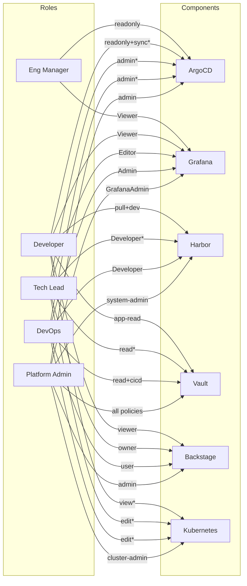

*Note: Asterisk (*) indicates scoped to specific projects/namespaces*

---

## Component OIDC Configuration

### ArgoCD

ArgoCD integrates directly with Keycloak OIDC without requiring Dex.

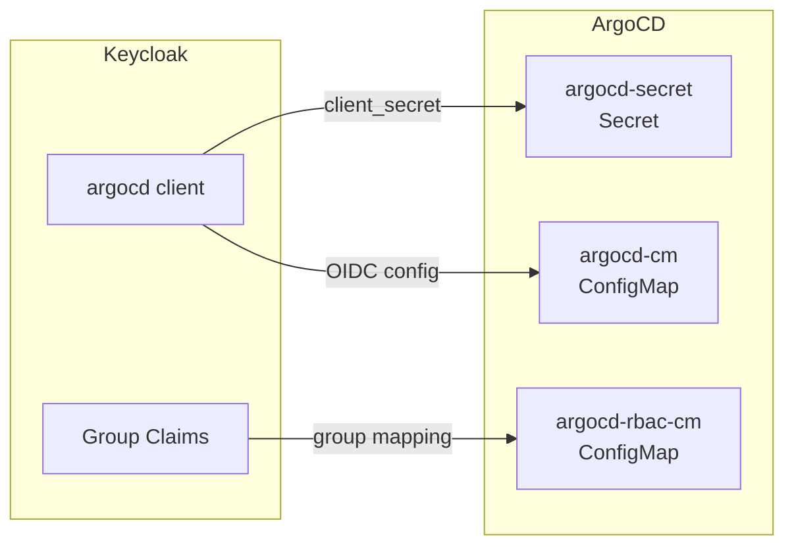

**argocd-cm ConfigMap:**

```yaml
apiVersion: v1
kind: ConfigMap
metadata:
  name: argocd-cm
  namespace: argocd
data:
  url: https://argocd.pnats.cloud
  oidc.config: |
    name: Keycloak
    issuer: https://keycloak.pnats.cloud/realms/platform
    clientID: argocd
    clientSecret: $oidc.keycloak.clientSecret
    requestedScopes: ["openid", "profile", "email", "groups"]
    enablePKCEAuthentication: true
```

**argocd-rbac-cm ConfigMap:**

```yaml
apiVersion: v1
kind: ConfigMap
metadata:
  name: argocd-rbac-cm
  namespace: argocd
data:
  policy.csv: |
    # Platform Admins - full access
    g, /platform-admins, role:admin
    
    # DevOps Engineers - full access
    g, /devops-engineers, role:admin
    
    # Tech Leads - read + sync for team projects
    p, role:tech-lead, applications, get, */*, allow
    p, role:tech-lead, applications, sync, */*, allow
    g, /tech-leads, role:tech-lead
    
    # Developers - read only + sync dev
    p, role:developer, applications, get, */*, allow
    p, role:developer, applications, sync, dev/*, allow
    g, /developers, role:developer
    
    # Engineering Managers - read only
    g, /engineering-managers, role:readonly
    
  policy.default: role:readonly
  scopes: '[groups]'
```

### Grafana

Grafana uses Generic OAuth with JMESPath expressions for role mapping.

**grafana.ini configuration:**

```ini
[server]
root_url = https://grafana.pnats.cloud

[auth.generic_oauth]
enabled = true
name = Keycloak SSO
allow_sign_up = true
client_id = grafana
client_secret = ${GF_AUTH_GENERIC_OAUTH_CLIENT_SECRET}
scopes = openid profile email groups
auth_url = https://keycloak.pnats.cloud/realms/platform/protocol/openid-connect/auth
token_url = https://keycloak.pnats.cloud/realms/platform/protocol/openid-connect/token
api_url = https://keycloak.pnats.cloud/realms/platform/protocol/openid-connect/userinfo

# Role mapping using JMESPath
role_attribute_path = contains(groups[*], '/platform-admins') && 'GrafanaAdmin' || contains(groups[*], '/devops-engineers') && 'Admin' || contains(groups[*], '/tech-leads') && 'Editor' || 'Viewer'
role_attribute_strict = true
allow_assign_grafana_admin = true

[auth]
disable_login_form = false
oauth_auto_login = false
```

### Harbor

Harbor OIDC authentication is configured via the admin UI or API.

| Setting | Value |
|---------|-------|
| **Auth Mode** | OIDC |
| **OIDC Provider Name** | Keycloak |
| **OIDC Endpoint** | `https://keycloak.pnats.cloud/realms/platform` |
| **OIDC Client ID** | `harbor` |
| **OIDC Client Secret** | (from Vault) |
| **OIDC Scope** | `openid,profile,email,groups` |
| **Group Claim Name** | `groups` |
| **OIDC Admin Group** | `/platform-admins` |
| **Automatic Onboarding** | Enabled |

**Group-to-Role Mapping in Harbor:**

| Keycloak Group | Harbor Role | Scope |
|----------------|-------------|-------|
| `/platform-admins` | System Admin | Global |
| `/devops-engineers` | Developer | All projects |
| `/tech-leads` | Developer | Team projects |
| `/developers` | Guest + Developer | Dev projects only |

### Vault

HashiCorp Vault OIDC authentication method configuration.

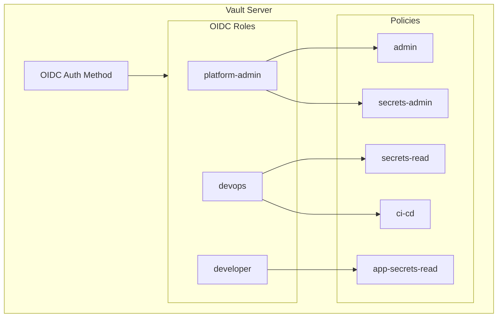

**Enable and Configure OIDC:**

```bash
# Enable OIDC auth method
vault auth enable oidc

# Configure OIDC with Keycloak
vault write auth/oidc/config \
    oidc_discovery_url="https://keycloak.pnats.cloud/realms/platform" \
    oidc_client_id="vault" \
    oidc_client_secret="$VAULT_OIDC_SECRET" \
    default_role="default"

# Create platform-admin role
vault write auth/oidc/role/platform-admin \
    user_claim="preferred_username" \
    allowed_redirect_uris="https://vault.pnats.cloud/ui/vault/auth/oidc/oidc/callback" \
    groups_claim="groups" \
    bound_claims='{"groups": ["/platform-admins"]}' \
    policies="admin,secrets-admin" \
    ttl="1h"

# Create devops role
vault write auth/oidc/role/devops \
    user_claim="preferred_username" \
    allowed_redirect_uris="https://vault.pnats.cloud/ui/vault/auth/oidc/oidc/callback" \
    groups_claim="groups" \
    bound_claims='{"groups": ["/devops-engineers"]}' \
    policies="secrets-read,ci-cd" \
    ttl="1h"

# Create developer role
vault write auth/oidc/role/developer \
    user_claim="preferred_username" \
    allowed_redirect_uris="https://vault.pnats.cloud/ui/vault/auth/oidc/oidc/callback" \
    groups_claim="groups" \
    bound_claims='{"groups": ["/developers"]}' \
    policies="app-secrets-read" \
    ttl="1h"
```

### Backstage

Backstage OIDC authentication requires custom provider configuration plus the Keycloak catalog plugin.

**app-config.yaml:**

```yaml
auth:
  environment: production
  session:
    secret: ${AUTH_SESSION_SECRET}
  providers:
    oidc:
      production:
        metadataUrl: https://keycloak.pnats.cloud/realms/platform/.well-known/openid-configuration
        clientId: backstage
        clientSecret: ${AUTH_OIDC_CLIENT_SECRET}
        scope: 'openid profile email groups'
        prompt: auto

catalog:
  providers:
    keycloakOrg:
      default:
        baseUrl: https://keycloak.pnats.cloud
        loginRealm: platform
        realm: platform
        clientId: backstage-catalog
        clientSecret: ${KEYCLOAK_CATALOG_SECRET}
        schedule:
          frequency: { hours: 1 }
          timeout: { minutes: 5 }
```

### Additional Components Summary

| Component | Client ID | Authentication Method | Notes |
|-----------|-----------|----------------------|-------|
| Kargo | `kargo` | Direct OIDC | Groups for stage promotion |
| Tekton Dashboard | `tekton` | OAuth2-proxy sidecar | Proxy handles OIDC flow |
| Argo Rollouts | `argo-rollouts` | Direct OIDC | Dashboard access |
| Verdaccio | `verdaccio` | OAuth2-proxy | htpasswd fallback for CLI |
| OneUptime | `oneuptime` | SAML or OIDC | Depends on version |
| Temporal | `temporal` | OAuth2-proxy | Web UI protection |

---

## Security Tools Architecture

### Defense-in-Depth Strategy

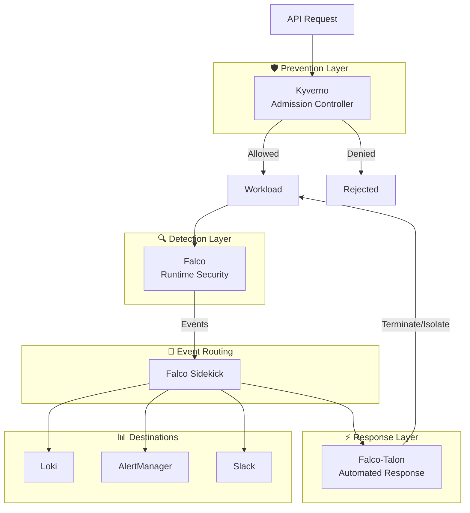

### Kyverno: Policy Enforcement

**Role:** Admission controller for policy enforcement at resource creation/modification time.

#### Key Policy Categories

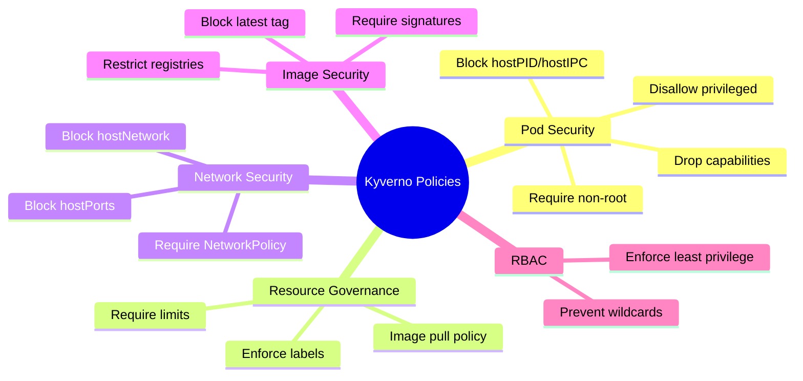

#### Platform-Specific Policies

**require-harbor-images (ClusterPolicy):**

```yaml
apiVersion: kyverno.io/v1
kind: ClusterPolicy
metadata:
  name: require-harbor-images
  annotations:
    policies.kyverno.io/title: Require Harbor Registry
    policies.kyverno.io/severity: high
spec:
  validationFailureAction: Enforce
  background: true
  rules:
    - name: validate-image-registry
      match:
        any:
          - resources:
              kinds:
                - Pod
      exclude:
        any:
          - resources:
              namespaces:
                - kube-system
                - rook-ceph
                - argocd
      validate:
        message: "Images must be from harbor.pnats.cloud registry"
        pattern:
          spec:
            containers:
              - image: "harbor.pnats.cloud/*"
            initContainers:
              - image: "harbor.pnats.cloud/*"
```

**disallow-latest-tag (ClusterPolicy):**

```yaml
apiVersion: kyverno.io/v1
kind: ClusterPolicy
metadata:
  name: disallow-latest-tag
spec:
  validationFailureAction: Enforce
  rules:
    - name: validate-image-tag
      match:
        any:
          - resources:
              kinds:
                - Pod
      validate:
        message: "Using ':latest' tag is not allowed"
        pattern:
          spec:
            containers:
              - image: "!*:latest"
```

**enforce-network-policy (ClusterPolicy):**

```yaml
apiVersion: kyverno.io/v1
kind: ClusterPolicy
metadata:
  name: enforce-network-policy
spec:
  validationFailureAction: Audit  # Start with audit
  rules:
    - name: require-network-policy
      match:
        any:
          - resources:
              kinds:
                - Namespace
      exclude:
        any:
          - resources:
              namespaces:
                - kube-system
                - kube-public
      validate:
        message: "Namespace must have at least one NetworkPolicy"
        deny:
          conditions:
            - key: "{{ request.object.metadata.name }}"
              operator: AnyIn
              value: "{{ networkpolicies.items[].metadata.namespace }}"
```

### Falco: Runtime Threat Detection

**Role:** Kernel-level syscall monitoring for runtime anomaly and threat detection.

#### Detection Categories

| Category | Examples |
|----------|----------|
| **Privilege Escalation** | Container escape, capability abuse, ptrace |
| **File Integrity** | /etc/shadow access, k8s secrets read |
| **Network Anomalies** | Unexpected outbound, port scanning, DNS exfil |
| **Process Anomalies** | Shells in containers, crypto mining, reverse shells |
| **K8s API Abuse** | Excessive API calls, unauthorized access |

#### Custom Platform Rules

```yaml
# Vault secret access monitoring
- rule: Unauthorized Vault Agent Access
  desc: Detect non-approved processes accessing Vault agent socket
  condition: >
    open_write and 
    fd.name startswith "/vault/secrets" and
    not proc.name in (vault, vault-agent, consul-template)
  output: >
    Unauthorized Vault secret access 
    (user=%user.name command=%proc.cmdline file=%fd.name container=%container.name)
  priority: WARNING
  tags: [platform, vault, secrets]

# ArgoCD credential access
- rule: ArgoCD Repo Credentials Access
  desc: Detect access to ArgoCD repository credentials
  condition: >
    open_read and
    fd.name contains "argocd-repo-creds" and
    not proc.name in (argocd-repo-server, argocd-application-controller)
  output: >
    ArgoCD repo credentials accessed by unexpected process
    (user=%user.name command=%proc.cmdline container=%container.name)
  priority: CRITICAL
  tags: [platform, argocd, credentials]

# Harbor registry bypass
- rule: Non-Harbor Registry Pull
  desc: Detect container pulls from non-Harbor registries
  condition: >
    spawned_process and
    proc.name = "docker" and
    proc.args contains "pull" and
    not proc.args contains "harbor.pnats.cloud"
  output: >
    Docker pull from non-Harbor registry detected
    (user=%user.name command=%proc.cmdline)
  priority: WARNING
  tags: [platform, harbor, compliance]
```

### Falco-Talon: Automated Response

**Role:** Response engine that takes automated action based on Falco alerts.

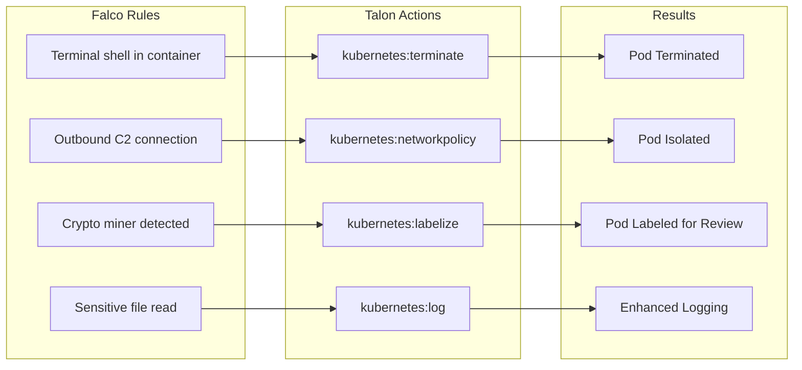

#### Talon Rules Configuration

```yaml
# falco-talon-rules.yaml
- action: Terminate on shell
  match:
    rules:
      - Terminal shell in container
    priority: Critical
  actions:
    - action: kubernetes:terminate
      parameters:
        grace_period_seconds: 0

- action: Isolate on C2 connection
  match:
    rules:
      - Outbound Connection to C2 Server
    priority: Critical
  actions:
    - action: kubernetes:networkpolicy
      parameters:
        allow:
          - "192.168.0.0/16"  # Internal only
    - action: slack:post
      parameters:
        channel: "#security-alerts"
        
- action: Label crypto miners
  match:
    rules:
      - Detect crypto miners
    priority: Warning
  actions:
    - action: kubernetes:labelize
      parameters:
        labels:
          security.pnats.cloud/quarantine: "true"
          security.pnats.cloud/reason: "crypto-mining"
```

---

## Kubernetes RBAC Integration

### OIDC Authentication to Kubernetes API

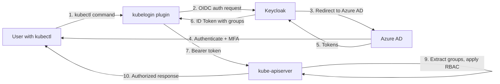

### API Server OIDC Configuration

| Flag | Value |
|------|-------|
| `--oidc-issuer-url` | `https://keycloak.pnats.cloud/realms/platform` |
| `--oidc-client-id` | `kubernetes` |
| `--oidc-username-claim` | `preferred_username` |
| `--oidc-groups-claim` | `groups` |
| `--oidc-username-prefix` | `-` (no prefix) |
| `--oidc-groups-prefix` | `oidc:` |

### ClusterRoleBindings

```yaml
# Platform Admins - cluster-admin
apiVersion: rbac.authorization.k8s.io/v1
kind: ClusterRoleBinding
metadata:
  name: oidc-platform-admins
subjects:
  - kind: Group
    name: "oidc:/platform-admins"
    apiGroup: rbac.authorization.k8s.io
roleRef:
  kind: ClusterRole
  name: cluster-admin
  apiGroup: rbac.authorization.k8s.io

---
# DevOps Engineers - edit in production namespaces
apiVersion: rbac.authorization.k8s.io/v1
kind: RoleBinding
metadata:
  name: oidc-devops-edit
  namespace: production
subjects:
  - kind: Group
    name: "oidc:/devops-engineers"
    apiGroup: rbac.authorization.k8s.io
roleRef:
  kind: ClusterRole
  name: edit
  apiGroup: rbac.authorization.k8s.io

---
# Developers - view in application namespaces
apiVersion: rbac.authorization.k8s.io/v1
kind: RoleBinding
metadata:
  name: oidc-developers-view
  namespace: apps
subjects:
  - kind: Group
    name: "oidc:/developers"
    apiGroup: rbac.authorization.k8s.io
roleRef:
  kind: ClusterRole
  name: view
  apiGroup: rbac.authorization.k8s.io
```

### kubelogin Configuration

**kubeconfig for OIDC authentication:**

```yaml
apiVersion: v1
kind: Config
clusters:
  - cluster:
      certificate-authority-data: ${CA_DATA}
      server: https://k8s.pnats.cloud:6443
    name: pn-production

contexts:
  - context:
      cluster: pn-production
      user: oidc
    name: pn-production

current-context: pn-production

users:
  - name: oidc
    user:
      exec:
        apiVersion: client.authentication.k8s.io/v1beta1
        command: kubectl
        args:
          - oidc-login
          - get-token
          - --oidc-issuer-url=https://keycloak.pnats.cloud/realms/platform
          - --oidc-client-id=kubernetes
          - --oidc-use-pkce
        interactiveMode: IfAvailable
```

---

## Implementation Plan

### Timeline Overview

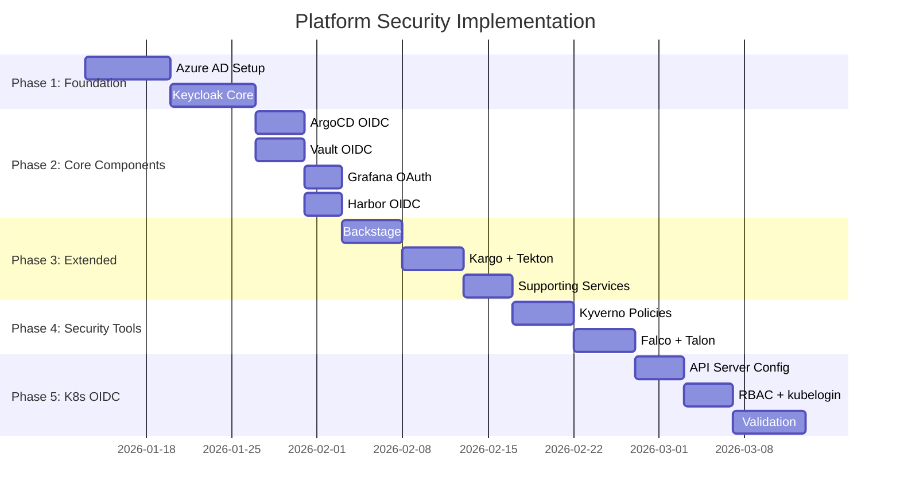

### Phase 1: Foundation (Week 1-2)

#### Azure AD Setup
- [ ] Create Enterprise Application `ProficientNow-Keycloak-OIDC`
- [ ] Configure group claims in token configuration
- [ ] Create security groups hierarchy (`PN-Tech-All` parent)
- [ ] Create role-specific subgroups
- [ ] Assign initial users to appropriate groups
- [ ] Document client ID and tenant ID

#### Keycloak Core
- [ ] Verify Keycloak deployment with PostgreSQL backend
- [ ] Create `platform` realm with security settings
- [ ] Configure Azure AD as OIDC identity provider
- [ ] Create identity provider mappers (email, name, groups)
- [ ] Create `groups` client scope with membership mapper
- [ ] Create Keycloak groups matching Azure AD groups
- [ ] Test end-to-end authentication flow
- [ ] Document realm configuration

### Phase 2: Core Components (Week 3-4)

#### ArgoCD
- [ ] Create `argocd` client in Keycloak
- [ ] Configure `argocd-cm` with OIDC settings
- [ ] Configure `argocd-rbac-cm` with group policies
- [ ] Store client secret in Vault
- [ ] Create ExternalSecret for client secret
- [ ] Test login and RBAC enforcement

#### Vault
- [ ] Create `vault` client in Keycloak
- [ ] Enable OIDC auth method
- [ ] Configure OIDC with Keycloak discovery URL
- [ ] Create Vault policies (admin, secrets-read, ci-cd, app-secrets-read)
- [ ] Create OIDC roles mapped to Keycloak groups
- [ ] Test login and policy enforcement

#### Grafana
- [ ] Create `grafana` client in Keycloak
- [ ] Configure Grafana OAuth settings
- [ ] Configure role_attribute_path JMESPath
- [ ] Store client secret in Vault
- [ ] Test login and role mapping

#### Harbor
- [ ] Create `harbor` client in Keycloak
- [ ] Configure OIDC in Harbor admin UI
- [ ] Set admin group to `/platform-admins`
- [ ] Configure group-to-project-role mappings
- [ ] Test login and project access

### Phase 3: Extended Components (Week 5-6)

#### Backstage
- [ ] Create `backstage` client in Keycloak
- [ ] Create `backstage-catalog` client for user sync
- [ ] Configure OIDC auth provider
- [ ] Configure Keycloak catalog plugin
- [ ] Set up user/group sync schedule
- [ ] Test login and catalog sync

#### Kargo
- [ ] Create `kargo` client in Keycloak
- [ ] Configure OIDC settings in Kargo
- [ ] Map groups to stage promotion permissions
- [ ] Test login and promotion workflows

#### Supporting Services
- [ ] Deploy OAuth2-proxy for Tekton Dashboard
- [ ] Configure Verdaccio authentication
- [ ] Set up OneUptime SSO
- [ ] Configure Temporal UI OAuth2-proxy
- [ ] Test all supporting service logins

### Phase 4: Security Tools (Week 7-8)

#### Kyverno
- [ ] Deploy Kyverno controller
- [ ] Create `require-harbor-images` policy (Audit mode)
- [ ] Create `disallow-latest-tag` policy (Audit mode)
- [ ] Create `require-labels` policy (Audit mode)
- [ ] Create `enforce-network-policy` policy (Audit mode)
- [ ] Review audit results
- [ ] Gradually enable Enforce mode
- [ ] Document exception procedures

#### Falco & Talon
- [ ] Deploy Falco with platform-specific rules
- [ ] Configure Falco Sidekick routing
- [ ] Deploy Falco-Talon
- [ ] Configure Talon response rules
- [ ] Test automated responses in non-prod
- [ ] Enable in production with monitoring
- [ ] Document incident response procedures

### Phase 5: Kubernetes OIDC (Week 9-10)

#### API Server Configuration
- [ ] Create `kubernetes` client in Keycloak (public)
- [ ] Configure kube-apiserver OIDC flags
- [ ] Restart API server with new configuration
- [ ] Verify OIDC token validation

#### RBAC & kubelogin
- [ ] Create ClusterRoleBindings for Keycloak groups
- [ ] Create namespace-scoped RoleBindings
- [ ] Install kubelogin on engineer workstations
- [ ] Distribute kubeconfig templates
- [ ] Test kubectl access for each role
- [ ] Document kubectl authentication procedure

#### Validation & Documentation
- [ ] End-to-end testing of all authentication flows
- [ ] Security review and penetration testing
- [ ] Create operational runbooks
- [ ] Create user onboarding documentation
- [ ] Training sessions for platform users

---

## Appendices

### Appendix A: Keycloak Clients Summary

| Client ID | Protocol | Access Type | Redirect URI Pattern | Default Scopes |
|-----------|----------|-------------|---------------------|----------------|
| `argocd` | OIDC | Confidential | `/auth/callback` | openid profile email groups |
| `grafana` | OIDC | Confidential | `/login/generic_oauth` | openid profile email groups |
| `harbor` | OIDC | Confidential | `/c/oidc/callback` | openid profile email groups |
| `vault` | OIDC | Confidential | `/ui/vault/auth/oidc/oidc/callback` | openid profile email groups |
| `backstage` | OIDC | Confidential | `/api/auth/oidc/handler/frame` | openid profile email groups |
| `backstage-catalog` | OIDC | Confidential | N/A (service account) | openid |
| `kargo` | OIDC | Confidential | `/auth/callback` | openid profile email groups |
| `tekton` | OIDC | Confidential | `/oauth2/callback` | openid profile email groups |
| `argo-rollouts` | OIDC | Confidential | `/auth/callback` | openid profile email groups |
| `kubernetes` | OIDC | Public | `http://localhost:8000` | openid profile email groups |

> **Note:** All clients should have the `groups` client scope added to their default scopes.

### Appendix B: Secrets Management

#### Vault Paths for Keycloak Secrets

| Vault Path | Keys | Target |
|------------|------|--------|
| `secret/platform/keycloak/clients` | `argocd-client-secret` | argocd-secret (argocd ns) |
| `secret/platform/keycloak/clients` | `grafana-client-secret` | grafana-oauth (monitoring ns) |
| `secret/platform/keycloak/clients` | `harbor-client-secret` | harbor-core (harbor ns) |
| `secret/platform/keycloak/clients` | `vault-client-secret` | vault-oidc (vault ns) |
| `secret/platform/keycloak/clients` | `backstage-client-secret` | backstage-auth (backstage ns) |
| `secret/platform/keycloak/clients` | `kargo-client-secret` | kargo-oidc (kargo ns) |
| `secret/platform/azure-ad` | `tenant-id`, `client-id`, `client-secret` | Keycloak IDP config |

#### ExternalSecret Example

```yaml
apiVersion: external-secrets.io/v1beta1
kind: ExternalSecret
metadata:
  name: argocd-oidc-secret
  namespace: argocd
spec:
  refreshInterval: 1h
  secretStoreRef:
    name: vault-backend
    kind: ClusterSecretStore
  target:
    name: argocd-secret
    creationPolicy: Merge
  data:
    - secretKey: oidc.keycloak.clientSecret
      remoteRef:
        key: secret/platform/keycloak/clients
        property: argocd-client-secret
```

### Appendix C: Troubleshooting Guide

#### Common Issues

| Issue | Symptom | Resolution |
|-------|---------|------------|
| Groups not in token | RBAC not working | Verify `groups` scope added to client, check mapper configuration |
| Login redirect loop | Infinite redirects | Check redirect URI matches exactly, verify client secret |
| User not created in Keycloak | First login fails | Verify Azure AD IDP sync mode is "Force" |
| Wrong role assigned | User has incorrect permissions | Check group membership in both Azure AD and Keycloak |
| Token expired | Frequent re-authentication | Adjust token lifespans in realm settings |

#### Debug Commands

```bash
# Verify Keycloak OIDC configuration
curl -s https://keycloak.pnats.cloud/realms/platform/.well-known/openid-configuration | jq

# Decode JWT token (paste token)
echo "YOUR_TOKEN" | cut -d'.' -f2 | base64 -d | jq

# Check ArgoCD OIDC config
kubectl get configmap argocd-cm -n argocd -o yaml | grep -A20 "oidc.config"

# Check Grafana OAuth status
kubectl logs -n monitoring deployment/grafana | grep -i oauth

# Verify Vault OIDC auth
vault read auth/oidc/config
vault read auth/oidc/role/platform-admin
```

---

## Document Control

| Version | Date | Author | Changes |
|---------|------|--------|---------|
| 1.0 | 2026-01-07 | Platform Team | Initial release |

---

*This document is maintained in Git and should be updated as the security architecture evolves.*
