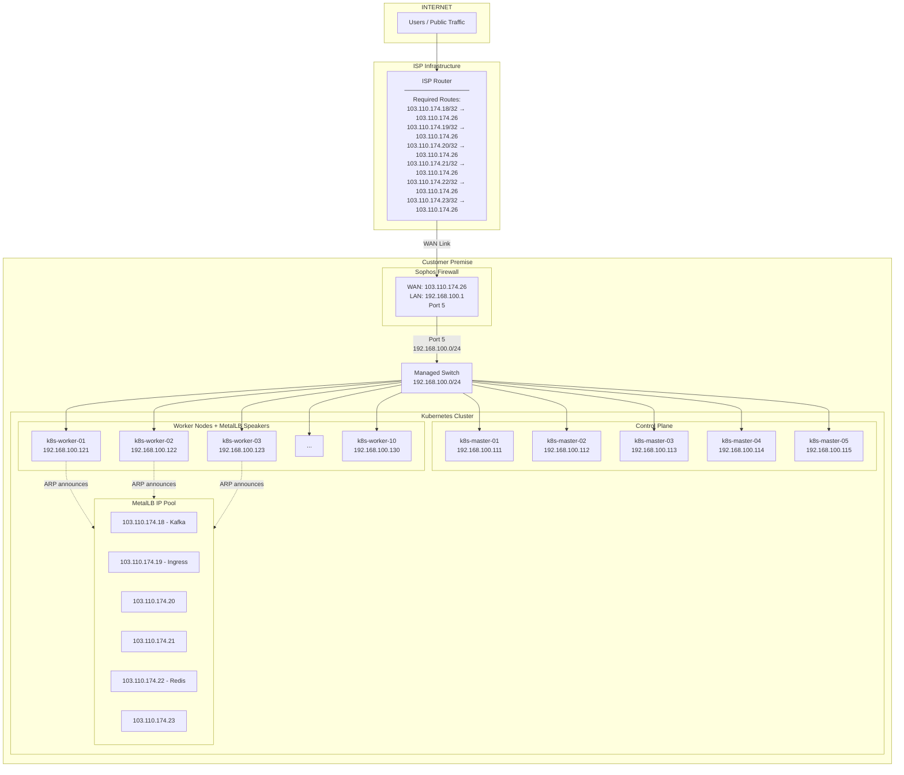
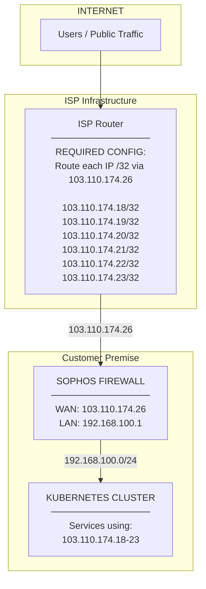

# Public IP Pool Routing Setup

## Current Situation

### Network Information

| Component | Value |
|-----------|-------|
| WAN IP (Sophos) | 103.110.174.26 |
| Public IP Pool | 103.110.174.18 - 103.110.174.23 (6 IPs) |
| Internal Network | 192.168.100.0/24 |
| Sophos Internal Port | Port 5 (dev port) |

### Internal Infrastructure

| Node | Internal IP | Role |
|------|-------------|------|
| k8s-master-01 | 192.168.100.111 | Control Plane |
| k8s-master-02 | 192.168.100.112 | Control Plane |
| k8s-master-03 | 192.168.100.113 | Control Plane |
| k8s-master-04 | 192.168.100.114 | Control Plane |
| k8s-master-05 | 192.168.100.115 | Control Plane |
| k8s-worker-01 | 192.168.100.121 | Worker |
| k8s-worker-02 | 192.168.100.122 | Worker |
| k8s-worker-03 | 192.168.100.123 | Worker |
| k8s-worker-04 | 192.168.100.124 | Worker |
| k8s-worker-05 | 192.168.100.125 | Worker |
| k8s-worker-06 | 192.168.100.126 | Worker |
| k8s-worker-07 | 192.168.100.127 | Worker |
| k8s-worker-08 | 192.168.100.128 | Worker |
| k8s-worker-09 | 192.168.100.129 | Worker |
| k8s-worker-10 | 192.168.100.130 | Worker |

### Currently Assigned Public IPs

| Public IP | Service |
|-----------|---------|
| 103.110.174.18 | Kafka Proxy |
| 103.110.174.19 | Ingress Controller (HTTP/HTTPS) |
| 103.110.174.22 | Redis External |

---

## The Problem

Traffic from the public internet cannot reach the IP pool (103.110.174.18-23) because:

1. **ISP has no route** - The ISP doesn't know to send traffic for these IPs to your WAN interface (103.110.174.26)
2. **Layer 2 limitation** - MetalLB Layer2 mode uses ARP, which only works on the local network segment

---

## Network Diagram



---

## Solution Options

### Option A: Static Routing (Simpler)

This is the simpler approach - no BGP required.

#### What ISP Needs To Do

Add static routes on their router for each IP (since the block is split with one gateway):

```
103.110.174.18/32 → 103.110.174.26
103.110.174.19/32 → 103.110.174.26
103.110.174.20/32 → 103.110.174.26
103.110.174.21/32 → 103.110.174.26
103.110.174.22/32 → 103.110.174.26
103.110.174.23/32 → 103.110.174.26
```

**Plain English for ISP:**
> "Please route the following individual IPs to our WAN IP 103.110.174.26:
> - 103.110.174.18/32
> - 103.110.174.19/32
> - 103.110.174.20/32
> - 103.110.174.21/32
> - 103.110.174.22/32
> - 103.110.174.23/32
>
> These are additional public IPs that should be forwarded to our firewall, which will
> route them to our internal servers. We need /32 routes because the IP block is not
> contiguous (split allocation)."

#### What You Need To Do on Sophos

1. **Ensure Port 5 has IP in 192.168.100.0/24** (e.g., 192.168.100.1)

2. **Add static routes for the public IP pool:**
   ```
   Destination: 103.110.174.18/32 → Gateway: 192.168.100.121 (or any worker)
   Destination: 103.110.174.19/32 → Gateway: 192.168.100.121
   Destination: 103.110.174.20/32 → Gateway: 192.168.100.121
   Destination: 103.110.174.21/32 → Gateway: 192.168.100.121
   Destination: 103.110.174.22/32 → Gateway: 192.168.100.121
   Destination: 103.110.174.23/32 → Gateway: 192.168.100.121
   ```

   **Note:** Point all routes to ONE worker node (e.g., k8s-worker-01). That node will use ARP to find the actual owner via MetalLB Layer2.

3. **Firewall Rules:**
   - Allow inbound traffic to 103.110.174.18-23 on required ports
   - Allow return traffic (stateful)

#### Pros/Cons

| Pros | Cons |
|------|------|
| Simple to understand | Single point of failure (gateway node) |
| No BGP knowledge needed | If gateway node dies, all public IPs fail |
| Works with current MetalLB Layer2 | Manual failover required |

---

### Option B: BGP Routing (Recommended)

This is more robust and is the standard approach for production environments.

#### What ISP Needs To Do

**Option B1: ISP does BGP peering with you**

```
BGP Peer: 103.110.174.26 (your Sophos WAN IP)
Your ASN: 65001 (private ASN - you pick this)
ISP ASN: [ISP provides this]
Prefixes you'll announce:
  - 103.110.174.18/32
  - 103.110.174.19/32
  - 103.110.174.20/32
  - 103.110.174.21/32
  - 103.110.174.22/32
  - 103.110.174.23/32
```

**Option B2: ISP uses static route (same as Option A)**

If ISP doesn't do BGP with customers, they just add:
```
103.110.174.18/32 → 103.110.174.26
103.110.174.19/32 → 103.110.174.26
103.110.174.20/32 → 103.110.174.26
103.110.174.21/32 → 103.110.174.26
103.110.174.22/32 → 103.110.174.26
103.110.174.23/32 → 103.110.174.26
```

Then YOU handle BGP internally between Sophos and MetalLB.

#### What You Need To Do

##### 1. Configure Sophos for BGP

On Sophos XG/XGS (if BGP supported):
```
Routing → BGP → Enable BGP
Local AS: 65001
Router ID: 192.168.100.1

Neighbor: 192.168.100.121 (or a virtual IP)
Remote AS: 65002
```

##### 2. Configure MetalLB for BGP

Replace your current L2Advertisement with BGP:

```yaml
apiVersion: metallb.io/v1beta2
kind: BGPPeer
metadata:
  name: sophos-peer
  namespace: metallb-system
spec:
  myASN: 65002
  peerASN: 65001
  peerAddress: 192.168.100.1  # Sophos internal IP
  peerPort: 179
---
apiVersion: metallb.io/v1beta1
kind: BGPAdvertisement
metadata:
  name: public-bgp-advertisement
  namespace: metallb-system
spec:
  ipAddressPools:
    - public-pool
```

##### 3. Keep your IPAddressPool (no changes needed)

```yaml
apiVersion: metallb.io/v1beta1
kind: IPAddressPool
metadata:
  name: public-pool
  namespace: metallb-system
spec:
  addresses:
    - 103.110.174.18-103.110.174.23
```

#### How BGP Works

```
1. MetalLB assigns 103.110.174.19 to ingress-nginx on k8s-worker-03

2. MetalLB speaker on worker-03 announces via BGP:
   "I have route to 103.110.174.19/32, next-hop is 192.168.100.123"

3. Sophos learns this route via BGP

4. When traffic for 103.110.174.19 arrives from ISP:
   - ISP sends to 103.110.174.26 (Sophos WAN)
   - Sophos looks up route, sees next-hop 192.168.100.123
   - Sophos forwards to k8s-worker-03
   - Traffic reaches the pod

5. If worker-03 dies, MetalLB moves the service to worker-05:
   - BGP withdraws old route
   - BGP announces new route with next-hop 192.168.100.125
   - Sophos updates routing table automatically
```

#### Pros/Cons

| Pros | Cons |
|------|------|
| Automatic failover | More complex initial setup |
| No single point of failure | Requires BGP knowledge |
| Industry standard | Sophos must support BGP |
| Dynamic route updates | |

---

## Recommendation

**For Low Maintenance:** Start with **Option A (Static Routing)** with the following enhancement:

1. Use **two gateway nodes** and configure VRRP or keepalived between them
2. Point Sophos routes to the VRRP virtual IP
3. If primary gateway dies, secondary takes over

**For Production Best Practice:** Use **Option B (BGP)** because:
- Automatic failover (no manual intervention)
- MetalLB handles all the routing logic
- Standard pattern used by cloud providers

---

## Information for ISP Ticket

### Minimum Required (for Static Routing)

```
Subject: Static Route Request for Additional IP Block

We need static routes configured on your router for our additional
public IPs. The block is split, so we need individual /32 routes:

103.110.174.18/32 → 103.110.174.26
103.110.174.19/32 → 103.110.174.26
103.110.174.20/32 → 103.110.174.26
103.110.174.21/32 → 103.110.174.26
103.110.174.22/32 → 103.110.174.26
103.110.174.23/32 → 103.110.174.26

Next-Hop Gateway: 103.110.174.26 (our WAN IP)

This will route our additional public IPs to our firewall,
which will then forward traffic to our internal servers.

Our WAN IP 103.110.174.26 is already configured and working.
We just need these additional IPs routed to it.
```

### For BGP Peering (if ISP supports it)

```
Subject: BGP Peering Request for Additional IP Block

We would like to establish BGP peering for our additional IP block.

Our Information:
- WAN IP: 103.110.174.26
- Our ASN: 65001 (private ASN)
- Prefixes we will announce (6 individual /32 routes):
  - 103.110.174.18/32
  - 103.110.174.19/32
  - 103.110.174.20/32
  - 103.110.174.21/32
  - 103.110.174.22/32
  - 103.110.174.23/32

Note: We use /32 routes because the IP block is split with a
single gateway, so aggregate routing is not possible.

Please provide:
- Your ASN
- Your peering IP
- Any MD5 password requirements
- Any prefix filters we should be aware of
```

---

## Diagram for ISP



**Traffic Flow:**
1. User requests 103.110.174.19 (our web service)
2. ISP routes to 103.110.174.26 (our firewall)
3. Firewall forwards to internal server
4. Response returns same path

---

## Next Steps

1. **Send ISP the static routing request** (see "Information for ISP Ticket" above)
2. **Ask ISP if they support BGP peering** (for future enhancement)
3. **Verify Sophos configuration:**
   - Port 5 has IP in 192.168.100.0/24
   - Static routes point to an internal gateway
   - Firewall rules allow traffic to public IP pool
4. **Test from external network** once ISP confirms route is added
