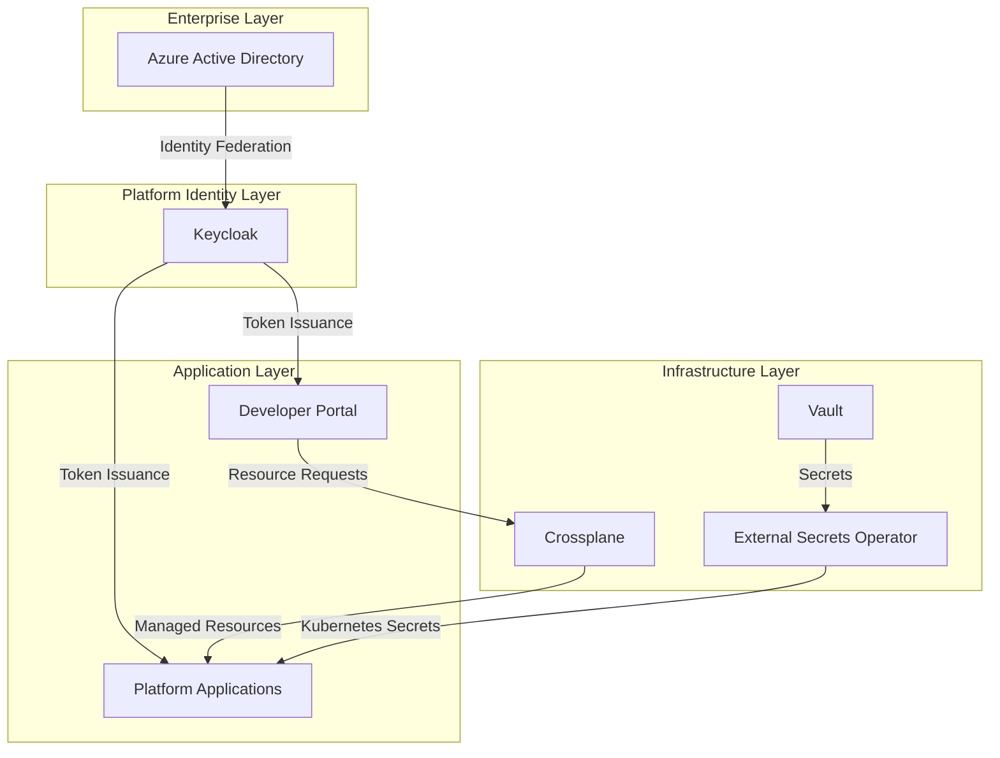
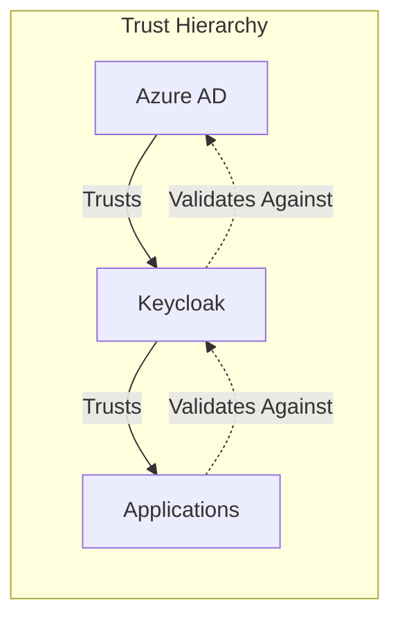
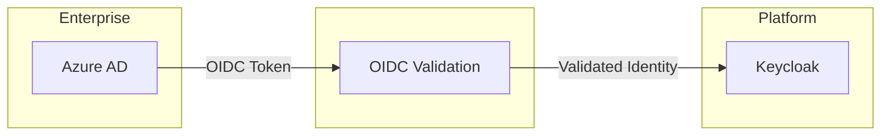
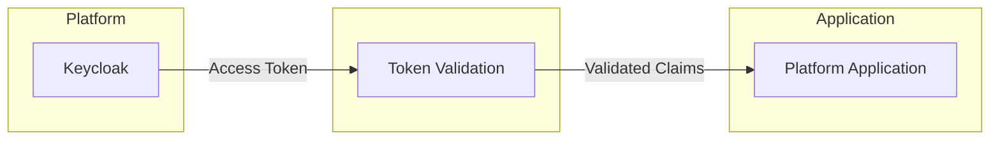
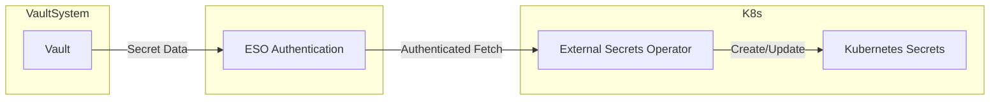
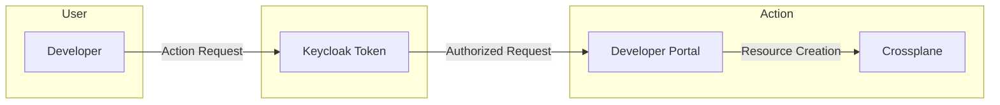
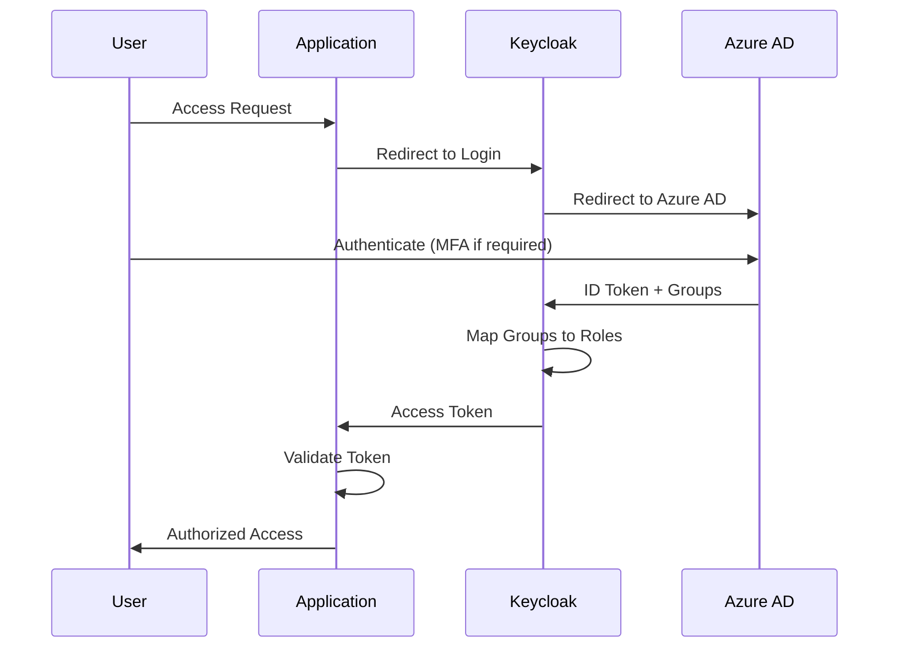
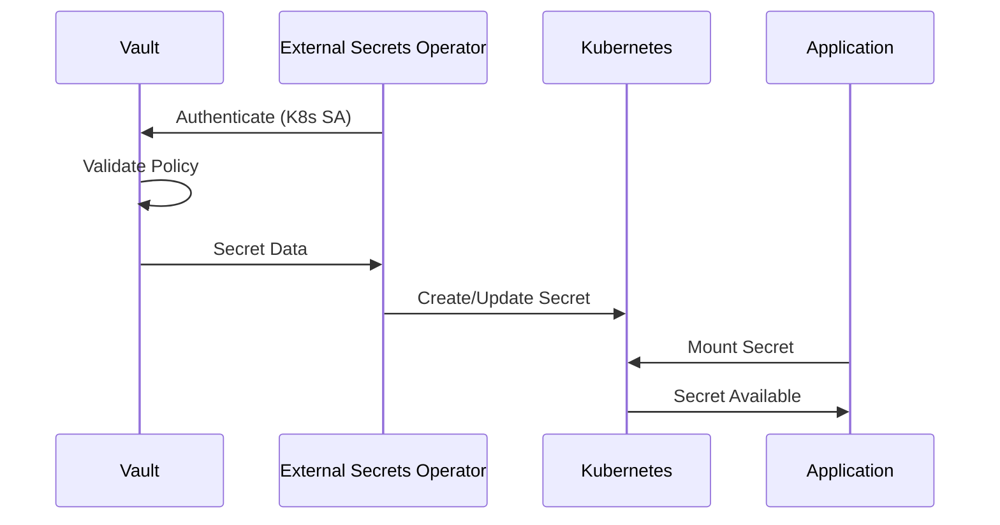
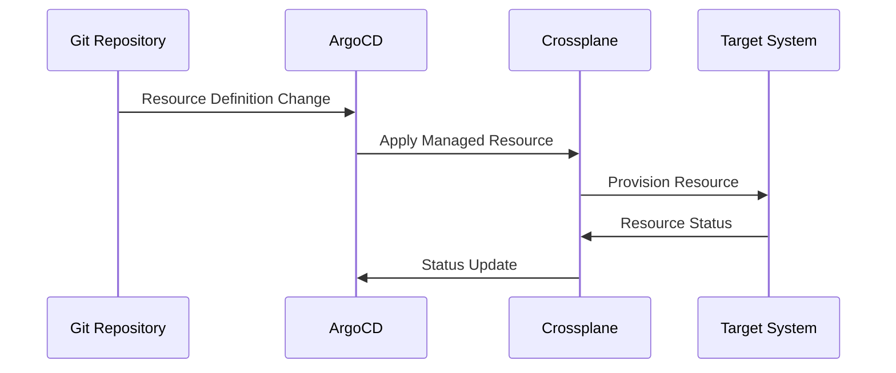

```
RFC-IAM-0001                                                  Section 3
Category: Standards Track                              Architecture
```

# 3. Architecture

[← Previous: Requirements](./02-requirements.md) | [Index](./00-index.md#table-of-contents) | [Next: Components →](./04-components.md)

---

## 3.1 System Overview

The federated identity and access management architecture establishes a layered system where each layer has distinct responsibilities and authorities. The design follows a principle of descending authority: upstream systems constrain downstream systems, but downstream systems cannot expand permissions granted by upstream systems.

### 3.1.1 Architectural Layers

The system comprises four distinct layers:



**Enterprise Layer**: Azure Active Directory serves as the authoritative source for organizational identity. This layer defines who users are, what groups they belong to, and what enterprise-level policies apply to them.

**Platform Identity Layer**: Keycloak serves as the platform's identity provider, federating with Azure AD for authentication while providing specialized authorization capabilities for platform applications.

**Infrastructure Layer**: Vault manages secrets, External Secrets Operator distributes secrets to namespaces, and Crossplane provisions application-specific resources.

**Application Layer**: Platform applications (container registries, package registries, developer portal, monitoring tools) consume identity services from Keycloak and secrets from ESO while being managed through Crossplane. The developer portal (Backstage) architecture is defined in RFC-DEVELOPER-PLATFORM.

### 3.1.2 Design Philosophy

The architecture embodies three core design principles:

**Principle 1: Authority Flows Downward**

Each layer receives authority from the layer above and cannot exceed that authority. Azure AD defines the maximum permission set; Keycloak can only grant subsets of that set; applications can only grant subsets of what Keycloak permits.

**Principle 2: Configuration Flows Through Git**

Structural configurations (what clients exist, what roles are defined, what resources should be created) flow through Git repositories and GitOps pipelines. This ensures version control, peer review, and auditability for infrastructure changes.

**Principle 3: Access Decisions Flow Through Keycloak**

All authorization decisions for platform applications flow through Keycloak. Applications do not make independent authorization decisions—they enforce decisions made by Keycloak based on token claims derived from Azure AD group memberships.

## 3.2 Trust Hierarchy Model

### 3.2.1 Trust Relationships

The system establishes explicit trust relationships between components:



| Trust Relationship | Description |
|--------------------|-------------|
| Azure AD → Keycloak | Azure AD trusts Keycloak as a registered application that can receive identity assertions |
| Keycloak → Applications | Keycloak trusts registered clients to enforce token-based authorization |
| Applications → Keycloak | Applications trust tokens signed by Keycloak's private key |
| Keycloak → Azure AD | Keycloak trusts Azure AD assertions about user identity and group membership |

### 3.2.2 Trust Verification

Trust is verified through cryptographic mechanisms at each boundary:

- **Azure AD to Keycloak**: OIDC ID tokens signed by Azure AD, verified against published JWKS
- **Keycloak to Applications**: Access tokens signed by Keycloak, verified against Keycloak's JWKS endpoint
- **Applications to Users**: Session tokens or API tokens derived from Keycloak access tokens

### 3.2.3 Trust Limitations

Trust does not imply permission equivalence. When Keycloak receives an identity assertion from Azure AD, it:

1. Accepts the identity claim (the user is who Azure AD says they are)
2. Accepts the group membership claims (the user belongs to the groups Azure AD asserts)
3. Does NOT assume any permissions beyond what those group memberships imply

This distinction is critical: Keycloak trusts Azure AD's identity assertions but derives authorization solely from the group memberships Azure AD provides.

## 3.3 Authority Domains

Each component has a defined authority domain—the scope of decisions it is empowered to make.

### 3.3.1 Azure AD Authority Domain

Azure AD holds authority over:

| Domain | Scope |
|--------|-------|
| Identity Lifecycle | User creation, suspension, termination |
| Group Membership | Which users belong to which organizational groups |
| Enterprise Policy | Conditional access, MFA requirements, sign-in risk |
| Organization Structure | Department, manager, location attributes |

Azure AD does NOT hold authority over:

- Platform-specific roles and permissions
- Application-level resource access
- Developer tool configurations

### 3.3.2 Keycloak Authority Domain

Keycloak holds authority over:

| Domain | Scope |
|--------|-------|
| Platform Roles | Definition of roles meaningful to platform applications |
| Role Mappings | Mapping Azure AD groups to platform roles (subject to Invariant 1) |
| Client Registration | Which applications can use Keycloak for authentication |
| Token Claims | What claims are included in tokens issued to applications |
| Session Management | Session duration, refresh policies, concurrent session limits |

Keycloak does NOT hold authority over:

- Enterprise identity lifecycle (defers to Azure AD)
- Secret management (defers to Vault)
- Application resource provisioning (defers to Crossplane)

### 3.3.3 Vault Authority Domain

Vault holds authority over:

| Domain | Scope |
|--------|-------|
| Secret Storage | Storage of all platform secrets |
| Secret Lifecycle | Creation, rotation, revocation of secrets |
| Access Policies | Which identities can access which secrets |
| Audit Logging | Recording of all secret access |

### 3.3.4 Crossplane Authority Domain

Crossplane holds authority over:

| Domain | Scope |
|--------|-------|
| Resource Provisioning | Creating resources in target systems (registry projects, package scopes, etc.) |
| Resource Reconciliation | Ensuring declared state matches actual state |
| Resource Lifecycle | Creation, update, deletion of managed resources |

### 3.3.5 Application Authority Domains

Individual platform applications hold authority only over their internal operations:

| Application Type | Authority Scope |
|------------------|-----------------|
| Container Registry | Image storage, vulnerability scanning, replication |
| Package Registry | Package storage, proxy caching, package metadata |
| Developer Portal | See RFC-DEVELOPER-PLATFORM |
| Monitoring Tools | Dashboard access, alert management, metric queries |

Applications do NOT hold authority over authentication or coarse-grained authorization—these decisions are made by Keycloak and enforced by the application.

## 3.4 Trust Boundaries

Trust boundaries define points where security context changes and validation must occur.

### 3.4.1 Boundary: Enterprise to Platform



**Crossing Mechanism**: OIDC authentication flow

**Validation Requirements**:
- Token signature verification against Azure AD JWKS
- Token issuer validation
- Token audience validation
- Token expiration validation
- Nonce validation (for authorization code flow)

**Security Properties Preserved**:
- User identity authenticity
- Group membership claims
- Enterprise policy compliance (MFA, conditional access already enforced by Azure AD)

### 3.4.2 Boundary: Platform to Application



**Crossing Mechanism**: OIDC or OAuth 2.0 access tokens

**Validation Requirements**:
- Token signature verification against Keycloak JWKS
- Token issuer validation (must be Keycloak)
- Token audience validation (must include this application)
- Token expiration validation
- Scope and claim validation

**Security Properties Preserved**:
- User identity (sub claim)
- Granted roles (realm and client roles)
- Group memberships (as claims)

### 3.4.3 Boundary: Vault to Namespace



**Crossing Mechanism**: Vault authentication (Kubernetes auth method)

**Validation Requirements**:
- ESO service account authentication to Vault
- Vault policy evaluation for requested secret paths
- Namespace scope validation

**Security Properties Preserved**:
- Secret confidentiality during transfer
- Namespace isolation (secrets only distributed to authorized namespaces)
- Audit trail of secret access

### 3.4.4 Boundary: User to Developer Portal Action

The developer portal (Backstage) architecture is defined in RFC-DEVELOPER-PLATFORM. This section documents only the identity trust boundary.



**Crossing Mechanism**: Keycloak token validation within the developer portal

**Validation Requirements**:
- Valid Keycloak token with required claims
- Permission claims determine what UI elements and actions are available

**Security Properties Preserved**:
- Authentication derived from Keycloak (which derives from Azure AD)
- Audit trail of who requested what action
- Resource creation attributed to authenticated user

See RFC-DEVELOPER-PLATFORM for the capability-based authorization model where the portal shows users only what they can do.

## 3.5 Data Flow Model

### 3.5.1 Authentication Data Flow



The authentication flow ensures that:
1. Users always authenticate against Azure AD first
2. Keycloak receives Azure AD's identity assertion
3. Keycloak maps Azure AD groups to platform roles
4. Applications receive tokens with both identity and authorization claims

### 3.5.2 Authorization Data Flow

Authorization data flows through the system as token claims:

| Stage | Data | Form |
|-------|------|------|
| Azure AD | Group memberships | OIDC claims in ID token |
| Keycloak | Roles derived from groups | Claims in access token |
| Application | Permission decisions | Local enforcement based on claims |

The key property is that authorization data originates from Azure AD and can only be restricted (not expanded) as it flows through the system.

### 3.5.3 Secret Data Flow



Secrets flow unidirectionally from Vault to applications:
1. ESO authenticates to Vault using Kubernetes service account
2. Vault validates access policy for the requested secret path
3. Vault returns secret data to ESO
4. ESO creates or updates Kubernetes Secret in target namespace
5. Application mounts secret through standard Kubernetes mechanisms

### 3.5.4 Resource Provisioning Data Flow



Resource definitions flow from Git through the GitOps pipeline:
1. Resource definitions committed to Git
2. ArgoCD detects changes and applies to cluster
3. Crossplane reconciles managed resources
4. Target systems receive provisioning requests
5. Status propagates back through the chain

---

## Document Navigation

| Previous | Index | Next |
|----------|-------|------|
| [← 2. Requirements](./02-requirements.md) | [Table of Contents](./00-index.md#table-of-contents) | [4. Components →](./04-components.md) |

---

*End of Section 3*
