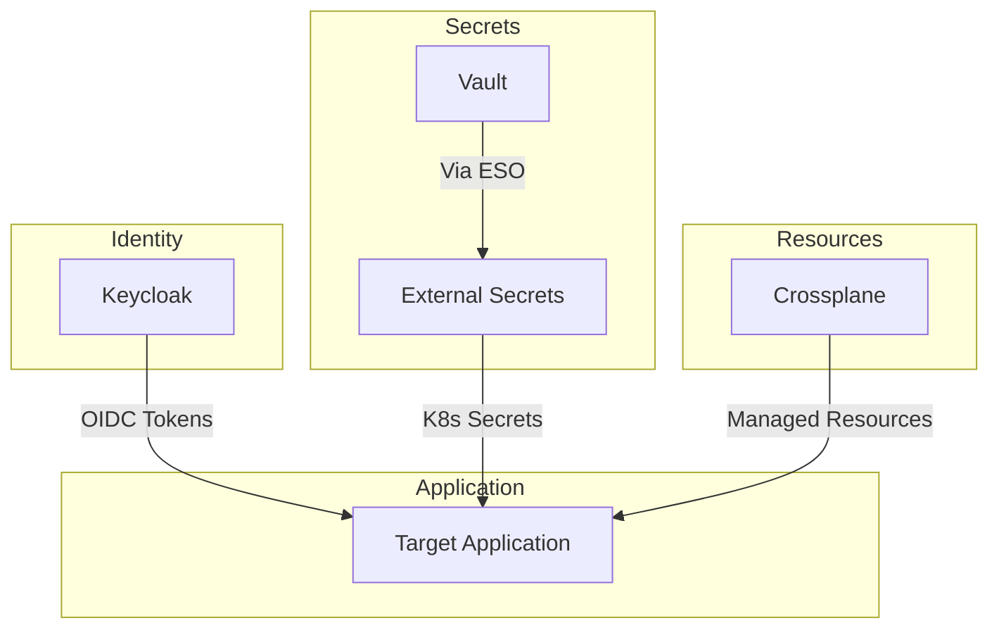
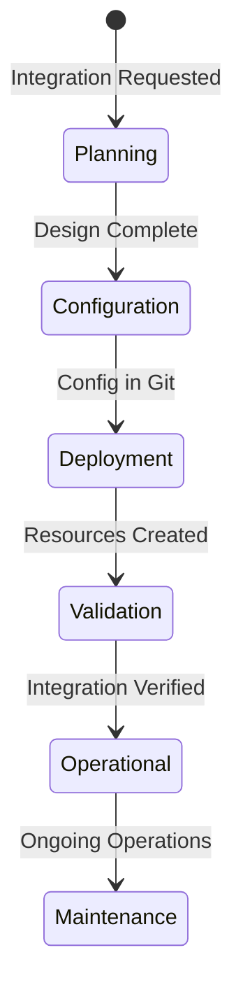
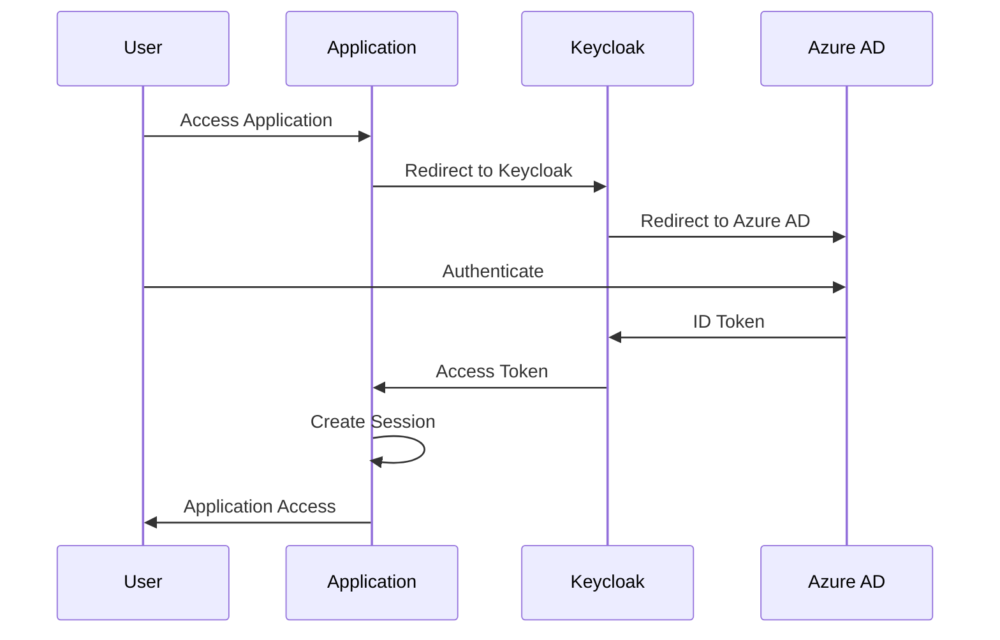
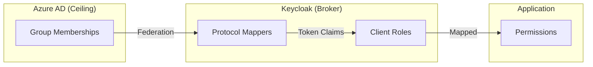
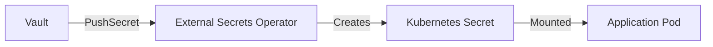
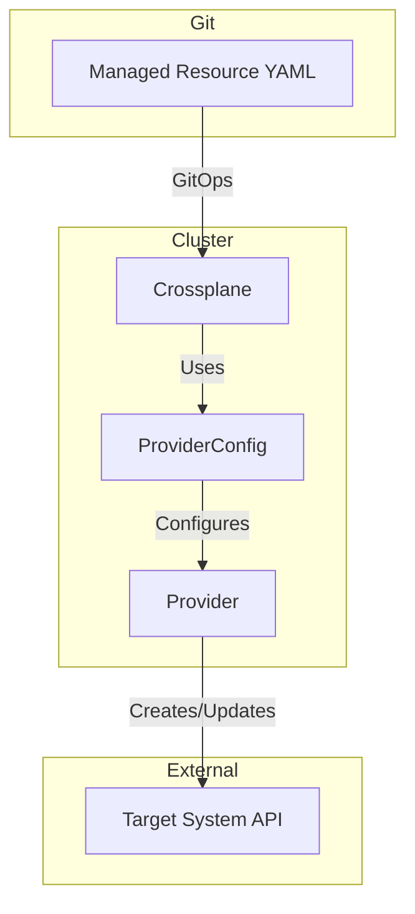
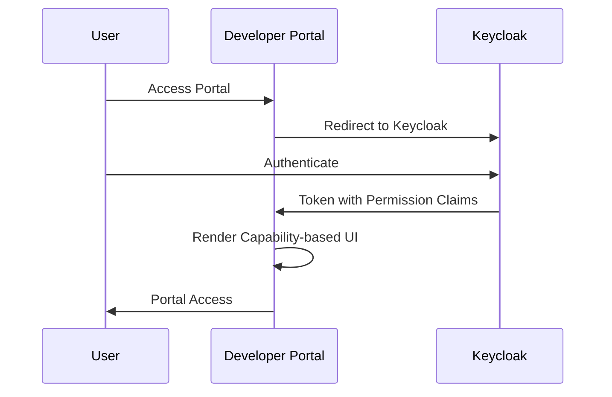
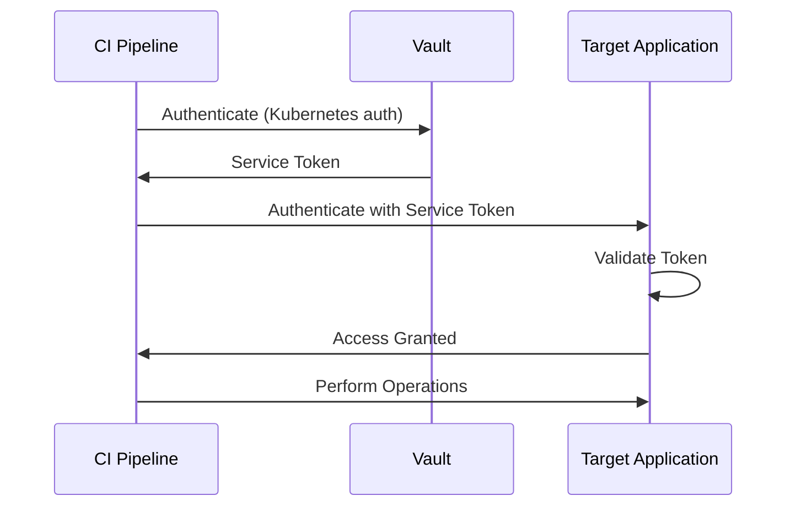

```
RFC-IAM-0001                                                  Section 8
Category: Standards Track                    Application Integration
```

# 8. Application Integration

[← Previous: GitOps Integration](./07-gitops-integration.md) | [Index](./00-index.md#table-of-contents) | [Next: Rationale →](./09-rationale.md)

---

## 8.1 Integration Patterns

### 8.1.1 Standard Integration Model

All platform applications follow a standard integration model:



### 8.1.2 Integration Components

Each application integration comprises:

| Component | Purpose | Configuration Source |
|-----------|---------|---------------------|
| OIDC Client | Authentication with Keycloak | Helm values → Keycloak config |
| ExternalSecret | Secret distribution from Vault | Helm values → ESO resources |
| Crossplane Resources | Application resource management | Helm values → Managed resources |
| Application Config | Application-specific settings | Helm values → ConfigMaps |

### 8.1.3 Integration Lifecycle

Application integration follows defined phases:



**Planning**: Define integration requirements, map Keycloak roles, identify secrets

**Configuration**: Create Helm values, define ExternalSecrets, template Crossplane resources

**Deployment**: Commit to Git, GitOps deploys resources

**Validation**: Verify authentication flow, confirm authorization, test resource management

**Operational**: Monitor integration health, handle incidents

## 8.2 Authentication Integration

### 8.2.1 OIDC Authentication Flow

Applications authenticate users through Keycloak OIDC:



### 8.2.2 Keycloak Client Configuration

Each application requires a Keycloak client with:

| Setting | Description | Example |
|---------|-------------|---------|
| Client ID | Unique identifier for application | `my-application` |
| Client Protocol | Authentication protocol | `openid-connect` |
| Access Type | Confidential (with secret) or public | `confidential` |
| Valid Redirect URIs | Allowed callback URLs | `https://app.example.com/callback` |
| Token Claims | Claims included in tokens | Groups, roles, email |

### 8.2.3 Token Claim Mapping

Keycloak tokens include claims for authorization decisions:

| Claim | Source | Purpose |
|-------|--------|---------|
| `sub` | Keycloak user ID | Unique user identifier |
| `email` | Azure AD | User email address |
| `groups` | Azure AD (via federation) | Group memberships |
| `resource_access.<client>.roles` | Keycloak client roles | Application-specific roles |
| `realm_access.roles` | Keycloak realm roles | Cross-application roles |

## 8.3 Authorization Integration

### 8.3.1 Authorization Model

Applications derive permissions from Keycloak token claims:



### 8.3.2 Role Mapping Pattern

Applications map Keycloak claims to internal permissions:

| Application Concept | Keycloak Source | Example Mapping |
|---------------------|-----------------|-----------------|
| Read Access | Group membership | `groups` contains `team-developers` |
| Write Access | Client role | `resource_access.<client>.roles` contains `contributor` |
| Admin Access | Client role | `resource_access.<client>.roles` contains `admin` |
| Super Admin | Realm role | `realm_access.roles` contains `platform-admin` |

### 8.3.3 Permission Inheritance

Permissions follow a hierarchical model:

```
Azure AD Group Membership (Ceiling)
    └── Keycloak Realm Role
        └── Keycloak Client Role
            └── Application Permission
```

Applications MUST NOT grant permissions that exceed what the user's Azure AD groups permit.

## 8.4 Secrets Integration

### 8.4.1 Secret Distribution Pattern

Secrets flow from Vault to applications through ESO:



### 8.4.2 Common Secret Types

Applications typically require these secret categories:

| Secret Type | Vault Path Pattern | Purpose |
|-------------|-------------------|---------|
| OIDC Client Secret | `secret/platform/<app>/oidc-client` | Keycloak authentication |
| Database Credentials | `secret/platform/<app>/db-credentials` | Database access |
| API Keys | `secret/platform/<app>/api-keys` | External service access |
| TLS Certificates | `secret/platform/<app>/tls` | HTTPS termination |
| Service Tokens | `secret/platform/<app>/service-token` | Inter-service auth |

### 8.4.3 ExternalSecret Configuration

Each application defines ExternalSecret resources in its Helm chart:

```yaml
# Conceptual structure (not actual implementation)
apiVersion: external-secrets.io/v1beta1
kind: ExternalSecret
metadata:
  name: {{ .Release.Name }}-secrets
spec:
  refreshInterval: 1h
  secretStoreRef:
    name: vault-backend
    kind: ClusterSecretStore
  target:
    name: {{ .Release.Name }}-secrets
  data:
    - secretKey: oidc-client-secret
      remoteRef:
        key: secret/platform/{{ .Values.application.name }}/oidc-client
        property: client_secret
```

## 8.5 Crossplane Resource Integration

### 8.5.1 Managed Resource Pattern

Applications requiring external resources use Crossplane:



### 8.5.2 Common Resource Types

| Resource Category | Examples | Provider Type |
|-------------------|----------|---------------|
| Registry Resources | Projects, robot accounts | Container Registry Provider |
| Package Resources | Scopes, organizations | Package Registry Provider |
| Database Resources | Schemas, users | Database Provider (PostgreSQL, etc.) |
| Cloud Resources | Storage, DNS | Cloud Provider (AWS/Azure/GCP) |

### 8.5.3 Template Coupling

Crossplane resources MUST be templated within application Helm charts:

**Key Principle**: Resource lifecycle tied to application lifecycle.

This ensures:
- Single values file controls both application and resources
- Deletion of application removes associated resources
- No orphaned resources in target systems
- Clear ownership and responsibility

## 8.6 Developer Portal Integration (Reference: RFC-DEVELOPER-PLATFORM)

The developer portal (Backstage) integration is defined in RFC-DEVELOPER-PLATFORM (planned).

### 8.6.1 Identity Integration Requirements

This RFC establishes the identity integration requirements for the developer portal:



### 8.6.2 Keycloak Client Requirements

The developer portal requires a Keycloak client:

| Setting | Value |
|---------|-------|
| Client ID | `developer-portal` |
| Client Protocol | `openid-connect` |
| Access Type | `confidential` |
| Valid Redirect URIs | Portal callback URLs |
| Token Claims | Groups, roles, permissions |

### 8.6.3 Authorization Model

RFC-DEVELOPER-PLATFORM defines the capability-based authorization model where:
- Keycloak token claims determine available UI elements and actions
- Users see only what they can do (no runtime authorization blocking)
- Authorization is enforced at the UI layer through visibility

## 8.7 Extension Model

### 8.7.1 Adding New Applications

New applications follow the established integration pattern:

1. **Define Keycloak Client**: Create client configuration in Keycloak realm config
2. **Map Authorization**: Determine which Keycloak roles/groups map to application permissions
3. **Identify Secrets**: List secrets required by the application
4. **Create ExternalSecrets**: Define ESO resources for secret distribution
5. **Template Crossplane Resources**: Define any managed resources the application requires
6. **Create Helm Chart**: Package configuration in application Helm chart
7. **Configure Application**: Set up OIDC integration within the application
8. **Validate Integration**: Test authentication and authorization flows

### 8.7.2 Integration Checklist

| Requirement | Verification |
|-------------|--------------|
| OIDC client registered | Client appears in Keycloak admin console |
| Client secret in Vault | Secret accessible at expected path |
| ExternalSecret syncing | Kubernetes Secret exists in namespace |
| Authentication functional | Users can log in through Keycloak |
| Authorization enforced | Permissions reflect Keycloak claims |
| Crossplane resources reconciling | Resources exist in target system |
| GitOps configuration complete | All config committed to Git |

### 8.7.3 Provider Development

When Crossplane providers don't exist for an application:

**Option 1: Use Kubernetes Provider**
- Define resources as Kubernetes manifests
- Apply through standard deployment
- Limited to Kubernetes-native resources

**Option 2: Use Terraform Provider**
- Leverage existing Terraform providers
- Bridge through Crossplane Terraform provider
- Inherits Terraform provider capabilities

**Option 3: Develop Custom Provider**
- Build Crossplane provider for application API
- Full control over resource management
- Significant development investment

### 8.7.4 Common Integration Challenges

| Challenge | Mitigation |
|-----------|------------|
| Application lacks OIDC support | Use OIDC proxy (OAuth2 Proxy) |
| Application has incompatible token format | Configure Keycloak protocol mappers |
| Application requires specific claims | Add custom claims through Keycloak |
| No Crossplane provider exists | Use alternative approaches (8.7.3) |
| Application manages its own secrets | Inject through init container or sidecar |

## 8.8 CI/CD Integration

### 8.8.1 Service Account Authentication

CI/CD pipelines require non-interactive authentication:



### 8.8.2 Robot Accounts

Applications that support robot/service accounts:

| Account Type | Purpose | Credential Source |
|--------------|---------|-------------------|
| Robot Account | Automated API access | Vault (created by Crossplane) |
| Service Account | Kubernetes workload identity | Kubernetes ServiceAccount |
| API Token | External service access | Vault |

Robot accounts bypass OIDC authentication—they use direct token authentication suitable for automated systems.

---

## Document Navigation

| Previous | Index | Next |
|----------|-------|------|
| [← 7. GitOps Integration](./07-gitops-integration.md) | [Table of Contents](./00-index.md#table-of-contents) | [9. Rationale →](./09-rationale.md) |

---

*End of Section 8*
