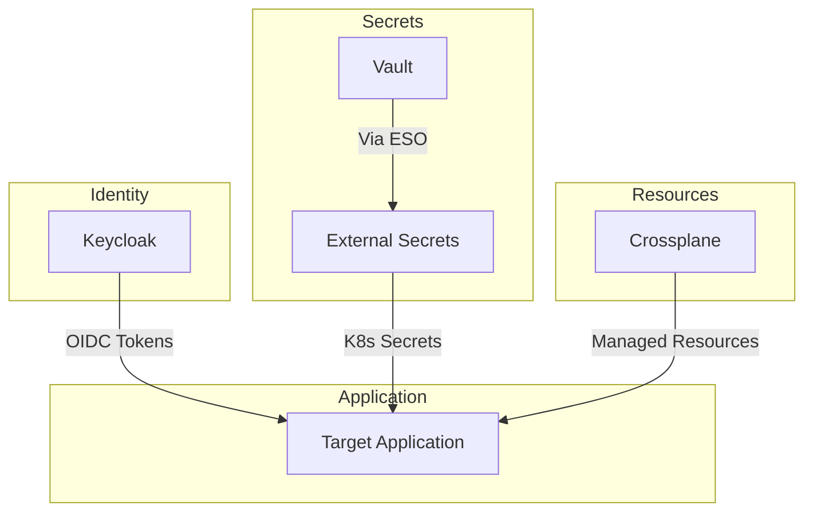
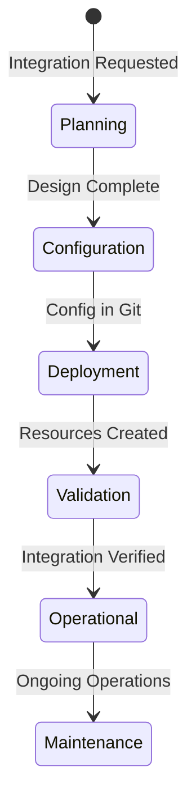
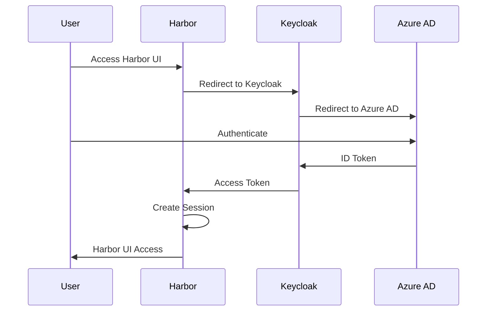
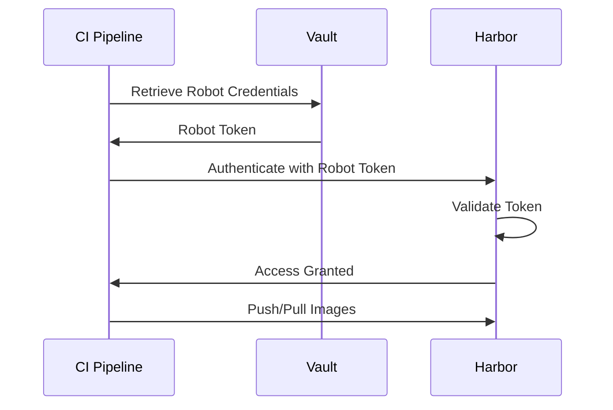
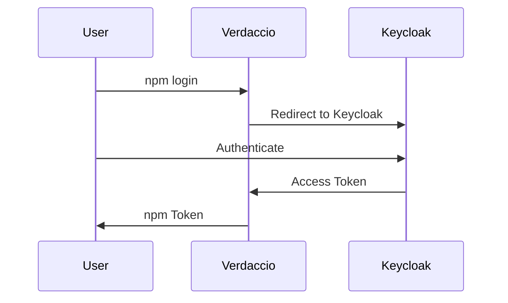
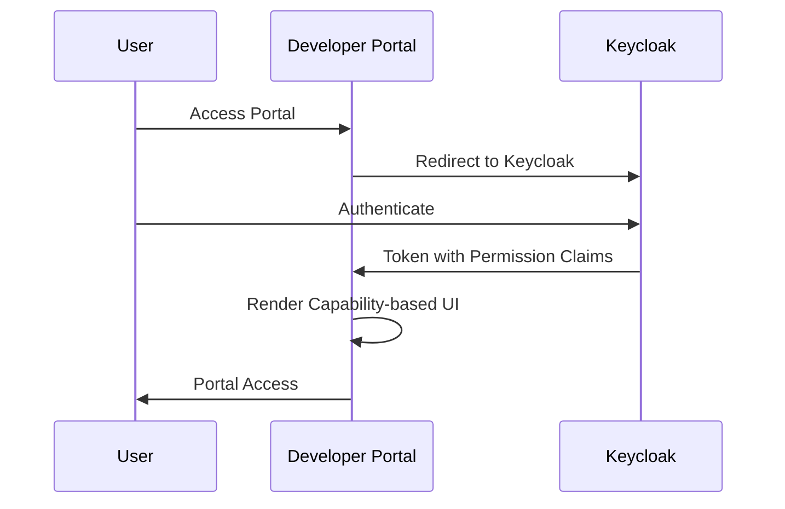

```
RFC-IAM-0001                                                  Section 8
Category: Standards Track                    Application Integration
```

# 8. Application Integration

[← Previous: GitOps Integration](./07-gitops-integration.md) | [Index](./00-index.md#table-of-contents) | [Next: Rationale →](./09-rationale.md)

---

## 8.1 Integration Patterns

### 8.1.1 Standard Integration Model

All platform applications follow a standard integration model:



### 8.1.2 Integration Components

Each application integration comprises:

| Component | Purpose | Configuration Source |
|-----------|---------|---------------------|
| OIDC Client | Authentication with Keycloak | Helm values → Keycloak config |
| ExternalSecret | Secret distribution from Vault | Helm values → ESO resources |
| Crossplane Resources | Application resource management | Helm values → Managed resources |
| Application Config | Application-specific settings | Helm values → ConfigMaps |

### 8.1.3 Integration Lifecycle

Application integration follows defined phases:



**Planning**: Define integration requirements, map Keycloak roles, identify secrets

**Configuration**: Create Helm values, define ExternalSecrets, template Crossplane resources

**Deployment**: Commit to Git, GitOps deploys resources

**Validation**: Verify authentication flow, confirm authorization, test resource management

**Operational**: Monitor integration health, handle incidents

## 8.2 Harbor Integration

### 8.2.1 Authentication Flow

Harbor authenticates users through Keycloak OIDC:



### 8.2.2 Authorization Model

Harbor authorization maps Keycloak claims to Harbor permissions:

| Keycloak Claim | Harbor Permission |
|----------------|-------------------|
| `groups` contains project group | Project member access |
| `resource_access.harbor.roles` contains `developer` | Push/pull access |
| `resource_access.harbor.roles` contains `admin` | Project administration |
| `resource_access.harbor.roles` contains `harbor-admin` | System administration |

Harbor enforces these permissions through OIDC group-to-role mapping configured within Harbor.

### 8.2.3 Keycloak Client Configuration

Harbor requires a Keycloak client with:

| Setting | Value |
|---------|-------|
| Client ID | `harbor` |
| Client Protocol | `openid-connect` |
| Access Type | `confidential` |
| Valid Redirect URIs | Harbor callback URLs |
| Token Claims | Groups, roles, email |

### 8.2.4 Secret Requirements

Harbor requires secrets distributed through ESO:

| Secret | Vault Path | Purpose |
|--------|------------|---------|
| OIDC Client Secret | `secret/platform/harbor/oidc-client` | Keycloak authentication |
| Database Credentials | `secret/platform/harbor/db-credentials` | PostgreSQL access |
| Admin Password | `secret/platform/harbor/admin-password` | Initial admin setup |
| Storage Credentials | `secret/platform/harbor/storage` | Object storage access |

### 8.2.5 Crossplane Resources

Harbor resources managed through Crossplane:

**Harbor Projects**:
- Created through Crossplane Harbor provider
- Defined in Helm templates
- Lifecycle tied to application deployment

**Robot Accounts**:
- Service accounts for CI/CD access
- Credentials stored in Vault after creation
- Scoped to specific projects

### 8.2.6 CI/CD Integration

CI/CD pipelines access Harbor through robot accounts:



Robot accounts are not subject to OIDC authentication—they use direct token authentication suitable for automated systems.

## 8.3 Verdaccio Integration

### 8.3.1 Authentication Flow

Verdaccio authenticates users through Keycloak:



For web UI access, standard OIDC redirect flow applies. For CLI access, Verdaccio issues npm-compatible tokens after OIDC authentication.

### 8.3.2 Authorization Model

Verdaccio authorization maps Keycloak claims to package permissions:

| Keycloak Claim | Verdaccio Permission |
|----------------|---------------------|
| `groups` contains scope group | Read packages in scope |
| `resource_access.verdaccio.roles` contains `publisher` | Publish packages |
| `resource_access.verdaccio.roles` contains `org-admin` | Manage organization |

### 8.3.3 Keycloak Client Configuration

Verdaccio requires a Keycloak client with:

| Setting | Value |
|---------|-------|
| Client ID | `verdaccio` |
| Client Protocol | `openid-connect` |
| Access Type | `confidential` |
| Valid Redirect URIs | Verdaccio callback URLs |
| Token Claims | Groups, roles |

### 8.3.4 Secret Requirements

Verdaccio requires secrets distributed through ESO:

| Secret | Vault Path | Purpose |
|--------|------------|---------|
| OIDC Client Secret | `secret/platform/verdaccio/oidc-client` | Keycloak authentication |
| Storage Credentials | `secret/platform/verdaccio/storage` | Package storage access |
| JWT Secret | `secret/platform/verdaccio/jwt-secret` | Token signing |

### 8.3.5 Crossplane Resources

Verdaccio resources managed through Crossplane:

**Organizations/Scopes**:
- Package scopes for team/project isolation
- Access policies tied to Keycloak groups
- Lifecycle managed through GitOps

### 8.3.6 Package Scope Model

Packages are organized by scope aligned with organizational structure:

| Scope | Access Group | Example Package |
|-------|--------------|-----------------|
| `@platform` | Platform-Developers | `@platform/common-utils` |
| `@team-alpha` | Team-Alpha-Members | `@team-alpha/service-lib` |
| `@shared` | All authenticated | `@shared/logging` |

Scope access is enforced through Keycloak group membership—users can only access scopes their groups permit.

## 8.4 Developer Portal Integration (Reference: RFC-DEVELOPER-PLATFORM)

The developer portal (Backstage) integration is defined in RFC-DEVELOPER-PLATFORM (planned).

### 8.4.1 Identity Integration Requirements

This RFC establishes the identity integration requirements for the developer portal:



### 8.4.2 Keycloak Client Requirements

The developer portal requires a Keycloak client:

| Setting | Value |
|---------|-------|
| Client ID | `developer-portal` |
| Client Protocol | `openid-connect` |
| Access Type | `confidential` |
| Valid Redirect URIs | Portal callback URLs |
| Token Claims | Groups, roles, permissions |

### 8.4.3 Secret Requirements

Developer portal secrets are managed per RFC-SECOPS-0001:

| Secret | Vault Path | Purpose |
|--------|------------|---------|
| OIDC Client Secret | `secret/platform/developer-portal/oidc-client` | Keycloak authentication |

Additional secrets (GitHub tokens, database credentials) are defined in RFC-DEVELOPER-PLATFORM.

### 8.4.4 Authorization Model

RFC-DEVELOPER-PLATFORM defines the capability-based authorization model where:
- Keycloak token claims determine available UI elements and actions
- Users see only what they can do (no runtime authorization blocking)
- Authorization is enforced at the UI layer through visibility

## 8.5 Extension Model

### 8.5.1 Adding New Applications

New applications follow the established integration pattern:

1. **Define Keycloak Client**: Create client configuration in Keycloak realm config
2. **Map Authorization**: Determine which Keycloak roles/groups map to application permissions
3. **Identify Secrets**: List secrets required by the application
4. **Create ExternalSecrets**: Define ESO resources for secret distribution
5. **Template Crossplane Resources**: Define any managed resources the application requires
6. **Create Helm Chart**: Package configuration in application Helm chart
7. **Configure Application**: Set up OIDC integration within the application
8. **Validate Integration**: Test authentication and authorization flows

### 8.5.2 Integration Checklist

| Requirement | Verification |
|-------------|--------------|
| OIDC client registered | Client appears in Keycloak admin console |
| Client secret in Vault | Secret accessible at expected path |
| ExternalSecret syncing | Kubernetes Secret exists in namespace |
| Authentication functional | Users can log in through Keycloak |
| Authorization enforced | Permissions reflect Keycloak claims |
| Crossplane resources reconciling | Resources exist in target system |
| GitOps configuration complete | All config committed to Git |

### 8.5.3 Provider Development

When Crossplane providers don't exist for an application:

**Option 1: Use Kubernetes Provider**
- Define resources as Kubernetes manifests
- Apply through standard deployment
- Limited to Kubernetes-native resources

**Option 2: Use Terraform Provider**
- Leverage existing Terraform providers
- Bridge through Crossplane Terraform provider
- Inherits Terraform provider capabilities

**Option 3: Develop Custom Provider**
- Build Crossplane provider for application API
- Full control over resource management
- Significant development investment

### 8.5.4 Common Integration Challenges

| Challenge | Mitigation |
|-----------|------------|
| Application lacks OIDC support | Use OIDC proxy (OAuth2 Proxy) |
| Application has incompatible token format | Configure Keycloak protocol mappers |
| Application requires specific claims | Add custom claims through Keycloak |
| No Crossplane provider exists | Use alternative approaches (8.5.3) |
| Application manages its own secrets | Inject through init container or sidecar |

---

## Document Navigation

| Previous | Index | Next |
|----------|-------|------|
| [← 7. GitOps Integration](./07-gitops-integration.md) | [Table of Contents](./00-index.md#table-of-contents) | [9. Rationale →](./09-rationale.md) |

---

*End of Section 8*
