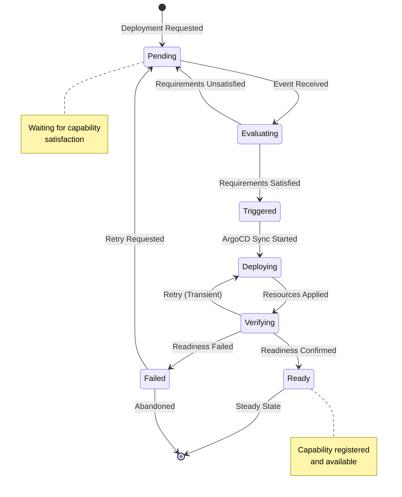
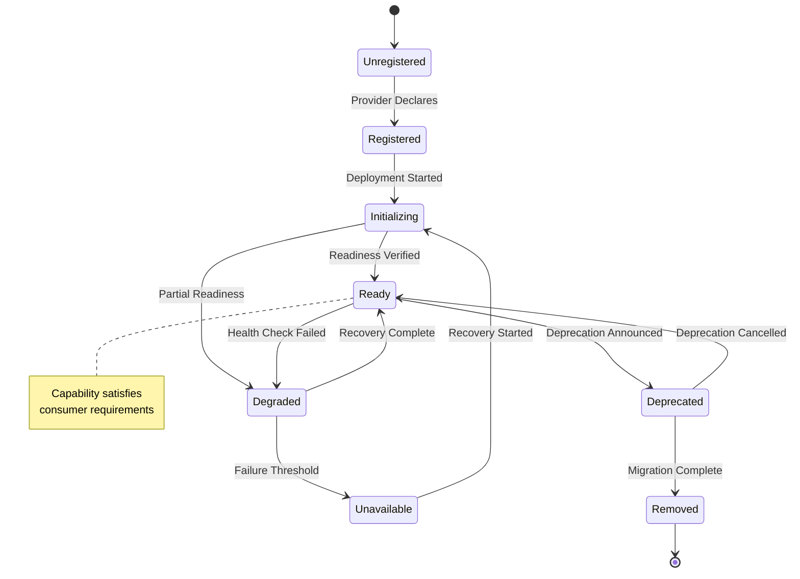
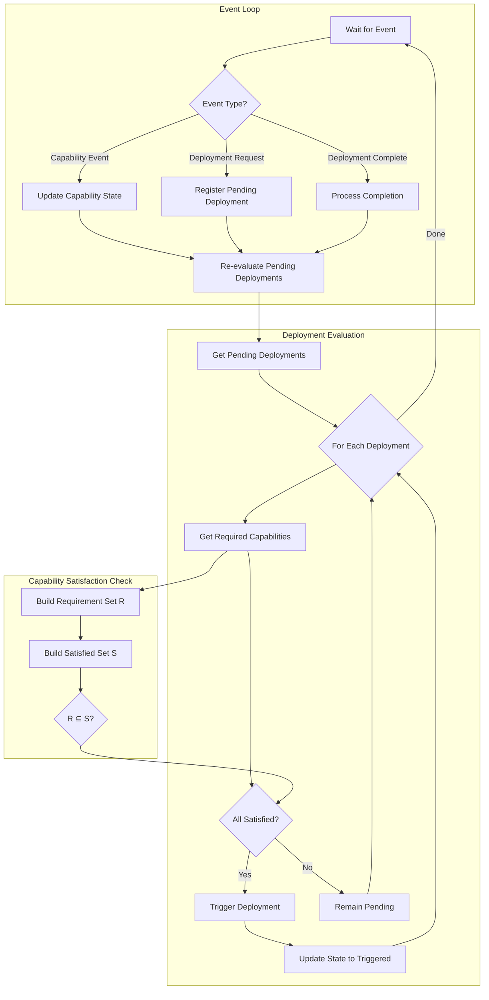
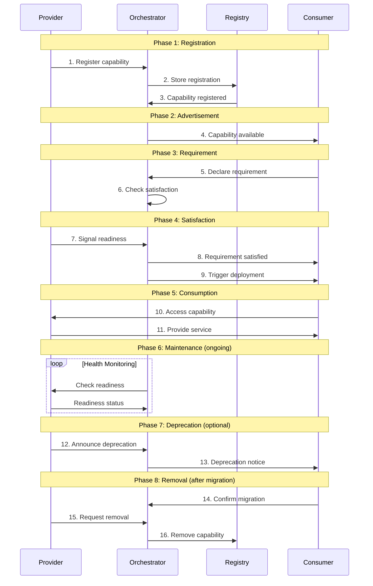
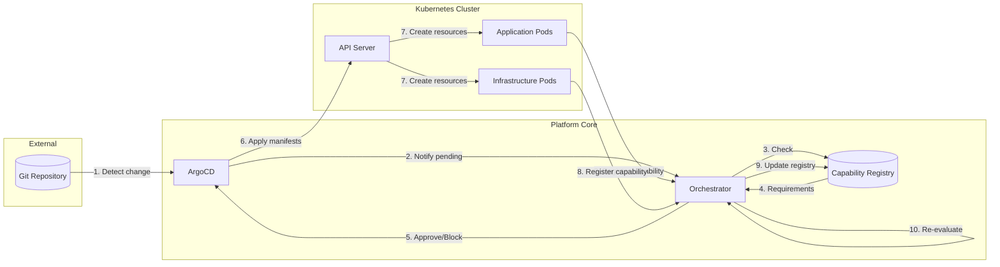

```
RFC-PLATARCH-0001                                              Section 3
Category: Standards Track                             Core Architecture
```

# 3. Core Architecture

[← Requirements](./02-requirements.md) | [Index](./00-index.md#table-of-contents) | [Next: Components →](./04-components.md)

---

## 3.1 Overview

This section defines the core architectural model of the platform. It describes the conceptual model that organizes platform components, the capability model that governs dependencies, and the structural relationships between platform elements.

---

## 2. Conceptual Model

### 2.1 Layered Structure

The platform is organized into layers. Each layer has distinct responsibilities. Higher layers depend on lower layers. Lower layers are unaware of higher layers.

**Layer 0: Cluster Infrastructure**
The foundational layer. Kubernetes control plane, node infrastructure, networking fabric. This layer exists before platform components.

**Layer 1: Platform Core**
Core platform services. The orchestrator, platform operators, CRD definitions. This layer enables the layers above it.

**Layer 2: Shared Infrastructure**
Shared services consumed by applications. Databases, message queues, identity services. This layer provides capabilities to applications.

**Layer 3: Platform Applications**
Business workloads. Applications deployed through the base chart. This layer consumes capabilities from layers below.

### 2.2 Dependency Direction

Dependencies flow downward. Layer 3 depends on Layer 2. Layer 2 depends on Layer 1. Layer 1 depends on Layer 0. Upward dependencies are prohibited.

This directionality ensures stability. Lower layers can be modified without considering every possible consumer. Higher layers cannot break lower layers.

### 2.3 Capability Boundaries

Each layer boundary is defined by capabilities. Lower layers provide capabilities. Higher layers consume capabilities. The capability model bridges layers.

Capabilities are the only permitted cross-layer interface. Applications do not directly access database internals. Applications access database capabilities. This indirection enables provider substitution.

---

## 3. The Capability Model

### 3.1 What Is a Capability

A capability is a discrete, well-defined function that a platform component provides or requires. Capabilities are the unit of dependency in the orchestration model.

Examples of capabilities:
- "postgresql-database" — the ability to provision and access PostgreSQL databases
- "redis-cache" — the ability to use Redis for caching
- "identity-authentication" — the ability to authenticate using platform identity
- "secret-injection" — the ability to receive secrets through platform mechanisms

Capabilities are not implementations. "PostgreSQL 15.3 on specific storage" is not a capability. "Relational database with SQL interface" is a capability. Implementations satisfy capabilities.

### 3.2 Capability Anatomy

A capability has:

**Name:** A unique identifier for the capability. Names follow naming conventions.

**Provider:** The component that satisfies the capability. Exactly one provider per capability per scope.

**Consumers:** Components that require the capability. Zero or more consumers per capability.

**Contract:** The interface and guarantees associated with the capability. Defined in the capability contract.

**State:** Whether the capability is currently satisfied. Satisfied or unsatisfied.

### 3.3 Capability Registration

Providers register capabilities. Registration declares that the provider can satisfy the capability. Registration does not mean the capability is currently satisfied.

Registration includes:
- The capability name being provided
- The contract version being satisfied
- Readiness conditions that indicate when the capability is actually available

### 3.4 Capability Requirements

Consumers declare capability requirements. A requirement declares that the consumer needs the capability to function.

Requirements include:
- The capability name required
- The minimum contract version acceptable
- Whether the requirement is mandatory or optional

### 3.5 Capability Satisfaction

A capability is satisfied when:
1. A provider is registered for the capability
2. The provider's readiness conditions are met
3. The provider's contract meets consumer requirements

Satisfaction is binary. A capability is either satisfied or not satisfied. Partial satisfaction is not satisfaction.

### 3.6 Capability Scope

Capabilities exist within scopes. The default scope is cluster-wide. Namespaced capabilities are possible for application-specific provisions.

Scope determines visibility. A cluster-scoped capability is visible to all consumers. A namespace-scoped capability is visible only within its namespace.

---

## 4. The Orchestrator

### 4.1 Orchestrator Role

The orchestrator is the component that sequences deployments based on capability satisfaction. The orchestrator observes capability state and triggers deployments when requirements are met.

The orchestrator does not deploy applications. ArgoCD deploys applications. The orchestrator determines when ArgoCD should deploy applications.

### 4.2 Orchestrator Inputs

The orchestrator receives:
- Capability registrations from providers
- Capability requirements from consumers
- Readiness signals from providers
- Deployment requests from Git changes

### 4.3 Orchestrator Outputs

The orchestrator produces:
- Deployment triggers for ArgoCD
- Capability state updates
- Orchestration events for observability

### 4.4 Orchestrator Algorithm

The orchestrator operates as an event-driven state machine that continuously evaluates deployment readiness based on capability satisfaction.

#### 4.4.1 Orchestrator State Machine

The following state diagram shows the states of a deployment as managed by the orchestrator:



#### 4.4.2 Capability State Machine

Capabilities transition through the following states:



#### 4.4.3 Orchestration Control Flow

The following diagram shows the control flow of the orchestrator's main loop:



#### 4.4.4 Formal Algorithm Specification

The orchestrator algorithm is specified using standard algorithmic notation:

---

**ALGORITHM 1: OrchestratorMainLoop**

```
ALGORITHM OrchestratorMainLoop
────────────────────────────────────────────────────────────────────────
INPUT:  EventQueue E         ▷ Queue of incoming events
        CapabilityRegistry C ▷ Current capability state
        DeploymentSet D      ▷ Set of all deployments
OUTPUT: Updated states for C and D

 1  loop forever
 2  │  event ← DEQUEUE(E)
 3  │
 4  │  case event.type of
 5  │  │  CAPABILITY_REGISTERED:
 6  │  │  │  C ← C ∪ {event.capability}
 7  │  │  │  EVALUATE-PENDING-DEPLOYMENTS(D, C)
 8  │  │
 9  │  │  CAPABILITY_READY:
10  │  │  │  C[event.capability].state ← READY
11  │  │  │  EVALUATE-PENDING-DEPLOYMENTS(D, C)
12  │  │
13  │  │  CAPABILITY_UNREADY:
14  │  │  │  C[event.capability].state ← DEGRADED
15  │  │  │  NOTIFY-CONSUMERS(event.capability)
16  │  │
17  │  │  DEPLOYMENT_REQUESTED:
18  │  │  │  d ← CREATE-DEPLOYMENT(event.spec)
19  │  │  │  d.state ← PENDING
20  │  │  │  D ← D ∪ {d}
21  │  │  │  EVALUATE-DEPLOYMENT(d, C)
22  │  │
23  │  │  DEPLOYMENT_COMPLETED:
24  │  │  │  d ← D[event.deployment_id]
25  │  │  │  if event.success then
26  │  │  │  │  d.state ← READY
27  │  │  │  │  REGISTER-PROVIDED-CAPABILITIES(d, C)
28  │  │  │  │  EVALUATE-PENDING-DEPLOYMENTS(D, C)
29  │  │  │  else
30  │  │  │  │  HANDLE-DEPLOYMENT-FAILURE(d, event.error)
31  │  │  end case
32  end loop
────────────────────────────────────────────────────────────────────────
```

---

**ALGORITHM 2: EvaluatePendingDeployments**

```
ALGORITHM EvaluatePendingDeployments
────────────────────────────────────────────────────────────────────────
INPUT:  DeploymentSet D      ▷ Set of all deployments
        CapabilityRegistry C ▷ Current capability state
OUTPUT: Triggered deployments

 1  P ← {d ∈ D : d.state = PENDING}          ▷ Get pending deployments
 2
 3  for each deployment d ∈ P do
 4  │  if REQUIREMENTS-SATISFIED(d, C) then
 5  │  │  d.state ← TRIGGERED
 6  │  │  TRIGGER-ARGOCD-SYNC(d)
 7  │  │  EMIT-EVENT(DEPLOYMENT_TRIGGERED, d)
 8  │  end if
 9  end for
────────────────────────────────────────────────────────────────────────
```

---

**ALGORITHM 3: RequirementsSatisfied**

```
ALGORITHM RequirementsSatisfied
────────────────────────────────────────────────────────────────────────
INPUT:  Deployment d         ▷ Deployment to check
        CapabilityRegistry C ▷ Current capability state
OUTPUT: Boolean indicating whether all requirements are satisfied

 1  R ← d.required_capabilities                ▷ Required capability set
 2
 3  for each requirement r ∈ R do
 4  │  if r.capability_name ∉ C then
 5  │  │  return FALSE                         ▷ Capability not registered
 6  │  end if
 7  │
 8  │  c ← C[r.capability_name]
 9  │
10  │  if c.state ≠ READY then
11  │  │  if r.mandatory = TRUE then
12  │  │  │  return FALSE                      ▷ Mandatory capability not ready
13  │  │  end if
14  │  end if
15  │
16  │  if ¬VERSION-COMPATIBLE(c.version, r.min_version) then
17  │  │  return FALSE                         ▷ Version mismatch
18  │  end if
19  end for
20
21  return TRUE                                ▷ All requirements satisfied
────────────────────────────────────────────────────────────────────────
```

---

#### 4.4.5 Algorithm Properties

| Property | Guarantee | Proof Sketch |
|----------|-----------|--------------|
| Termination | Each event processing terminates | Finite deployments, finite capabilities |
| Determinism | Same events → same state | No external randomness, ordered processing |
| Monotonicity | Satisfied capabilities remain satisfied | Only explicit revocation changes READY state |
| Convergence | System reaches stable state | Acyclic dependencies, finite graph |

This algorithm is event-driven. State changes trigger re-evaluation. The orchestrator does not poll.

### 4.5 Orchestrator Properties

**Deterministic:** Same inputs produce same outputs.

**Monotonic:** Progress is forward. Satisfied capabilities remain satisfied unless explicitly revoked.

**Convergent:** The system converges to a stable state where all satisfiable deployments are deployed.

---

## 5. Provider-Consumer Relationship

### 5.1 Provider Responsibilities

Providers are responsible for:
- Registering capabilities they provide
- Maintaining capability readiness
- Honoring capability contracts
- Signaling capability state changes

Providers do not know their consumers. Providers publish capabilities. Consumers discover capabilities. This decoupling enables provider evolution.

### 5.2 Consumer Responsibilities

Consumers are responsible for:
- Declaring capabilities they require
- Waiting for capability satisfaction
- Using capabilities according to contracts
- Handling capability unavailability gracefully

Consumers do not know their providers. Consumers require capabilities. Providers satisfy capabilities. This decoupling enables provider substitution.

### 5.3 The Contract Interface

Providers and consumers interact through contracts. Contracts define:
- What the capability provides
- How to access the capability
- What guarantees the capability offers
- What the consumer must do

Contracts are versioned. Version compatibility rules govern which consumers can use which providers.

### 5.4 Capability Flow

The lifecycle of a capability follows a defined sequence from registration through optional removal:



**Capability Lifecycle Stages:**

1. **Registration:** Provider registers capability
2. **Advertisement:** Capability becomes visible to consumers
3. **Requirement:** Consumer declares requirement
4. **Satisfaction:** Provider signals readiness
5. **Consumption:** Consumer uses capability
6. **Maintenance:** Provider maintains capability
7. **Deprecation:** (If needed) Provider signals deprecation
8. **Removal:** (If needed) Capability is removed after migration

---

## 6. System Topology

### 6.1 Platform Components

The platform consists of:

**Orchestrator:** Sequences deployments based on capabilities

**ArgoCD:** Deploys applications to the cluster

**Operators:** Manage specific resource types

**Shared Infrastructure:** Databases, queues, identity, etc.

**Applications:** Business workloads

### 6.2 Control Flow

Control flows through the system as illustrated:



**Control Flow Steps:**

1. Git change triggers ArgoCD
2. ArgoCD notifies orchestrator of pending deployment
3. Orchestrator checks capability requirements
4. If satisfied, orchestrator approves deployment
5. ArgoCD executes deployment
6. Deployment updates capability state
7. Orchestrator re-evaluates other pending deployments

### 6.3 Data Flow

Data flows as follows:

1. Applications access shared infrastructure through capabilities
2. Shared infrastructure provides data services
3. Capabilities abstract infrastructure details
4. Applications remain decoupled from infrastructure implementation

---

## 7. Capability Contract Structure

### 7.1 Contract Definition

A capability contract defines:

**Interface Specification:**
- Access methods (API endpoints, connection strings, etc.)
- Data formats and protocols
- Authentication requirements

**Guarantee Specification:**
- Availability targets
- Durability guarantees
- Performance characteristics

**Constraint Specification:**
- Usage limits
- Tenant isolation boundaries
- Supported operations

### 7.2 Contract Versioning

Contracts are versioned using semantic versioning:

**Major version:** Breaking changes that require consumer modification

**Minor version:** Backward-compatible additions

**Patch version:** Backward-compatible fixes

Version compatibility:
- Consumers specify minimum required version
- Providers satisfy any compatible version
- Major version changes require explicit consumer updates

### 7.3 Contract Stability Levels

**Stable:** Contract is committed. Breaking changes require deprecation period and major version increment.

**Beta:** Contract is maturing. Breaking changes possible with notice.

**Alpha:** Contract is experimental. Breaking changes may occur without notice.

Applications SHOULD only depend on stable contracts for production workloads.

---

## 8. Architectural Constraints

### 8.1 No Direct Application Dependencies

Applications MUST NOT depend on other applications directly. All inter-application dependencies MUST be expressed as capability dependencies.

This constraint enables:
- Provider substitution without consumer changes
- Clear dependency graphs
- Independent application lifecycles

### 8.2 No Capability Inference

The orchestrator MUST NOT infer capabilities. All capabilities MUST be explicitly declared. Implicit capabilities do not exist.

This constraint enables:
- Auditable dependency graphs
- Predictable orchestration
- Debuggable deployments

### 8.3 No Circular Dependencies

Capability dependency graphs MUST be acyclic. If A requires B and B requires A, the system cannot be deployed.

This constraint enables:
- Deterministic ordering
- Guaranteed convergence
- Finite deployment sequences

### 8.4 Single Provider Per Capability

Each capability MUST have exactly one provider per scope. Multiple providers for the same capability create ambiguity.

This constraint enables:
- Deterministic resolution
- Clear ownership
- Unambiguous state

---

## 9. Summary

### 9.1 Layered Model

| Layer | Content | Role |
|-------|---------|------|
| 0 | Cluster Infrastructure | Foundation |
| 1 | Platform Core | Enablement |
| 2 | Shared Infrastructure | Capability provision |
| 3 | Platform Applications | Business workloads |

### 9.2 Capability Model

| Element | Description |
|---------|-------------|
| Capability | Discrete function that can be provided or required |
| Provider | Component that satisfies a capability |
| Consumer | Component that requires a capability |
| Contract | Interface and guarantees for a capability |
| Satisfaction | State where provider readiness meets consumer requirement |

### 9.3 Orchestrator

| Property | Description |
|----------|-------------|
| Deterministic | Same inputs produce same outputs |
| Event-driven | State changes trigger re-evaluation |
| Capability-gated | Deployments proceed only when requirements met |

---

## Document Navigation

| Previous | Index | Next |
|----------|-------|------|
| [← 2. Requirements](./02-requirements.md) | [Table of Contents](./00-index.md#table-of-contents) | [4. Components →](./04-components.md) |

---

*End of Section 3 — RFC-PLATARCH-0001*
