# Platform Security Architecture Proposal

**A Zero Trust Security Foundation for Enterprise Operations**

---

## Document Information

| Field | Value |
|-------|-------|
| **Document Type** | Proposal |
| **Status** | Draft |
| **Author** | [Shaik Noorullah](https://github.com/shaik-noorullah) |
| **Audience** | Executive Leadership, Business Stakeholders |
| **Version** | 1.0 |

---

## 1. Executive Summary

Imagine this scenario: A developer leaves the company on Friday. On Monday, they still have access to every system they ever touched—databases, servers, internal tools. Nobody remembers what access they had. Nobody knows how to revoke it all. This isn't hypothetical—this is how we operate today.

In view of the recent attacks and databreach incident at ProficientNow, we present the following system to mitigate the risk associated with security breaches internal or external.

**Our organization requires enterprise-grade Zero Trust security.**

This proposal outlines a comprehensive security architecture built on a simple principle: **trust nothing, verify everything**. The architecture works through six integrated pillars:

- **Nobody touches credentials.** Applications receive the secrets they need automatically. Humans never see database passwords, API keys, or certificates. You can't leak what you never had.

- **One identity, everywhere.** Users authenticate once through enterprise single sign-on. When someone leaves, access is revoked everywhere in minutes, not weeks.

- **Access expires automatically.** Administrative access is granted for specific tasks with time limits. When the time is up, access disappears, no action required.

- **Every request is verified.** Services don't trust each other by default. Every single request between systems is authenticated and encrypted, every time.

- **Applications are protected at the edge.** Before traffic reaches any application, it passes through enterprise-grade protection that blocks attacks, bots, and abuse.

- **Developers help themselves.** Instead of waiting days for access requests, developers use self-service tools that maintain security while eliminating bottlenecks.

**The outcome: A defense-in-depth architecture that eliminates entire categories of security vulnerabilities while improving operational efficiency.**

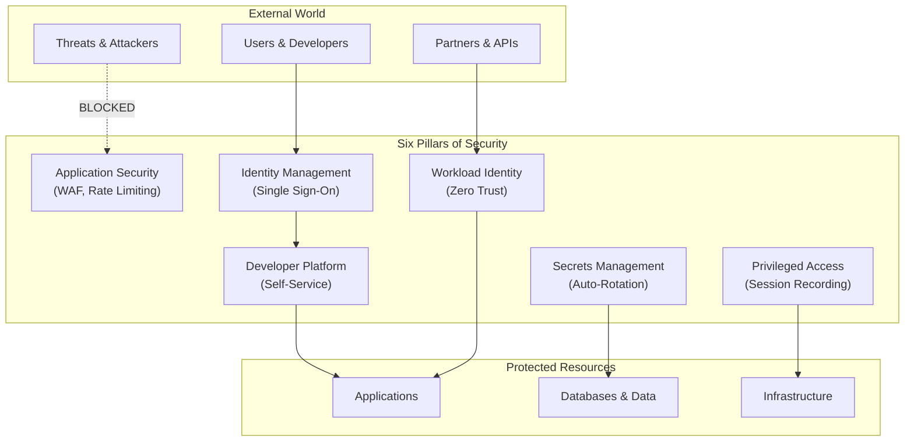

---

## 2. The Modern Threat Landscape

Let's take a look at a possible scenario.

Consider what happens when an employee leaves:
- IT disables their email account
- HR completes the exit paperwork
- But nobody remembers that they had SSH access to twelve servers, API keys to three external services, and a database password they wrote down somewhere

Three months later, that former employee still has working access. Maybe they're ethical and never use it. Maybe they're not. Either way, there's no audit trail, no visibility, and no accountability.

**What Leading Organizations Are Doing**

Microsoft, Google, Netflix, and Spotify have all built Zero Trust architectures. The US federal government mandates Zero Trust for all agencies under NIST 800-207. These organizations understand that the question isn't whether security incidents will happen—it's how quickly they can be contained when they do.

**The question is not whether to implement enterprise security, but how quickly we can establish these protections.**

---

## 3. Current State Assessment

Let me walk through a typical day under our current security posture to illustrate the gaps.

**Morning: The New Developer**

A new developer joins the team. They need access to the development database, the staging server, and several internal tools. Here's what happens:

1. They ask their manager who has the database password
2. Manager forwards an email from six months ago containing the password
3. Developer saves the password in a notes app on their phone
4. Nobody records that this developer now has this credential

The password has now been shared via email, stored on a personal device, and exists with no tracking of who has it. If that developer's phone is compromised tomorrow, we won't know. We won't even know to change the password.

**Afternoon: The Expired Certificate**

Production goes down. The SSL certificate expired. Nobody knew it was expiring because:
- The certificate was created two years ago by someone who's since left
- The email notifications went to their old email address
- Nobody else knew the certificate existed or when it would expire

Two hours of downtime, customer complaints, and an emergency scramble to generate a new certificate.

**Evening: The Security Question**

The CEO asks a simple question: "Who has access to our customer database?"

Nobody can answer. Access was granted over years through ad-hoc requests, direct credential sharing, and inherited permissions. There's no central record. Creating one would take weeks of investigation, and it would be outdated by the time it was finished.

```mermaid
flowchart LR
    subgraph Before["CURRENT STATE: Vulnerable"]
        direction TB
        B1["Scattered Credentials<br/>Manual rotation"]
        B2["Multiple Logins<br/>No central control"]
        B3["Standing Access<br/>No audit trail"]
        B4["No Application Firewall<br/>Direct exposure"]
        B5["Long-Lived Secrets<br/>Indefinite breach risk"]
    end

    subgraph After["FUTURE STATE: Protected"]
        direction TB
        A1["Centralized Vault<br/>Auto-rotation"]
        A2["Single Sign-On<br/>Enterprise policies"]
        A3["Time-Limited Access<br/>Full recording"]
        A4["WAF Protection<br/>Bot mitigation"]
        A5["Short-Lived Credentials<br/>Hours, not years"]
    end

    Before -->|"TRANSFORMATION"| After
```

---

## 4. The Six Pillars of Platform Security

This architecture is built on six integrated pillars. Let me explain each one through the lens of how it changes daily operations.

---

### Pillar 1: Secrets Management — Nobody Touches Credentials

**The Scenario Today**

Picture a typical database credential:
1. A developer creates a database and sets a password
2. They put the password in a configuration file
3. They copy it to a wiki page "so others can find it"
4. They email it to the DevOps team who needs it for deployment
5. Someone on that team saves it to their password manager
6. The password exists in: the database config, the wiki, three email inboxes, two password managers, and who knows where else

Now imagine that password needs to be rotated (as security best practices require). Someone has to find every place it's stored, update every system that uses it, and pray they didn't miss anything. Inevitably, they miss something. Production breaks. It takes hours to debug.
!NOTE: and this is exactly why it takes time to properly protect unprotected systems. Any change that has a tendency to break something can result in halting the operations of the entire team. And the worst thing is no one can answer how long it might take to get back to work since they don't know what they don't know.

**The Scenario After**

With the proposed architecture, nobody ever sees the database password:
1. The application declares it needs database access
2. The system automatically provisions a credential and injects it directly into the application
3. The credential rotates automatically on schedule
4. Humans are never involved—they can't leak what they never had

**A Real-World Example**

Let's say a developer's laptop is stolen. In the current world, the attacker has access to whatever credentials that developer had saved—potentially dozens of database passwords, API keys, and server access credentials.

In the new world? The attacker has nothing. The developer never had credentials to steal. The applications they worked on received credentials automatically, but those credentials never touched the developer's machine.

**The credential that doesn't exist on a laptop can't be stolen from a laptop.**

```mermaid
flowchart TB
    subgraph CurrentProcess["CURRENT: Manual Credential Management"]
        C1["Create Credential"] --> C2["Store in Spreadsheet/Wiki"]
        C2 --> C3["Share via Email/Slack"]
        C3 --> C4["Forget to Rotate"]
        C4 --> C5["Credential Expires"]
        C5 --> C6["PRODUCTION OUTAGE"]
        C6 --> C7["Emergency Rotation"]
        C7 --> C3
    end

    subgraph FutureProcess["FUTURE: Automated Credential Management"]
        F1["Application Requests Access"] --> F2["Vault Issues Short-Lived Credential"]
        F2 --> F3["Credential Injected to Application"]
        F3 --> F4["Auto-Rotates Before Expiry"]
        F4 --> F3
        F4 --> F5["Complete Audit Log"]
    end
```

**What Changes:**
- No more spreadsheets with passwords
- No more "can you send me that API key?"
- No more production outages from expired credentials
- No more "who has this password?" investigations
- When someone leaves, there's nothing to revoke because they never had credentials to begin with

---

### Pillar 2: Identity & Access Management — One Identity, Everywhere

**The Scenario Today**

A typical employee has:
- An Ubuntu login
- An email password
- Separate logins for: GitHub, Slack, and 10 different tools and services.
Each system has its own password policy, its own session management, its own user database. When the employee leaves:
- IT disables their Windows account
- HR marks them as terminated
- But nobody thinks about the 15 other systems they could still access

Three weeks later, someone notices the ex-employee is still showing active in Slack.

**The Scenario After**

The employee has one identity:
1. They log in once at the start of the day through enterprise single sign-on
2. Every application they access uses that same authenticated session
3. Multi-factor authentication is enforced—not requested, enforced
4. When they leave, one account disable removes access everywhere, immediately

**A Real-World Example**

An employee is terminated for cause. The situation requires immediate access revocation. Today, this means:
- Emergency calls to every system administrator
- Manual checks of dozens of systems
- No certainty that everything was caught
- Anxiety for weeks about what was missed

With this architecture:
- HR updates the employee status in the enterprise directory
- Within minutes, the single sign-on system invalidates their session
- Every application that relied on that authentication immediately stops working
- Complete, immediate, verifiable revocation

**One disable, everywhere gone.**

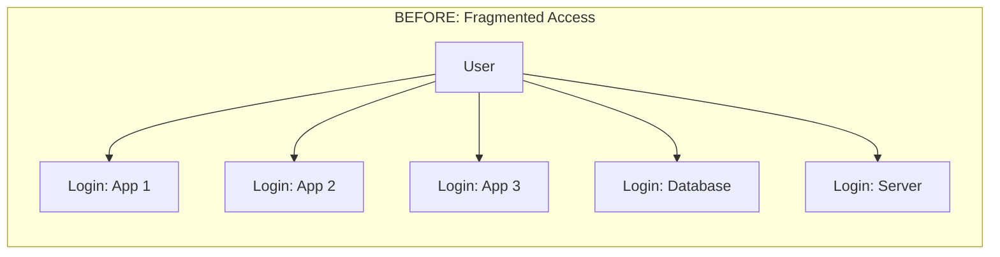

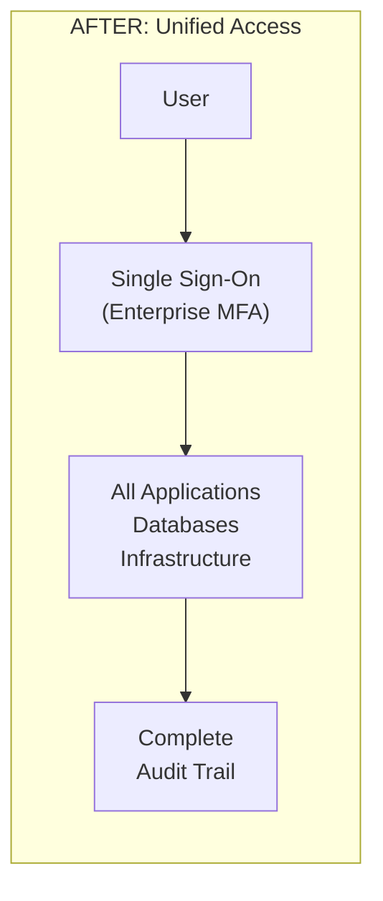

**What Changes:**
- No more "which systems did they have access to?"
- No more password fatigue (users have one password, not twenty)
- No more inconsistent security policies across applications
- No more weeks-long access revocation processes
- Complete audit trail of who accessed what, when

---

### Pillar 3: Privileged Access Management — Access Expires Automatically

**The Scenario Today**

A system administrator needs to fix a production issue. They:
1. SSH to the server using a key they created years ago
2. Make the fix
3. Log off

That SSH key still works. It will work tomorrow. It will work next year. If the administrator leaves the company, it will still work. If their laptop is stolen, the attacker has permanent access to every server that key can reach.

When a security incident occurs, investigation is nearly impossible:
- We know someone logged in
- We don't know what commands they ran
- We can't prove whether any data was accessed or modified

**The Scenario After**

The administrator needs to fix a production issue:
1. They request access to the specific server through the access management system
2. They state why they need access and for how long
3. Access is granted for 2 hours
4. Every command they run is recorded
5. After 2 hours, the access automatically expires—no action required

If their laptop is stolen after they're done, the attacker has nothing—the access has already expired.

**A Real-World Example**

A contractor needs database access to run a data migration. In the current world, someone creates a database user for them. The migration is done in a day. Six months later, that database user still exists with full access.

With this architecture:
- The contractor requests access for 8 hours
- Access is provisioned automatically
- The migration runs
- After 8 hours, access disappears
- No cleanup required, no forgotten accounts, no risk

**Access that expires automatically can't be forgotten.**

**What Changes:**
- No more "standing" access that persists indefinitely
- No more "we think they only accessed these files"—we know exactly what happened
- No more SSH keys that work forever
- No more cleanup of old accounts and permissions
- Complete forensic capability for any incident

---

### Pillar 4: Workload Identity — Every Request is Verified

**The Scenario Today**

Your payment service needs to talk to your database. So you:
1. Create a database password
2. Put it in the payment service's configuration
3. Hope nobody finds it

The payment service sends that password with every request. If an attacker compromises any service that can read that configuration, they have permanent database access. If the attacker compromises the network, they can see the password in transit.

Services trust each other implicitly. Once you're "inside," you can talk to anything.

**The Scenario After**

Services don't trust each other by default. Every single request is verified:
1. The payment service needs to talk to the database
2. It proves its identity using a certificate that expires in hours
3. The database verifies that identity before allowing access
4. All communication is encrypted—even inside our own network
5. If the payment service is compromised, the attacker can only reach what the payment service was explicitly allowed to reach

**A Real-World Example**

An attacker compromises a logging service—one of the least sensitive applications. In the current world, they can now:
- Read the logging service's configuration to find credentials
- Use those credentials to access other systems
- Move laterally across the entire infrastructure
- Eventually reach the database with customer data

With this architecture:
- The logging service has access only to the logging database
- It has no credentials to any other system
- The attacker is contained to a single, low-value service
- Lateral movement is impossible

**Zero trust means exactly that—zero trust, verify everything.**

**What Changes:**
- No more "once you're in, you're in"
- No more lateral movement through credential theft
- No more unencrypted internal traffic
- Compromised services can only reach what they were explicitly allowed to reach
- Breach containment is built into the architecture

---

### Pillar 5: Application Security — Attacks Blocked at the Edge

**The Scenario Today**

Your application is on the internet. Attackers can:
- Probe for vulnerabilities
- Attempt SQL injection attacks
- Run brute-force password attacks
- Flood you with traffic (DDoS)
- Deploy bots to abuse your APIs

The application has to defend itself against all of this while also doing its actual job.

**The Scenario After**

Before traffic ever reaches your application:
1. A web application firewall inspects every request
2. Known attack patterns (SQL injection, XSS, etc.) are blocked
3. Suspicious IPs are challenged or blocked
4. Rate limiting prevents abuse
5. Bot traffic is detected and challenged

Your application receives only legitimate traffic. It can focus on being an application.

**A Real-World Example**

A bot network discovers your login form and starts a credential stuffing attack—thousands of login attempts per minute using stolen username/password combinations from other breaches.

In the current world, your application:
- Processes all these requests, using server resources
- May not have rate limiting
- May not detect the pattern
- Might let some combinations through

With this architecture:
- The firewall detects the abnormal pattern immediately
- Requests are rate-limited
- Bot challenges are deployed
- Your application never sees the attack traffic

**Attacks blocked at the edge never reach your applications.**

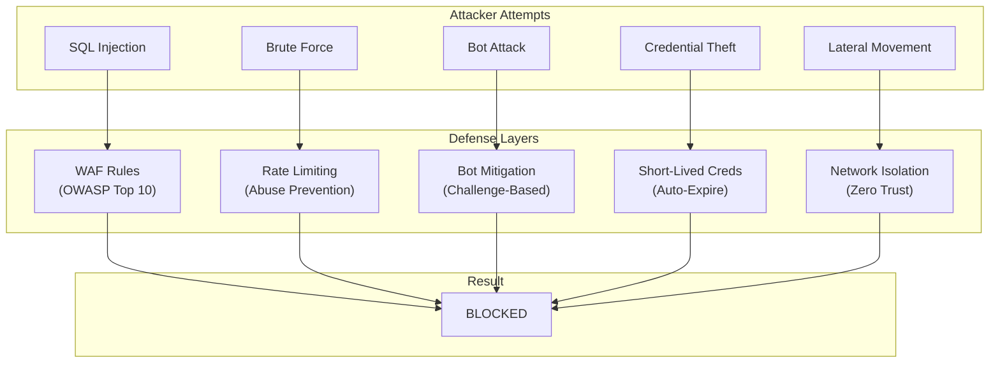

---

### Pillar 6: Developer Platform — Help Yourself Securely

**The Scenario Today**

A developer needs a new database for their project:
1. They submit a ticket to the platform team
2. The ticket sits in a queue for days
3. Eventually someone creates the database manually
4. They email the developer the connection details
5. The developer copies credentials into their code

The developer waited a week. Security was bypassed. Everyone is frustrated.

**The Scenario After**

The developer needs a new database:
1. They open the developer portal
2. They select "New Database" from the service catalog
3. They choose size and configuration options
4. They click "Create"
5. Within minutes, the database exists and their application is automatically configured to connect to it

No tickets. No waiting. No credential sharing. Security is embedded in the process, not bolted on as an afterthought.

**A Real-World Example**

A team needs to set up a new microservice. In the current world:
- days waiting for database access
- days or weeks of waiting for deployment pipeline configuration
- Multiple manual configuration steps

With this architecture:
- The team uses a template in the developer portal
- Database, pipeline, monitoring, and secrets are all provisioned automatically
- Security best practices are embedded in the template
- The team is productive in hours, not weeks
- The beauty of this is that the developer got what they needed without having access to the credentials and its audited, every activity and action they take is auditable and observable

**Self-service doesn't mean less secure—it means security is built in from the start.**

---

## Complete Security Architecture

Here's how all six pillars work together:

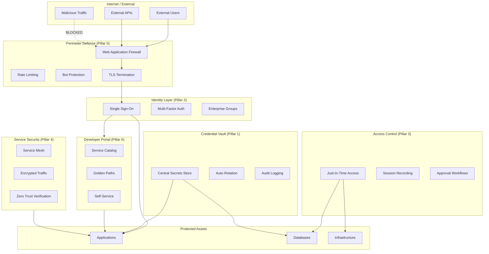

---

## 5. Integration with Enterprise Security Ecosystem

**This is critically important: This architecture COMPLEMENTS existing tools—it does NOT replace them.**

We're not proposing to replace Microsoft Intune, Mimecast Incydr, or ManageEngine. Those tools do their jobs well. What we're proposing is a central platform that connects everything together and fills the gaps where those tools don't reach.

Think of it this way: You have excellent locks on your doors (endpoint security), excellent security cameras (monitoring), and excellent alarm systems (threat detection). What you don't have is a security control room that ties everything together and extends protection to areas those systems can't see.

### Microsoft Ecosystem Integration

**Current Focus:** For this initial implementation, we are integrating with **Microsoft Entra ID (Azure AD)** and **Conditional Access** only. Other Microsoft integrations (Intune, Defender, Sentinel) are architecturally possible but will be addressed in future phases.

| Microsoft Tool | How We Integrate | Status |
|----------------|------------------|--------|
| **Microsoft Entra ID (Azure AD)** | The authoritative source of truth for identity. All our identity decisions respect what Entra says. If Entra says you're part of the Engineering group, that's what our systems believe. | **Planned** |
| **Microsoft Entra Conditional Access** | Our single sign-on integrates with Conditional Access policies. If Conditional Access blocks an authentication, we respect that decision. | **Planned** |
| **Microsoft Intune** | Continues managing device compliance. Our systems can check Intune status before granting access. | Future Phase |
| **Microsoft Defender for Cloud** | Our security events can feed into Defender for centralized threat visibility. | Future Phase |
| **Microsoft Sentinel** | All our audit logs can flow into Sentinel for SIEM correlation. | Future Phase |

### Existing Security Tool Integration

**Note:** Direct integration with these tools is not part of the current scope. They continue operating as-is. The architecture supports future integration when needed.

| Existing Tool | Current State | Future Potential |
|---------------|---------------|------------------|
| **Mimecast Incydr** | Continues insider threat monitoring unchanged | Can receive enhanced audit data for correlation |
| **Zoho ManageEngine/Endpoint Central** | Continues endpoint management unchanged | Can integrate with infrastructure-layer identity |
| **Network Firewalls** | Continue perimeter security unchanged | Platform WAF complements at application layer |

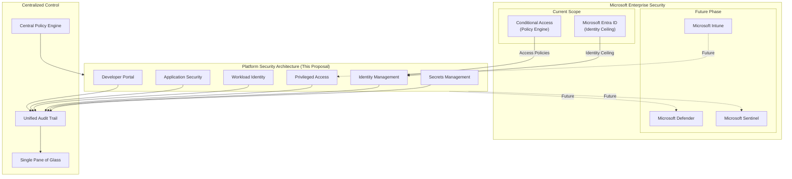

### The Real Problem: Tool Sprawl

Today, security capabilities are scattered across a dozen different tools:

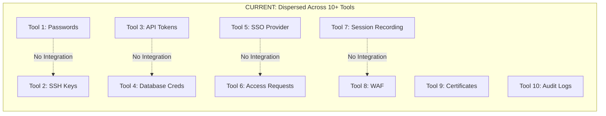

Nobody has a complete picture. Getting an answer to "who has access to what?" requires checking ten different systems. Audit requests take weeks to fulfill. Security policies are inconsistent.

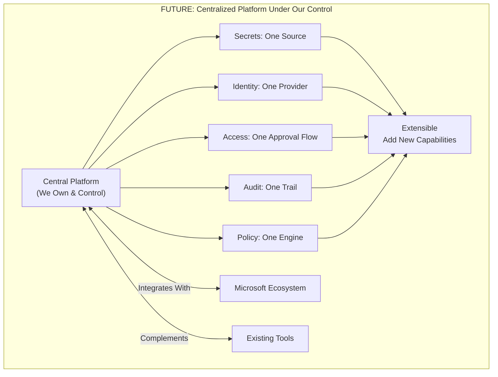

### Key Benefits of Centralization

| Benefit | What It Means |
|---------|---------------|
| **Single Source of Truth** | Ask a security question, get an answer from one place, not ten |
| **Consistent Policy Enforcement** | Set a policy once, it applies everywhere |
| **Reduced Vendor Lock-in** | We control the platform; vendor tools are plugins, not dependencies |
| **Extensibility** | Need a new capability? Add it to our platform, don't buy another tool |
| **Cost Efficiency** | Consolidate overlapping tool functions over time |
| **Audit Simplicity** | One audit trail that tells the complete story |

---

## 6. Audit Readiness & Future Compliance

**Important Note: Formal compliance certifications are OUT OF SCOPE for this phase.**

We're not pursuing SOC 2, ISO 27001, PCI DSS, or similar certifications as part of this initiative. Those are significant undertakings that require dedicated effort beyond architecture.

What this architecture does is **prepare the foundation** for future compliance efforts:

| Capability | How It Helps Future Compliance |
|------------|-------------------------------|
| **Complete audit trails** | Every identity and access event is logged. When auditors ask "who accessed this system on this date?" we can answer. |
| **Centralized logging** | All logs in one place. No more aggregating from ten systems for an audit. |
| **Policy enforcement** | Policies are defined in code. We can show exactly what policies are in place. |
| **Session recording** | Complete records of privileged access. We can prove what happened during any session. |

When the organization decides to pursue formal compliance certifications, the technical controls will already be in place. The audit will be about documentation and process, not about scrambling to implement controls.

---

## 7. Implementation Timeline

Implementation follows a phased approach, with each phase building on the previous:

| Phase | Description | Duration |
|-------|-------------|----------|
| Phase 1 | Foundation (Secrets + IAM) | 3-4 weeks |
| Phase 2 | Privileged Access | 2 weeks |
| Phase 3 | Workload Security | 2 weeks |
| Phase 4 | Application Security | 1 week |
| Phase 5 | Developer Platform | 3 weeks |
| **Total** | | **~3 months** |

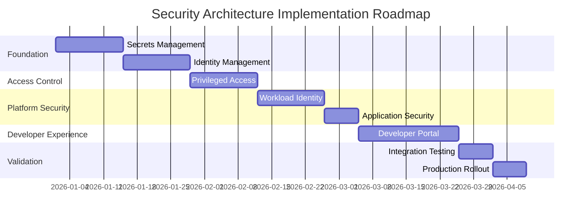

**Why This Order:**

Think of it like building a house. You can't install plumbing before the foundation is poured.

1. **Secrets Management** comes first because everything else depends on it. Services need credentials. Those credentials need to come from somewhere secure.

2. **Identity Management** comes next because access decisions require knowing who (or what) is asking.

3. **Privileged Access** builds on identity. Now that we know who you are, we can control what you can do.

4. **Workload Identity** and **Application Security** can happen in parallel—they don't depend on each other.

5. **Developer Platform** ties everything together with a self-service interface.

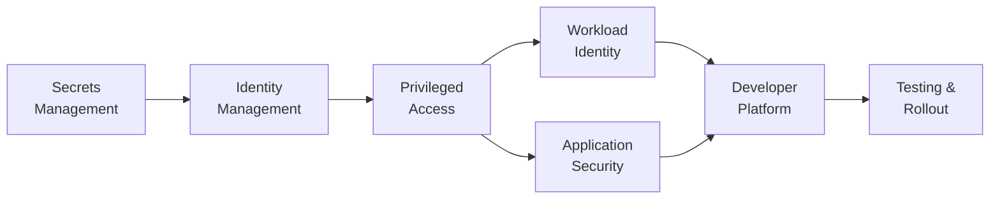

**Why Not Faster?**

Security systems require careful integration. Rushing creates vulnerabilities. Each phase includes testing and validation before proceeding. The goal is to build something secure, not something fast.

---

## 8. Scope Boundaries & Future Roadmap

**Important Disclaimer:**

This proposal addresses core platform security architecture. Some areas are **not yet in scope** and will require separate planning:

| Out of Scope Item | Notes |
|-------------------|-------|
| Security Information and Event Monitoring (SIEM) | We integrate with existing SIEM; full SIEM implementation is separate |
| Infrastructure-level intrusion detection (IDS/IPS) | Network-layer security separate from platform security |
| Firewall rule auditing and network access control lists | Network infrastructure team responsibility |
| Internal network infrastructure redesign | Separate initiative if required |
| Physical security integration | Facility security is a separate concern |
| Endpoint device management | Continues under existing Intune/ManageEngine |
| Third-party vendor security assessment | Procurement and vendor management process |
| Security Operations Center (SOC) procedures | Operational runbooks are separate from architecture |

These aren't being ignored—they're being scoped appropriately. This proposal focuses on what we can accomplish as a coherent platform initiative.

---

## 9. Recommendation & Next Steps

**Recommendation:** Approve this proposal to establish enterprise-grade Zero Trust security architecture.

We've identified real, material security gaps that create business risk every day. We've designed an architecture that addresses those gaps while integrating with—not replacing—our existing security investments. We've planned a phased implementation that builds capabilities methodically.

**Immediate Next Steps:**

1. **Approval** — Authorize implementation of the six-pillar security architecture
2. **Resource Allocation** — Assign platform engineering team to implementation
3. **Kickoff** — Begin Phase 1 (Secrets Management and Identity Management)
4. **Progress Reporting** — Regular updates to stakeholders on implementation progress

**Our Commitment:**

Upon approval, the platform engineering team will:
- Provide regular progress updates
- Escalate blockers and resource needs promptly
- Validate each phase before proceeding to the next
- Document operational procedures alongside implementation

The question isn't whether we need this—it's how quickly we can establish these protections before the next credential is leaked, the next certificate expires unexpectedly, or the next terminated employee retains access they shouldn't have.

---

## Appendix: Technical Reference Documents

This proposal summarizes detailed technical architecture documents. For those who want to understand the implementation details, component specifications, or security rationale, the full RFCs are available below.

### Pillar 1: Secrets Management

**[RFC-SECOPS-0001: GitOps-Native, Vault-First Secret Management Architecture](./rfcs/secret-ops/00-index.md)**

Defines how credentials are stored, rotated, and distributed without human involvement. Covers HashiCorp Vault configuration, External Secrets Operator integration, and secret lifecycle management.

Key sections:
- [Introduction & Problem Statement](./rfcs/secret-ops/01-introduction.md)
- [Architecture Overview](./rfcs/secret-ops/03-architecture.md)
- [Vault Integration](./rfcs/secret-ops/04-components.md)

---

### Pillar 2: Identity & Access Management

**[RFC-IAM-0001: Federated Identity and Access Management Architecture](./rfcs/iam/00-index.md)**

Defines how users authenticate through single sign-on and how permissions flow from Microsoft Entra ID through Keycloak to applications.

Key sections:
- [Introduction & Problem Statement](./rfcs/iam/01-introduction.md)
- [Architecture Overview](./rfcs/iam/03-architecture.md)
- [Authorization Model](./rfcs/iam/05-authorization-model.md)
- [Application Integration](./rfcs/iam/08-application-integration.md)

---

### Pillar 3: Privileged Access Management

**[RFC-PAM-0001: Privileged Access Management Architecture](./rfcs/pam/00-index.md)**

Defines how administrative access is granted, time-limited, recorded, and revoked. Covers Teleport integration for SSH, database, and Kubernetes access.

Key sections:
- [Introduction & Problem Statement](./rfcs/pam/01-introduction.md)
- [Architecture Overview](./rfcs/pam/03-architecture.md)
- [Access Workflows](./rfcs/pam/05-access-workflows.md)

---

### Pillar 4: Workload Identity

**[RFC-WORKLOAD-IDENTITY-0001: Workload Identity Architecture](./rfcs/workload-identity/00-index.md)**

Defines how services authenticate to each other using short-lived certificates instead of static credentials. Covers SPIFFE/SPIRE, service mesh integration, and zero-trust service communication.

Key sections:
- [Introduction & Problem Statement](./rfcs/workload-identity/01-introduction.md)
- [Architecture Overview](./rfcs/workload-identity/03-architecture.md)
- [Kubernetes Workloads](./rfcs/workload-identity/05-kubernetes-workloads.md)
- [Service Mesh Integration](./rfcs/workload-identity/11-service-mesh-integration.md)

---

### Pillar 5: Application Security

**[RFC-TENANT-SECURITY-0001: Tenant Application Security Architecture](./rfcs/tenant-security/00-index.md)**

Defines how applications are protected at the network edge. Covers web application firewall, rate limiting, bot protection, and network isolation.

Key sections:
- [Introduction & Problem Statement](./rfcs/tenant-security/01-introduction.md)
- [Architecture Overview](./rfcs/tenant-security/03-architecture.md)
- [Security Controls](./rfcs/tenant-security/05-security-controls.md)

---

### Pillar 6: Developer Platform

**[RFC-DEVELOPER-PLATFORM-0001: Developer Platform Architecture](./rfcs/developer-platform/00-index.md)**

Defines the self-service portal for developers. Covers service catalog, golden path templates, and how security is embedded in developer workflows.

Key sections:
- [Introduction & Problem Statement](./rfcs/developer-platform/01-introduction.md)
- [Architecture Overview](./rfcs/developer-platform/03-architecture.md)
- [Service Catalog](./rfcs/developer-platform/05-service-catalog.md)

---

### How to Read These Documents

**For executives and managers:** The introduction sections of each RFC explain the business problem and high-level approach without technical jargon.

**For technical leads:** The architecture sections provide system design, component interactions, and integration patterns.

**For implementers:** The full RFCs include detailed specifications, configuration examples, and operational procedures.

---

*End of Proposal*
