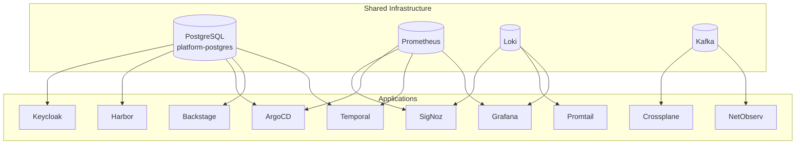
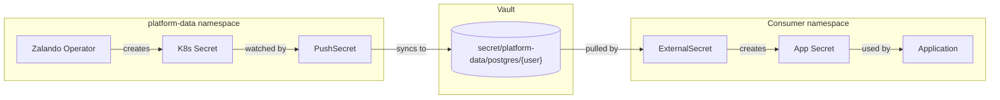
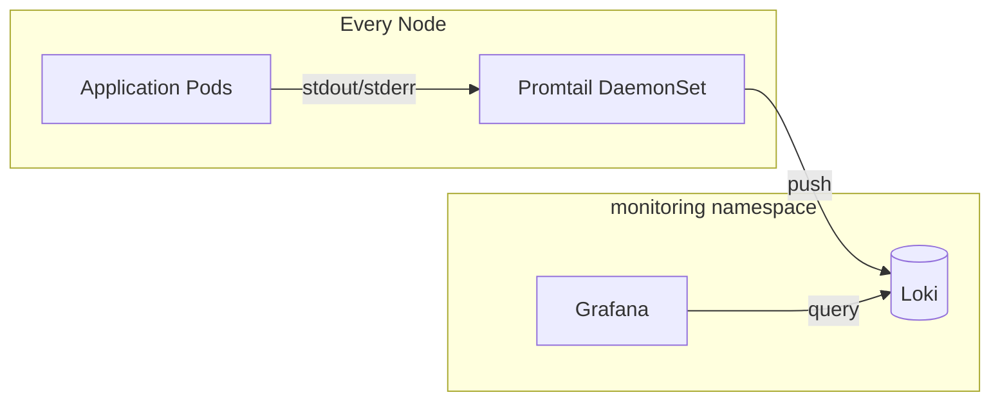

# Shared Infrastructure Components

This document catalogs infrastructure components that are shared across multiple platform applications.

## Overview

The platform follows a shared-services model where common infrastructure components (databases, caches, message queues, observability) are centralized rather than deployed per-application. This reduces operational overhead and resource consumption.

## Components Used by 3+ Applications



## Component Details

### 1. PostgreSQL (platform-postgres)

**Consumers:** 5 applications

| Application | Database | User | Namespace |
|-------------|----------|------|-----------|
| Temporal | `temporal`, `temporal_visibility` | `temporal` | temporal |
| Backstage | `backstage` | `backstage` | backstage |
| ArgoCD | `argocd` | `argocd` | argocd |
| Harbor | `harbor` | `harbor` | harbor |
| Keycloak | `bitnami_keycloak` | `bn_keycloak` | keycloak |

**Service Details:**
- **Endpoint:** `platform-postgres.platform-data.svc:5432`
- **Namespace:** `platform-data`
- **Version:** PostgreSQL 16
- **HA:** 3 replicas with Patroni failover
- **TLS:** Enabled
- **Storage:** 350Gi

**Credentials Flow:**


**Configuration Files:**
- Cluster definition: `platform/stacks/platform-data/pg-clusters/`
- PushSecrets: `platform/stacks/platform-data/pg-clusters/templates/pushsecrets.yaml`

---

### 2. Prometheus

**Consumers:** 4+ applications

| Application | Integration Type | Configuration |
|-------------|-----------------|---------------|
| Grafana | Primary datasource | Built-in |
| Temporal | ServiceMonitor | 30s scrape interval |
| ArgoCD | ServiceMonitor | Multiple components |
| SigNoz | Datasource | APM metrics |

**Service Details:**
- **Endpoint:** `prometheus-kube-prometheus-prometheus.monitoring.svc:9090`
- **Namespace:** `monitoring`
- **Chart:** `kube-prometheus-stack`
- **Retention:** 30 days
- **Storage:** 50Gi

**Included Components:**
- Prometheus Server
- Alertmanager
- Kube-state-metrics
- Node Exporter
- Grafana (optional, we use separate instance)

**Configuration Files:**
- Chart: `platform/stacks/monitoring/charts/prometheus/`

---

### 3. Loki (Log Aggregation)

**Consumers:** 3+ applications

| Application | Integration Type |
|-------------|-----------------|
| Promtail | Log shipper (DaemonSet) |
| Grafana | Log visualization datasource |
| SigNoz | Log aggregation |

**Service Details:**
- **Endpoint:** `loki.monitoring.svc:3100`
- **Namespace:** `monitoring`
- **Mode:** SingleBinary
- **Retention:** 7 days (168h)
- **Storage:** 50Gi (filesystem backend)

**Log Collection Flow:**


**Configuration Files:**
- Loki: `platform/stacks/monitoring/charts/loki/`
- Promtail: `platform/stacks/monitoring/charts/promtail/`

---

### 4. Kafka (Message Streaming)

**Consumers:** 3 applications

| Application | Use Case |
|-------------|----------|
| NetObserv | Network flow data streaming |
| Crossplane | Infrastructure event streaming |
| Data Streaming Stack | Core message bus |

**Service Details:**
- **Operator:** Strimzi Kafka Operator
- **Namespace:** `kafka` (operator), application namespaces (clusters)
- **Replicas:** 2 brokers
- **Image:** `quay.io/strimzi:0.48.0`

**Configuration Files:**
- Operator: `platform/stacks/data-streaming/charts/kafka/`

---

## Components with <3 Consumers

These components are shared but have fewer than 3 consumers currently.

### Redis (Key-Value Stores)

Two Redis clusters serve different purposes:

| Cluster | Port | Purpose | Primary Consumer |
|---------|------|---------|------------------|
| `platform-kv` | 6379 | Platform services state | Infisical |
| `cache-kv` | 6380 | Application caching | General apps |

**Service Details:**
- **Namespace:** `platform-data`
- **HA:** 3 instances (1 master + 2 replicas)
- **Sentinel:** Enabled (quorum: 2)
- **External Access:** MetalLB LoadBalancer

**Configuration Files:**
- `platform/stacks/platform-data/kv-clusters/`

### ClickHouse

| Consumer | Use Case |
|----------|----------|
| SigNoz | APM data storage (traces, metrics, logs) |

**Service Details:**
- **Namespace:** `monitoring` (SigNoz deployment)
- **Databases:** `signoz_metrics`, `signoz_traces`, `signoz_logs`
- **Storage:** 50Gi

---

## Connection Reference

| Component | Service DNS | Port | Auth Method |
|-----------|-------------|------|-------------|
| PostgreSQL | `platform-postgres.platform-data.svc` | 5432 | Vault (ExternalSecret) |
| Prometheus | `prometheus-kube-prometheus-prometheus.monitoring.svc` | 9090 | None (internal) |
| Loki | `loki.monitoring.svc` | 3100 | None (internal) |
| Kafka | `{cluster}-kafka-bootstrap.{ns}.svc` | 9092 | Strimzi-managed |
| Redis (platform) | `platform-kv.platform-data.svc` | 6379 | None |
| Redis (cache) | `cache-kv.platform-data.svc` | 6380 | None |

---

## Adding a New Consumer

### For PostgreSQL

1. **Add database to pg-clusters:**
   ```yaml
   # platform/stacks/platform-data/pg-clusters/values-production.yaml
   databases:
     myapp: {}  # Creates database and user 'myapp'
   ```

2. **Add PushSecret** (auto-generated by template based on databases list)

3. **Create ExternalSecret in your app:**
   ```yaml
   apiVersion: external-secrets.io/v1beta1
   kind: ExternalSecret
   spec:
     secretStoreRef:
       name: vault-backend
       kind: ClusterSecretStore
     target:
       name: myapp-postgres-secret
     data:
     - secretKey: password
       remoteRef:
         key: platform-data/postgres/myapp
         property: password
   ```

### For Prometheus Metrics

1. **Add ServiceMonitor to your Helm chart:**
   ```yaml
   apiVersion: monitoring.coreos.com/v1
   kind: ServiceMonitor
   metadata:
     name: myapp
     labels:
       release: prometheus  # Must match Prometheus selector
   spec:
     selector:
       matchLabels:
         app: myapp
     endpoints:
     - port: metrics
       interval: 30s
   ```

### For Loki Logs

Logs are collected automatically by Promtail from all pods. To add custom labels:

```yaml
# Pod annotations
metadata:
  annotations:
    promtail.io/scrape: "true"
    promtail.io/parser: "json"  # or "logfmt", "raw"
```

---

## Related Documentation

- [Vault Secret Flow](./vault-secret-flow.md) - How secrets flow between components
- [PostgreSQL Operator](https://postgres-operator.readthedocs.io/) - Zalando operator docs
- [Strimzi Kafka](https://strimzi.io/documentation/) - Kafka operator docs
- [Loki Documentation](https://grafana.com/docs/loki/latest/)
