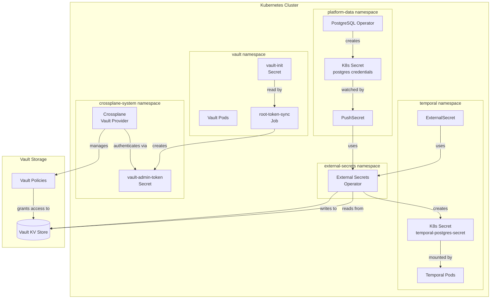
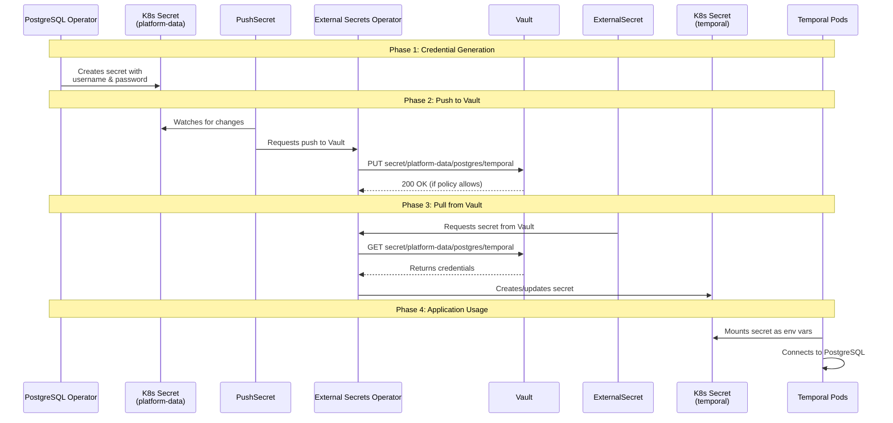
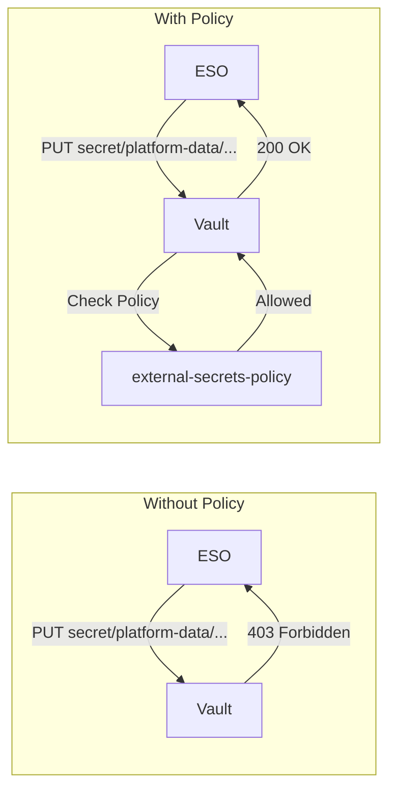
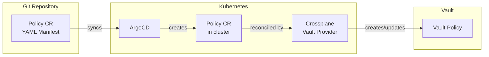
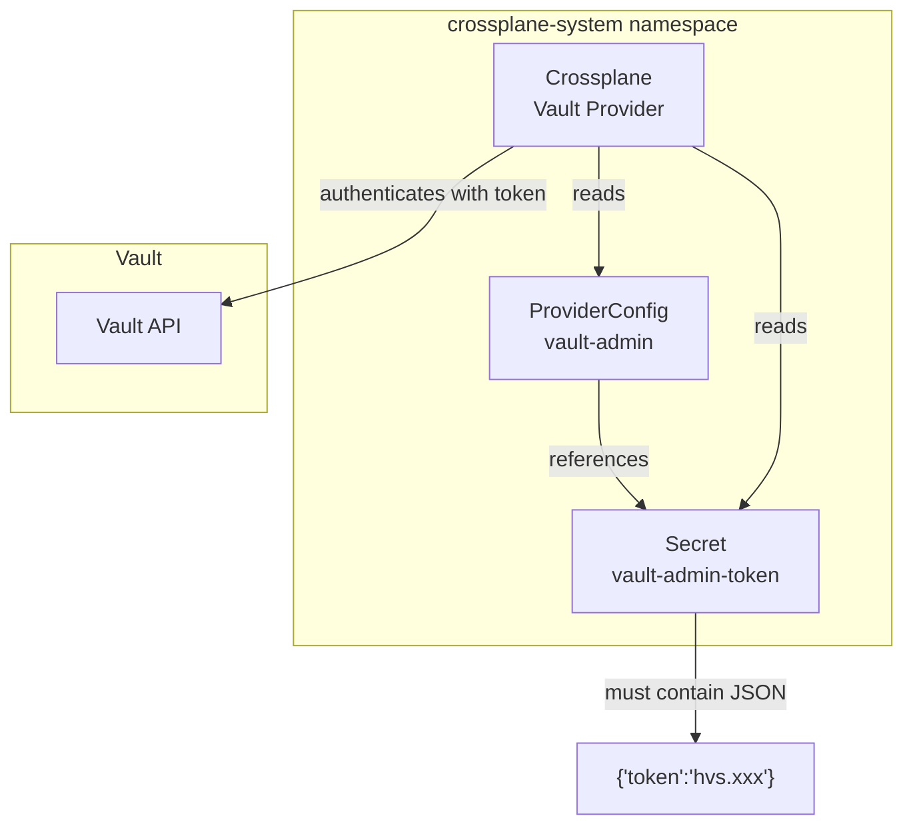
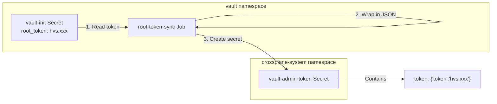
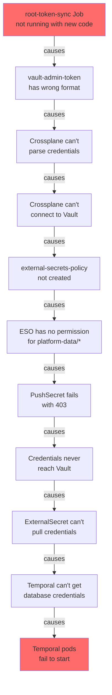
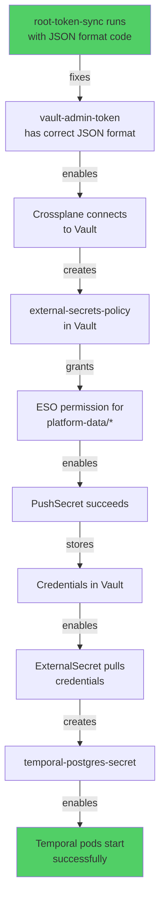

# Vault Secret Flow Architecture

This document explains how secrets flow through the platform, focusing on the integration between Vault, External Secrets Operator (ESO), and Crossplane.

## Overview

The platform uses a GitOps-driven secret management system where:
- **Vault** stores secrets securely
- **External Secrets Operator (ESO)** syncs secrets between Kubernetes and Vault
- **Crossplane Vault Provider** manages Vault configuration (policies, roles) declaratively

## The Players

| Component | Role | Analogy |
|-----------|------|---------|
| **Vault** | Central secret storage | A secure safe |
| **ESO (External Secrets Operator)** | Moves secrets between K8s and Vault | A courier service |
| **Crossplane Vault Provider** | Configures Vault itself via K8s manifests | A locksmith who can change safe permissions |
| **PushSecret** | ESO resource that pushes K8s secrets TO Vault | Outbound courier |
| **ExternalSecret** | ESO resource that pulls secrets FROM Vault | Inbound courier |

## High-Level Architecture



## The Secret Journey: PostgreSQL to Temporal

This is the complete flow of how database credentials get from PostgreSQL operator to Temporal.



## The Permission Problem

ESO needs permission to read/write secrets in Vault. Without proper policies, ESO gets `403 Permission Denied`.



## The `external-secrets-policy`

This Vault policy grants ESO permission to manage secrets:

```hcl
# Application secrets
path "secret/data/applications/*" {
  capabilities = ["create", "update", "read", "list"]
}
path "secret/metadata/applications/*" {
  capabilities = ["create", "update", "read", "list"]
}

# Platform data secrets (PostgreSQL credentials, etc.)
path "secret/data/platform-data/*" {
  capabilities = ["create", "update", "read", "list"]
}
path "secret/metadata/platform-data/*" {
  capabilities = ["create", "update", "read", "list"]
}

# Platform config secrets
path "secret/data/platform-config/*" {
  capabilities = ["create", "update", "read", "list"]
}
path "secret/metadata/platform-config/*" {
  capabilities = ["create", "update", "read", "list"]
}
```

## Creating Policies via GitOps (Crossplane)

Instead of manually running `vault policy write`, we use Crossplane to manage Vault policies declaratively:



The Policy Custom Resource:

```yaml
apiVersion: vault.vault.upbound.io/v1alpha1
kind: Policy
metadata:
  name: external-secrets-policy
spec:
  providerConfigRef:
    name: vault-admin  # References ProviderConfig with Vault credentials
  forProvider:
    name: external-secrets-policy
    policy: |
      path "secret/data/platform-data/*" {
        capabilities = ["create", "update", "read", "list"]
      }
      # ... more paths
```

## Crossplane Authentication to Vault

Crossplane needs credentials to talk to Vault. This is configured via `ProviderConfig`:



**Critical:** The secret must be in JSON format:
```json
{"token":"hvs.EXAMPLE_TOKEN_PLACEHOLDER"}
```

NOT raw format:
```
hvs.EXAMPLE_TOKEN_PLACEHOLDER
```

## The `root-token-sync` Job

This job bridges the gap between Vault's auto-initialization and Crossplane's requirements:



**What the job does:**
1. Waits for `vault-init` secret to exist (created when Vault initializes)
2. Reads the `root_token` value
3. Wraps it in JSON format: `{"token":"<value>"}`
4. Creates/updates `vault-admin-token` secret in crossplane-system

## Current Issue: Chain of Failures



## The Fix

Once `root-token-sync` runs with the updated code:



## File Locations

| Component | File Path |
|-----------|-----------|
| Vault values | `platform/stacks/security/charts/vault/values.yaml` |
| root-token-sync Job | `platform/stacks/security/charts/vault/templates/root-token-sync.yaml` |
| Crossplane Policy CR | `platform/stacks/security/charts/vault/templates/eso/crossplane-policy.yaml` |
| ESO ClusterSecretStore | `platform/stacks/security/charts/vault/templates/eso/cluster-secret-store.yaml` |
| pg-clusters PushSecrets | `platform/stacks/platform-data/pg-clusters/templates/pushsecrets.yaml` |
| Temporal ExternalSecret | `platform/stacks/application-infra/charts/temporal/templates/external-secret.yaml` |

## Sync Wave Order

Resources are deployed in order using ArgoCD sync waves:

```
Wave 0:   ProviderConfig (vault-admin)
Wave 60:  ServiceAccount, RBAC for root-token-sync
Wave 65:  external-secrets-policy (Crossplane Policy CR)
Wave 100: root-token-sync Job (PreSync hook)
```

## Related Documentation

- [Vault Documentation](https://developer.hashicorp.com/vault/docs)
- [External Secrets Operator](https://external-secrets.io/)
- [Crossplane Vault Provider](https://marketplace.upbound.io/providers/upbound/provider-vault/)
