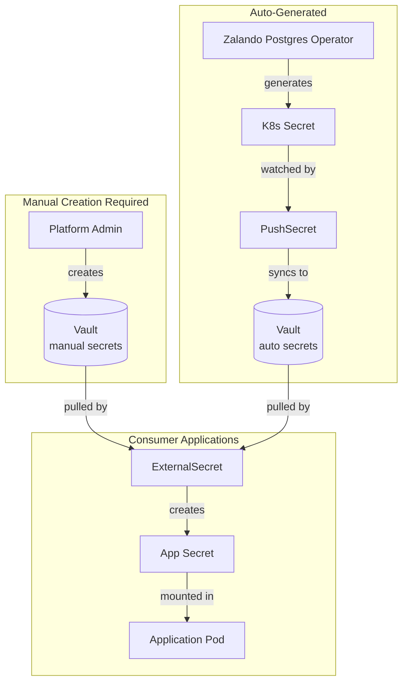

# Vault Secret Prerequisites

This document lists secrets that must be created in Vault **before** deploying platform applications. These secrets are pulled by ExternalSecrets and are required for applications to start successfully.

## Overview

Applications that require manual secret creation in Vault:

| Application | Vault Path | Description |
|-------------|------------|-------------|
| Harbor | `applications/developer-platform/harbor/core` | Core secrets (admin password, encryption keys) |
| Harbor | `applications/developer-platform/harbor/s3` | S3 storage credentials |

## Harbor Secrets

### Core Secrets

**Vault Path:** `applications/developer-platform/harbor/core`

| Key | Description | Generation |
|-----|-------------|------------|
| `REGISTRY_HTPASSWD` | htpasswd format: `user:$apr1$hash` | `htpasswd -nb admin <password>` |
| `REGISTRY_PASSWD` | Registry password (plaintext) | Random 24 chars |
| `admin-password` | Harbor admin UI password | Random 24 chars |
| `database-password` | Internal PostgreSQL password | Random 32 chars |
| `jobservice-secret` | Job service internal secret | Random 32 chars |
| `registry-http-secret` | Registry HTTP session secret | Random 48 chars |
| `secret` | Core service secret | Random 48 chars |
| `secretKey` | Encryption key for secrets | Random 64 chars |

**Create via Vault CLI:**
```bash
# Generate passwords
ADMIN_PWD=$(openssl rand -base64 18)
REGISTRY_PWD=$(openssl rand -base64 18)
DB_PWD=$(openssl rand -base64 24)
JOB_SECRET=$(openssl rand -base64 24)
HTTP_SECRET=$(openssl rand -base64 36)
CORE_SECRET=$(openssl rand -base64 36)
SECRET_KEY=$(openssl rand -base64 48)

# Generate htpasswd (requires apache2-utils or httpd-tools)
HTPASSWD=$(htpasswd -nbB harbor_registry_user "$REGISTRY_PWD")

# Write to Vault
vault kv put secret/applications/developer-platform/harbor/core \
  REGISTRY_HTPASSWD="$HTPASSWD" \
  REGISTRY_PASSWD="$REGISTRY_PWD" \
  admin-password="$ADMIN_PWD" \
  database-password="$DB_PWD" \
  jobservice-secret="$JOB_SECRET" \
  registry-http-secret="$HTTP_SECRET" \
  secret="$CORE_SECRET" \
  secretKey="$SECRET_KEY"
```

### S3 Storage Credentials

**Vault Path:** `applications/developer-platform/harbor/s3`

| Key | Description |
|-----|-------------|
| `REGISTRY_STORAGE_S3_ACCESSKEY` | S3 access key ID |
| `REGISTRY_STORAGE_S3_SECRETKEY` | S3 secret access key |

**Create via Vault CLI:**
```bash
vault kv put secret/applications/developer-platform/harbor/s3 \
  REGISTRY_STORAGE_S3_ACCESSKEY="<your-access-key>" \
  REGISTRY_STORAGE_S3_SECRETKEY="<your-secret-key>"
```

---

## Auto-Generated Secrets (No Action Required)

The following secrets are automatically managed and do NOT require manual creation:

### PostgreSQL Credentials (pg-clusters)

Credentials are automatically generated by Zalando Postgres Operator and synced to Vault via PushSecrets.

**Vault Paths:** `platform-data/postgres/<username>`

| Consumer | Vault Path | Auto-Generated By |
|----------|------------|-------------------|
| Temporal | `platform-data/postgres/temporal` | Zalando + PushSecret |
| Backstage | `platform-data/postgres/backstage` | Zalando + PushSecret |
| ArgoCD | `platform-data/postgres/argocd` | Zalando + PushSecret |
| Harbor | `platform-data/postgres/harbor` | Zalando + PushSecret |
| Keycloak | `platform-data/postgres/bn_keycloak` | Zalando + PushSecret |

### PostgreSQL Config (pg-clusters)

Connection configuration is synced to Vault for consumers.

**Vault Path:** `platform-config/postgres/platform-postgres`

| Key | Value |
|-----|-------|
| `host` | `platform-postgres.platform-data.svc` |
| `port` | `5432` |

---

## Secret Flow Diagram



---

## Verification

### Check ExternalSecret Status

```bash
# Harbor secrets
kubectl get externalsecret -n harbor

# Expected output:
# NAME                    STORE           REFRESH INTERVAL   STATUS
# harbor-core-secrets     vault-backend   1h                 SecretSynced
# harbor-s3-credentials   vault-backend   1h                 SecretSynced
```

### Check Secret Exists

```bash
# Verify secrets are created
kubectl get secret -n harbor harbor-core-secrets
kubectl get secret -n harbor harbor-s3-credentials
```

### Common Issues

| Symptom | Cause | Fix |
|---------|-------|-----|
| ExternalSecret shows `SecretSyncedError` | Secret not in Vault | Create secret in Vault using commands above |
| Pod fails with "secret not found" | ExternalSecret not synced | Check ExternalSecret status, verify Vault path |
| ExternalSecret stuck on `Syncing` | ClusterSecretStore issue | Check `vault-backend` ClusterSecretStore status |

---

## Related Documentation

- [Vault Secret Flow](./vault-secret-flow.md) - Complete secret flow architecture
- [Shared Infrastructure Components](./shared-infrastructure-components.md) - Component overview
