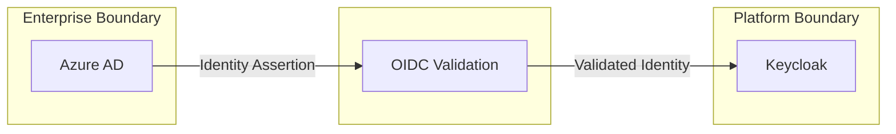

```
RFC-RFCSTD-0002                                                   Section 4
Category: Standards Track                           Formatting Standards
```

# 4. Formatting Standards

[← Structure](./03-structure.md) | [Index](./00-index.md) | [Next →](./05-validation.md)

---

## 4.1 Document Header

Each file in an Architecture RFC MUST begin with:

```
```
RFC-<ID>                                                          Section N
Category: <Category>                                        <Section Title>
```

# N. Section Title

[← Previous](./prev.md) | [Index](./00-index.md) | [Next →](./next.md)

---
```

---

## 4.2 Diagram Requirements

Architecture RFCs SHOULD include diagrams for:

| Concept | Diagram Type | Required |
|---------|--------------| ---------|
| System overview | flowchart | RECOMMENDED |
| Trust boundaries | flowchart | CONDITIONAL (if security-relevant) |
| Data flows | sequenceDiagram | RECOMMENDED |
| State transitions | stateDiagram-v2 | OPTIONAL |
| Component relationships | flowchart | RECOMMENDED |

All diagrams MUST use Mermaid syntax.

---

## 4.3 Invariant Format

Invariants MUST follow this format:

```markdown
### Invariant N — Short Title

Statement using RFC 2119 keywords (MUST, MUST NOT, etc.).

Explanation of why this invariant exists and consequences of violation.
```

Example:

```markdown
### Invariant 3 — Secret Authority

HashiCorp Vault MUST be the sole authoritative source for secrets
required by platform applications.

No application MAY store authoritative secrets outside of Vault.
Kubernetes Secrets exist only as derived artifacts synchronized
by External Secrets Operator.

This invariant ensures centralized secret lifecycle management
and auditability. Violation would create untracked secrets
outside the rotation and audit framework.
```

---

## 4.4 Trust Boundary Format

Trust boundaries SHOULD be illustrated using Mermaid flowcharts with subgraphs:



---

## 4.5 Component Format

Components SHOULD be documented using tables:

```markdown
### Component Name

| Aspect | Description |
|--------|-------------|
| Responsibility | What this component does |
| Inputs | What it receives |
| Outputs | What it produces |
| Dependencies | What it requires |
| Failure Mode | How it fails |
| Recovery | How it recovers |
```

---

## 4.6 Rejected Alternative Format

Rejected alternatives MUST follow this format:

```markdown
### N.N.N Alternative Name

**Description**: What the alternative is.

**Why It Was Attractive**:
- Genuine benefit 1
- Genuine benefit 2

**Why It Was Rejected**:
- Specific failure or limitation 1
- Specific failure or limitation 2
- Violates Invariant N (if applicable)

**Conclusion**: Summary judgment.
```

---

## 4.7 Navigation Links

Each file MUST include navigation links after the header:

```markdown
[← Previous](./prev.md) | [Index](./00-index.md) | [Next →](./next.md)
```

The index file uses:

```markdown
[Index](./00-index.md) | [Next →](./01-introduction.md)
```

---

## 4.8 Section Separators

Use horizontal rules (`---`) to separate:

| Usage | Placement |
|-------|-----------|
| After navigation links | Before content begins |
| Before section footer | After content ends |
| Between major subsections | When logical break needed |

---

*End of Section 4 — RFC-RFCSTD-0002*
