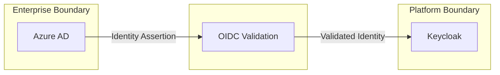
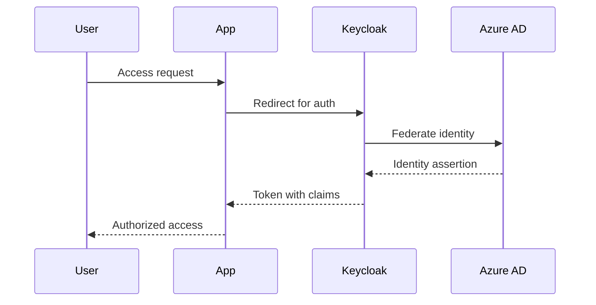

```
RFC-RFCSTD-0002                                                   Section 6
Category: Standards Track                                         Examples
```

# 6. Examples

[← Validation](./05-validation.md) | [Index](./00-index.md) | [Next →](./appendix-a-glossary.md)

---

## 6.1 Invariant Example

**Well-Formed Invariant:**

```markdown
### Invariant 3 — Secret Authority

HashiCorp Vault MUST be the sole authoritative source for secrets
required by platform applications.

No application MAY store authoritative secrets outside of Vault.
Kubernetes Secrets exist only as derived artifacts synchronized
by External Secrets Operator.

This invariant ensures centralized secret lifecycle management
and auditability. Violation would create untracked secrets
outside the rotation and audit framework.
```

This invariant demonstrates:

| Property | Value |
|----------|-------|
| Numbered | Invariant 3 |
| Uses RFC 2119 | MUST, MAY |
| Falsifiable | Yes—finding a secret outside Vault violates it |
| Has rationale | Explains consequences of violation |

---

## 6.2 Trust Boundary Example



This diagram shows:

| Element | Meaning |
|---------|---------|
| Enterprise Boundary | External identity authority |
| Platform Boundary | Internal identity system |
| Crossing point | Where validation occurs |
| Arrows | Data flow direction |

---

## 6.3 Rejected Alternative Example

```markdown
### 9.1.2 Direct Azure AD Integration

**Description**: Each application integrates directly with Azure AD
without a platform identity layer.

**Why It Was Attractive**:
- Simpler initial setup—no Keycloak to maintain
- Native Microsoft tooling support
- One fewer component in the stack

**Why It Was Rejected**:
- Each application requires separate Azure AD configuration
- No centralized platform-level authorization
- Cannot add platform-specific claims or roles
- Violates Invariant 2 (Authentication Chain)—identity must flow
  through Keycloak

**Conclusion**: Direct integration prevents unified platform identity
and would require each team to implement authentication separately.
```

This example demonstrates:

| Component | Presence |
|-----------|----------|
| Description | ✓ |
| Why Attractive | ✓ (3 genuine benefits) |
| Why Rejected | ✓ (4 specific reasons) |
| Invariant Violation | ✓ (Invariant 2) |
| Conclusion | ✓ |

---

## 6.4 Component Documentation Example

```markdown
### External Secrets Operator

| Aspect | Description |
|--------|-------------|
| Responsibility | Synchronize secrets from Vault to Kubernetes Secrets |
| Inputs | SecretStore CRD, ExternalSecret CRD |
| Outputs | Kubernetes Secret objects |
| Dependencies | Vault (source), Kubernetes API (target) |
| Failure Mode | Sync stops; secrets become stale |
| Recovery | Automatic retry on Vault availability |
```

---

## 6.5 Design Goal Example

```markdown
## Design Goals

### Goal 1 — Unified Identity

All platform users and services MUST authenticate through a single
identity chain, enabling consistent authorization across all
platform applications.

### Goal 2 — Auditability

All authentication and authorization events MUST be logged with
sufficient detail for security investigation and compliance
reporting.
```

---

## 6.6 Non-Goal Example

```markdown
## Non-Goals

### Non-Goal 1 — User Provisioning

This architecture does NOT define how users are created or
deprovisioned. User lifecycle management is out of scope.
See RFC-IDENTITY-LIFECYCLE-0001 for user provisioning.

### Non-Goal 2 — Application-Level Authorization

This architecture defines platform-level roles (admin, developer,
viewer). Fine-grained application-level authorization is the
responsibility of individual applications.
```

---

## 6.7 Data Flow Example



---

*End of Section 6 — RFC-RFCSTD-0002*
